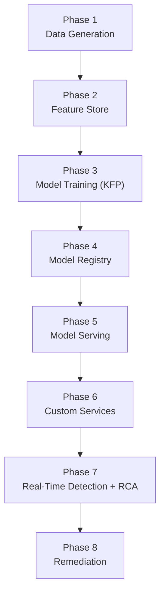

# Architecture By Phase

This directory contains a small set of deep-dive architecture documents. They are easier to navigate when grouped into the end-to-end platform phases below.

## Phase Flow

## Phase Breakdown

| Phase | Stage doc | Primary focus | Main components | Main outputs | Deep dive docs |
| --- | --- | --- | --- | --- | --- |
| Phase 1: Data Generation | [Phase 01 Overview](./phase-01-overview-data-generation.md) | Generate IMS traffic, fault conditions, and persisted raw runtime evidence | OpenIMSs IMS core, SIPp, XML scenarios, `sipp-runner`, MinIO | feature windows, scenario labels, raw logs, incident-linked evidence | [Engineering specification](./engineering-spec.md), [Incident release and offline training](./incident-release-corpus-and-offline-training.md) |
| Phase 2: Feature Store | [Phase 02 Overview](./phase-02-overview-feature-store.md) | Convert persisted runtime data into stable feature definitions and training projections | OpenShift AI Feature Store, entities, feature views, feature services, offline store, optional online store | versioned feature contracts and reusable feature projections | [Feature store training path](./feature-store-training-path.md) |
| Phase 3: Model Training (KFP) | [Phase 03 Overview](./phase-03-overview-model-training-kfp.md) | Train and evaluate anomaly models from persisted data using reproducible pipelines | Kubeflow Pipelines, training components, evaluation and selection stages | trained model artifacts, metrics, reproducible training runs | [AutoGluon training and model selection](./autogluon-training-and-model-selection.md), [Engineering specification](./engineering-spec.md), [Feature store training path](./feature-store-training-path.md), [Incident release and offline training](./incident-release-corpus-and-offline-training.md) |
| Phase 4: Model Registry | [Phase 04 Overview](./phase-04-overview-model-registry.md) | Track trained model lineage, metadata, and promotion decisions | MinIO artifact storage, repo-managed registry metadata, Red Hat OpenShift AI Model Registry target path | model versions, lineage metadata, promotion-ready records | [Feature store training path](./feature-store-training-path.md), [Incident release and offline training](./incident-release-corpus-and-offline-training.md) |
| Phase 5: Model Serving | [Phase 05 Overview](./phase-05-overview-model-serving.md) | Expose trained models through a stable inference runtime | OpenShift AI model serving, KServe, NVIDIA Triton, `ims-predictive`, future side-by-side serving path | REST and gRPC inference endpoints | [Engineering specification](./engineering-spec.md), [Feature store training path](./feature-store-training-path.md) |
| Phase 6: Custom Services | [Phase 06 Overview](./phase-06-overview-custom-services.md) | Connect runtime data, inference, incident orchestration, and UI workflows | `feature-gateway`, `anomaly-service`, `control-plane`, `rca-service`, `demo-ui`, shared service library | end-to-end orchestration from traffic to incident state | [Engineering specification](./engineering-spec.md), [RCA and remediation](./rca-remediation.md) |
| Phase 7: Real-Time Detection + RCA | [Phase 07 Overview](./phase-07-overview-real-time-detection-and-rca.md) | Score live windows, retrieve similar incidents, and generate grounded explanations | anomaly scoring path, control-plane, Milvus, vLLM, incident evidence, reasoning, and resolution embeddings | anomaly decisions, RCA payloads, related evidence, operator-facing explanations | [Engineering specification](./engineering-spec.md), [RCA and remediation](./rca-remediation.md) |
| Phase 8: Remediation | [Phase 08 Overview](./phase-08-overview-remediation.md) | Suggest, approve, execute, verify, and learn from incident response actions | control-plane workflow, Plane integration, AAP/Ansible automation, verification loop, audit trail | remediation suggestions, approvals, execution records, verification outcomes, reusable knowledge | [RCA and remediation](./rca-remediation.md), [Remediation suggestions and playbooks](./remediation-suggestions-and-playbooks.md), [Event-Driven Ansible](./event-driven-ansible.md) |

## Phase Files

1. [Phase 01 Overview — Data Generation](./phase-01-overview-data-generation.md)
2. [Phase 02 Overview — Feature Store](./phase-02-overview-feature-store.md)
3. [Phase 03 Overview — Model Training (KFP)](./phase-03-overview-model-training-kfp.md)
4. [Phase 04 Overview — Model Registry](./phase-04-overview-model-registry.md)
5. [Phase 05 Overview — Model Serving](./phase-05-overview-model-serving.md)
6. [Phase 06 Overview — Custom Services](./phase-06-overview-custom-services.md)
7. [Phase 07 Overview — Real-Time Detection and RCA](./phase-07-overview-real-time-detection-and-rca.md)
8. [Phase 08 Overview — Remediation](./phase-08-overview-remediation.md)

## How The Current Docs Map

- the `phase-01-overview` through `phase-08-overview` files are the fastest way to read the architecture stage by stage
- `engineering-spec.md` is the umbrella architecture reference across phases 1 to 8.
- `autogluon-training-and-model-selection.md` is the focused explainer for how the Phase 3 candidate model is trained, compared, and promoted versus the serving artifact.
- `incident-release-corpus-and-offline-training.md` is a cross-phase release and offline-training contract. It draws on persisted outputs from phases 1 to 4 and defines how they become a public corpus and offline-training input.
- `feature-store-training-path.md` is the primary deep dive for phases 2 to 5.
- `rca-remediation.md` is the primary deep dive for phases 6 to 8.
- `remediation-suggestions-and-playbooks.md` is the focused explainer for how Phase 8 ranks remediation actions and maps them to playbooks.
- `event-driven-ansible.md` is the focused explainer for the EDA webhook and callback flow inside Phase 8.

## Which Docs To Keep

Keep both layers of documentation:

- the `phase-01-overview` through `phase-08-overview` files are short stage summaries with focused diagrams
- the larger architecture documents remain the detailed design references and should not be deleted yet

Those larger docs still contain material that the phase files intentionally do not repeat in full, including:

- runtime and repository mapping in `engineering-spec.md`
- release manifest, privacy, linkage, and quality-gate rules in `incident-release-corpus-and-offline-training.md`
- Feature Store objects, pipeline contracts, and serving transition options in `feature-store-training-path.md`
- RCA workflow, data model, APIs, embedding strategy, and remediation execution rules in `rca-remediation.md`

## Embedding Stages In The RCA Path

Phase 7 uses multiple retrieval layers rather than one generic embedding bucket:

- runbooks and curated knowledge in `ims_runbooks`
- incident evidence embeddings in `incident_evidence`
- RCA reasoning embeddings in `incident_reasoning`
- verified remediation and outcome embeddings in `incident_resolution`

This separation keeps retrieval grounded by stage: evidence retrieval supports diagnosis, reasoning retrieval supports RCA context, and resolution retrieval supports remediation suggestions and verified learning.

## Suggested Reading Order

1. Read [Engineering specification](./engineering-spec.md) for the end-to-end platform.
2. Read [Incident release and offline training](./incident-release-corpus-and-offline-training.md) for persisted release data, dataset policy, and offline-training inputs.
3. Read [Feature store training path](./feature-store-training-path.md) for phases 2 to 5.
4. Read [RCA and remediation](./rca-remediation.md) for phases 6 to 8.
5. Read [Remediation suggestions and playbooks](./remediation-suggestions-and-playbooks.md) for the current ranking and playbook-mapping flow.
6. Read [Event-Driven Ansible](./event-driven-ansible.md) for the event-driven automation path in remediation.
