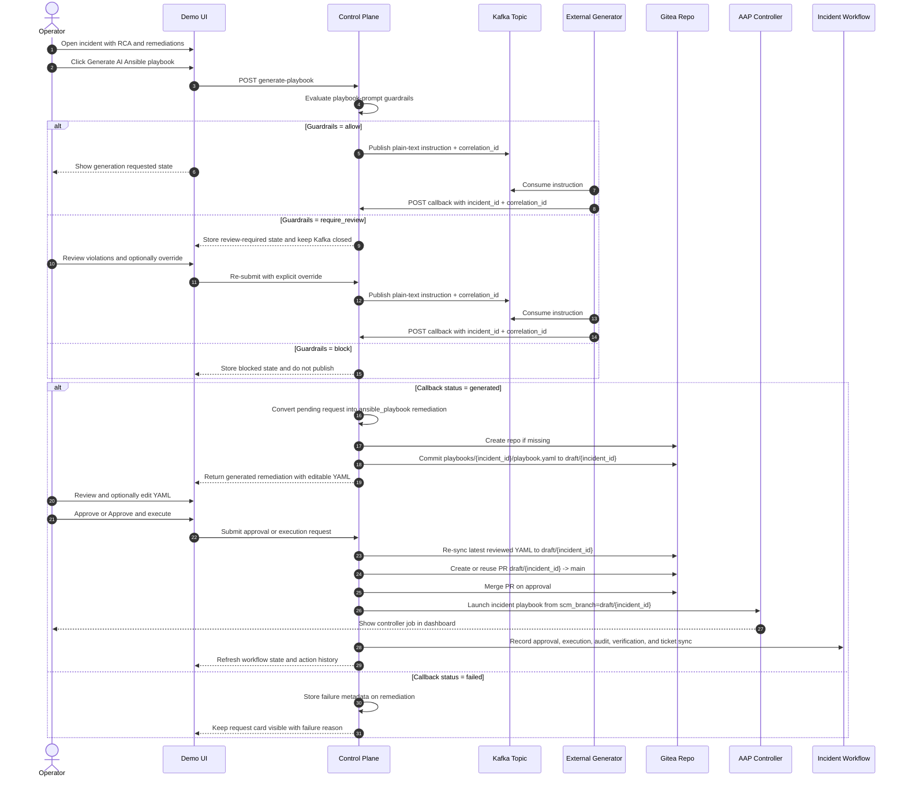

# AI Playbook Generation

## Purpose

This document defines the Phase 8 contract for on-demand AI-generated Ansible playbooks after RCA exists for an incident.

Use this file when you need to know:

- how the UI publishes the generation request
- what is sent to Kafka
- how to test the callback endpoint with `curl`
- how the generated playbook is stored in Gitea
- how the generated playbook appears in the UI
- how the generated playbook is approved, promoted, and executed on our side

## Implemented Platform Behavior

This flow is implemented on the platform side:

1. The incident UI exposes `Generate AI Ansible playbook` after RCA and remediations exist.
2. The UI previews the plain-text instruction through `POST /incidents/{incident_id}/remediation/{remediation_id}/playbook-instruction-preview`.
3. The control-plane evaluates playbook-prompt guardrails on the operator-controlled text, especially the note and any full-text instruction override, and sanitizes the final Kafka instruction draft before publish.
4. The UI calls `POST /incidents/{incident_id}/remediation/{remediation_id}/generate-playbook`.
5. The control-plane does one of three things before Kafka publish:
   - `allow`: publish the instruction immediately
   - `require_review`: store the request as review-required and keep Kafka closed until an explicit operator override
   - `block`: store the blocked result and never publish that draft
6. An external generator consumes only allowed or explicitly overridden instructions and calls the control-plane callback endpoint with either:
   - `status=generated` and one YAML playbook
   - `status=failed` and an error
7. On a successful callback, the control-plane converts the pending request remediation into a normal `ansible_playbook` remediation.
8. The UI shows a new AI-generated remediation card with:
   - the same approval and execution controls as other remediations
   - a collapsed playbook editor by default
   - editable YAML before approval or execution
9. The generated YAML is synced into a dedicated in-cluster Gitea repository on an incident-scoped draft branch.
10. When the operator approves or executes that remediation, any edited YAML is re-synced to the same incident draft branch before approval is recorded.
11. Approval creates or reuses the incident pull request from `draft/{incident_id}` to `main` and merges it.
12. Execution launches the playbook through the AAP controller path from the incident draft branch, so the run appears in the AAP dashboard and continues through the normal approval, execution, verification, audit, and ticket-sync workflow.

## Generated Playbook Git Workflow

AI-generated playbooks use one shared Gitea repository:

- owner: `gitadmin`
- repo: `ani-ai-generated-playbooks`
- main branch: `main`
- draft branch pattern: `draft/{incident_id}`
- playbook path: `playbooks/{incident_id}/playbook.yaml`

Repository behavior:

- if the repository does not exist, the control-plane creates it automatically
- each callback writes only the current incident playbook path
- each incident gets its own draft branch, so incidents do not overwrite each other
- approval promotes only that incident branch to `main`

## End-To-End Flow

1. An operator opens an incident with RCA attached.
2. The remediation section shows ranked remediations and the optional AI playbook request card.
3. The operator clicks `Generate AI Ansible playbook`.
4. The control-plane builds the plain-text instruction draft and runs playbook-prompt guardrails on the note plus final prompt text.
5. If the decision is `allow`, the control-plane generates a `correlation_id` and publishes the instruction to Kafka.
6. If the decision is `require_review`, the remediation remains visible with generation status `review_required` until the operator explicitly overrides the guardrail.
7. If the decision is `block`, the remediation remains visible with generation status `blocked` and Kafka publish does not happen.
8. The external generator returns one callback payload for the same `incident_id` and `correlation_id` only for the published cases.
9. The control-plane updates that remediation in place:
   - `suggestion_type` becomes `ansible_playbook`
   - `generation_kind` becomes `generated`
   - returned YAML is stored in `playbook_yaml`
   - the same YAML is committed to `playbooks/{incident_id}/playbook.yaml` on `draft/{incident_id}`
10. The UI refresh shows the generated remediation card with an `AI generated` badge and draft Git metadata.
11. The operator can expand the YAML, review it, optionally edit it, and then approve or approve-and-execute it.
12. Approval syncs the latest YAML to Gitea again, creates or reuses the incident PR, and merges `draft/{incident_id}` to `main`.
13. Execution enters the standard workflow path:
    - `APPROVED`
    - `EXECUTING`
    - `EXECUTED` or `EXECUTION_FAILED`
    - verification and closure as normal
14. The AAP job is visible in the controller dashboard because the controller launches the incident-scoped playbook from the draft branch.

## Workflow Diagram



Important behavior shown above:

- the external generator always calls the control-plane callback endpoint, not the AAP route
- the incident draft branch is the execution source of truth for the reviewed playbook
- merging to `main` records the approved version, while AAP still runs the exact incident draft branch
- each incident writes to `playbooks/{incident_id}/playbook.yaml`, so incidents do not collide

## Kafka Topic

- Topic name: `aiops-ansible-playbook-generate-instruction`
- Key: generated control-plane correlation id
- Value: plain-text instruction

The control-plane config uses:

- `AI_PLAYBOOK_GENERATION_KAFKA_TOPIC`
- `AI_PLAYBOOK_GENERATION_KAFKA_BOOTSTRAP_SERVERS`
- `AI_PLAYBOOK_GENERATION_ENABLED`

## Plain-Text Instruction Contract

The Kafka value is intentionally plain text so the external generator can treat it as a natural-language work item.

The control-plane instruction includes:

- incident id
- project
- anomaly type
- severity
- model confidence
- workflow revision
- summarized feature signals
- RCA root cause
- RCA explanation and recommendation
- current ranked remediation titles when available
- optional operator note
- optional incident page URL
- callback URL
- correlation id
- required callback JSON fields

The external generator should treat:

- `callback_url` as authoritative
- `correlation_id` as required
- the rest of the text as generation context

## Playbook Prompt Guardrails

This flow now has a dedicated prompt guardrail boundary before Kafka publish. The primary trust boundary is the operator-controlled text:

- `notes` on the AI playbook request card
- any full-text `instruction_override`
- the final plain-text instruction assembled by the control-plane, which is sanitized before publish

This guardrail layer is implemented on the platform side, not in AAP Controller and not in the generated playbook itself.

### Decision Model

- `allow`: the instruction can be published to Kafka immediately
- `require_review`: the request is stored, Kafka stays closed, and the operator must explicitly override before publish
- `block`: the request is stored as blocked and is never published as written

### Current Policy

Implemented policy examples:

- `allow`
  - reversible, diagnostic, or smoke-marker style playbooks
  - requests grounded to the incident RCA and current remediation context
- `require_review`
  - live restart requests
  - workload patch or edit requests
  - scale-change requests
  - any manual full-text instruction override
- `block`
  - prompt-injection language such as `ignore previous instructions`
  - destructive requests to delete or wipe live components
  - requests to scale critical workloads to zero
  - attempts to bypass approval or request cluster-admin style privilege

### Persisted Metadata

The request remediation now stores a `playbook_guardrails` envelope in remediation metadata, including:

- `status`
- `reason`
- `policy_version`
- `contract_version`
- `violations`
- `detectors`
- `sanitized_instruction`

This lets the UI explain why a draft was allowed, flagged for review, or blocked before Kafka publish.

### Demo Prompts

The incident UI includes preset prompts for demo purposes:

- `Allow demo`
  - generates a reversible smoke-marker or diagnostics playbook
- `Review demo`
  - asks for a live restart after diagnostics
- `Block demo`
  - uses prompt-injection plus destructive delete language

## Callback Endpoint

The external generator must `POST` the result to the control-plane service, not to AAP Controller:

```text
/incidents/{incident_id}/playbook-generation/callback
```

Do not post this payload to:

```text
https://aap-controller-.../incidents/{incident_id}/playbook-generation/callback
```

That host belongs to AWX / AAP Controller and does not implement the incident workflow API. If you hit the wrong host, AWX returns its HTML `Not Found` page.

## API Endpoints

These AI playbook endpoints are implemented by `services/control-plane/app.py`:

| Purpose | Method | Path | Used by |
| --- | --- | --- | --- |
| Generate the Kafka request | `POST` | `/incidents/{incident_id}/remediation/{remediation_id}/generate-playbook` | Demo UI or direct API caller |
| Preview the Kafka instruction | `POST` | `/incidents/{incident_id}/remediation/{remediation_id}/playbook-instruction-preview` | Demo UI or operator debugging |
| Return the generated playbook | `POST` | `/incidents/{incident_id}/playbook-generation/callback` | External playbook generator |

All three endpoints live on the control-plane base URL.

Authentication:

- header: `x-api-key: demo-token`
- the key must map to a role that includes `automation`

The callback base URL is resolved from:

- `PLAYBOOK_GENERATION_CALLBACK_BASE_URL`
- otherwise `CONTROL_PLANE_PUBLIC_URL`
- otherwise `CONTROL_PLANE_URL`

Resolve the live control-plane public host like this:

```bash
CONTROL_PLANE_HOST="$(oc get route control-plane -n ani-runtime -o jsonpath='{.status.ingress[0].host}')"
echo "https://${CONTROL_PLANE_HOST}"
```

## Callback Contract

### Supported statuses

- `generated`
- `ready`
- `completed`
- `success`
- `failed`

All success-like statuses are normalized to a generated playbook.

### Required rules

- `correlation_id` must match the Kafka message key generated by the control-plane
- `status` must be one of the supported values above
- `playbook_yaml` is required for success
- `error` should be populated for `failed`
- `action_ref` and `playbook_ref` are optional, but recommended

## Quick Test With Curl

Use this exact pattern to simulate the external generator callback.

Set these variables:

```bash
CONTROL_PLANE_HOST="$(oc get route control-plane -n ani-runtime -o jsonpath='{.status.ingress[0].host}')"
INCIDENT_ID="replace-with-incident-id"
CORRELATION_ID="replace-with-correlation-id-from-ui"
```

Then run:

```bash
curl -ksS \
  -X POST \
  "https://${CONTROL_PLANE_HOST}/incidents/${INCIDENT_ID}/playbook-generation/callback" \
  -H 'Content-Type: application/json' \
  -H 'x-api-key: demo-token' \
  --data-binary @- <<JSON
{
  "correlation_id": "${CORRELATION_ID}",
  "status": "generated",
  "title": "Apply AI-generated busy-destination guardrail",
  "description": "Create a reversible smoke-marker ConfigMap so operators can verify callback, review, editing, and AAP execution without touching the static demo playbooks.",
  "summary": "Generated from RCA, feature signals, and current ranked remediations.",
  "expected_outcome": "The incident receives a reviewable Ansible remediation, and approving or executing it creates or updates a dedicated smoke-marker ConfigMap in ani-sipp.",
  "preconditions": [
    "Confirm the incident is still in remediation review or approval scope",
    "Verify namespace ani-sipp is the intended smoke-test target",
    "Confirm creating or updating ai-generated-playbook-smoke is acceptable in this demo cluster",
    "Review rollback ownership before execution",
    "Use this sample only for callback and execution validation"
  ],
  "playbook_ref": "ai_generated_playbook_${CORRELATION_ID}",
  "action_ref": "ai_generated_playbook_${CORRELATION_ID}",
  "provider_name": "external-generator",
  "provider_run_id": "generator-run-42",
  "metadata": {
    "model": "granite-3.1-8b-instruct",
    "generator_version": "2026-04-10",
    "prompt_profile": "ims-remediation-v1"
  },
  "playbook_yaml": "---\n- name: AI-generated busy-destination guardrail\n  hosts: localhost\n  gather_facts: false\n  vars:\n    target_namespace: ani-sipp\n    target_configmap: ai-generated-playbook-smoke\n    control_value: reviewed-approved-executed\n  tasks:\n    - name: Validate required inputs\n      ansible.builtin.assert:\n        that:\n          - target_namespace | length > 0\n          - target_configmap | length > 0\n          - control_value | length > 0\n    - name: Read current smoke marker state\n      kubernetes.core.k8s_info:\n        api_version: v1\n        kind: ConfigMap\n        name: \"{{ target_configmap }}\"\n        namespace: \"{{ target_namespace }}\"\n      register: smoke_state\n    - name: Capture previous control marker\n      ansible.builtin.set_fact:\n        previous_marker: \"{{ (smoke_state.resources | first).data.control_marker | default('unset') if smoke_state.resources else 'unset' }}\"\n    - name: Create or update smoke marker ConfigMap\n      kubernetes.core.k8s:\n        state: present\n        definition:\n          apiVersion: v1\n          kind: ConfigMap\n          metadata:\n            name: \"{{ target_configmap }}\"\n            namespace: \"{{ target_namespace }}\"\n          data:\n            control_marker: \"{{ control_value }}\"\n            execution_mode: ai-generated-playbook\n            incident_ref: \"{{ incident_id }}\"\n    - name: Emit operator audit message\n      ansible.builtin.debug:\n        msg: \"Updated {{ target_namespace }}/{{ target_configmap }} from {{ previous_marker }} to {{ control_value }}\"\n    - name: Re-read final smoke marker state\n      kubernetes.core.k8s_info:\n        api_version: v1\n        kind: ConfigMap\n        name: \"{{ target_configmap }}\"\n        namespace: \"{{ target_namespace }}\"\n      register: final_state\n    - name: Verify final marker exists\n      ansible.builtin.assert:\n        that:\n          - final_state.resources | length > 0\n          - (final_state.resources | first).data.control_marker == control_value\n"
}
JSON
```

This example intentionally hardcodes:

- `demo-token`
- provider identity
- metadata
- a larger sample playbook with 7 tasks
- a cluster-valid smoke marker that executed successfully in `ani-sipp`

Only `CONTROL_PLANE_HOST`, `INCIDENT_ID`, and `CORRELATION_ID` should vary per cluster.

## How To Find The Correlation Id

1. Open the incident in the UI.
2. Click `Generate AI Ansible playbook`.
3. Expand the AI request card.
4. Copy the `Correlation id` shown under the Kafka request metadata.

## What You Should See After The Callback

After the curl request succeeds:

1. The AI request remediation remains attached to the incident, but now represents a generated playbook.
2. The remediation card shows:
   - `AI generated`
   - draft/main Git status for the incident playbook
   - the normal remediation action buttons:
     - `Approve & execute`
     - `Escalate`
     - `Approve only`
     - `Reject`
3. The playbook section is collapsed by default.
4. Expanding the card shows the returned YAML in an editable text area.
5. If the operator edits the YAML and then approves or executes it, the edited YAML is persisted on our side and re-synced to the incident draft branch before launch.
6. Once a remediation is already approved or executed, the YAML becomes read-only in the UI so the reviewed version and executed version cannot drift.

## Execution Behavior On Our Side

For AI-generated playbooks:

- the callback stores the YAML directly in the remediation record
- the callback also commits the YAML to `draft/{incident_id}` in the generated-playbook Gitea repository
- the generated remediation stays tied to the current workflow revision
- approval merges the incident-scoped draft branch into `main`
- execution launches through an AAP controller job template tied to `playbooks/{incident_id}/playbook.yaml`
- the controller job is launched with `scm_branch=draft/{incident_id}`, so the exact reviewed draft is what AAP runs
- the incident still follows the normal platform workflow:
  - approval is recorded
  - execution history is recorded
  - audit events are written
  - ticket sync still works
  - verification still uses the same incident verification flow

This means the generated playbook is not just displayed in the UI. It is versioned in Git, promoted on approval, and executed through the same AAP controller workflow as the rest of the remediation system.

## Failure Callback Example

Use this when the external generator cannot safely produce a playbook:

```bash
CONTROL_PLANE_HOST="$(oc get route control-plane -n ani-runtime -o jsonpath='{.status.ingress[0].host}')"
curl -ksS \
  -X POST \
  "https://${CONTROL_PLANE_HOST}/incidents/${INCIDENT_ID}/playbook-generation/callback" \
  -H 'Content-Type: application/json' \
  -H 'x-api-key: demo-token' \
  --data-binary @- <<JSON
{
  "correlation_id": "${CORRELATION_ID}",
  "status": "failed",
  "provider_name": "external-generator",
  "provider_run_id": "generator-run-42",
  "error": "Prompt validation failed because the requested playbook would exceed the allowed safety scope."
}
JSON
```

On failure:

- the request remediation remains visible
- the failure reason is stored in remediation metadata
- the operator can retry generation from the same card

## External Generator Checklist

- consume plain-text messages from `aiops-ansible-playbook-generate-instruction`
- preserve the control-plane `correlation_id`
- return exactly one safe YAML playbook on success
- call the callback endpoint with `x-api-key: demo-token`
- return `failed` with an explicit `error` when no safe playbook can be produced

## Wrong Endpoint Symptom

If your callback returns HTML like:

```text
<!DOCTYPE html>
<title>Not Found · AWX</title>
```

you posted to the AAP Controller route instead of the control-plane route. Switch the base URL to:

```bash
CONTROL_PLANE_HOST="$(oc get route control-plane -n ani-runtime -o jsonpath='{.status.ingress[0].host}')"
```
