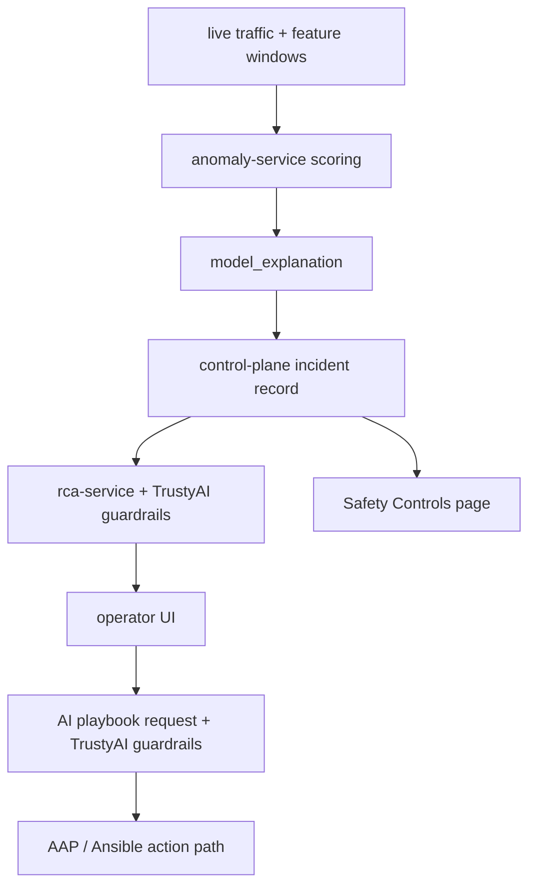
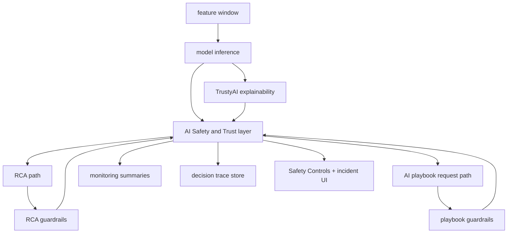
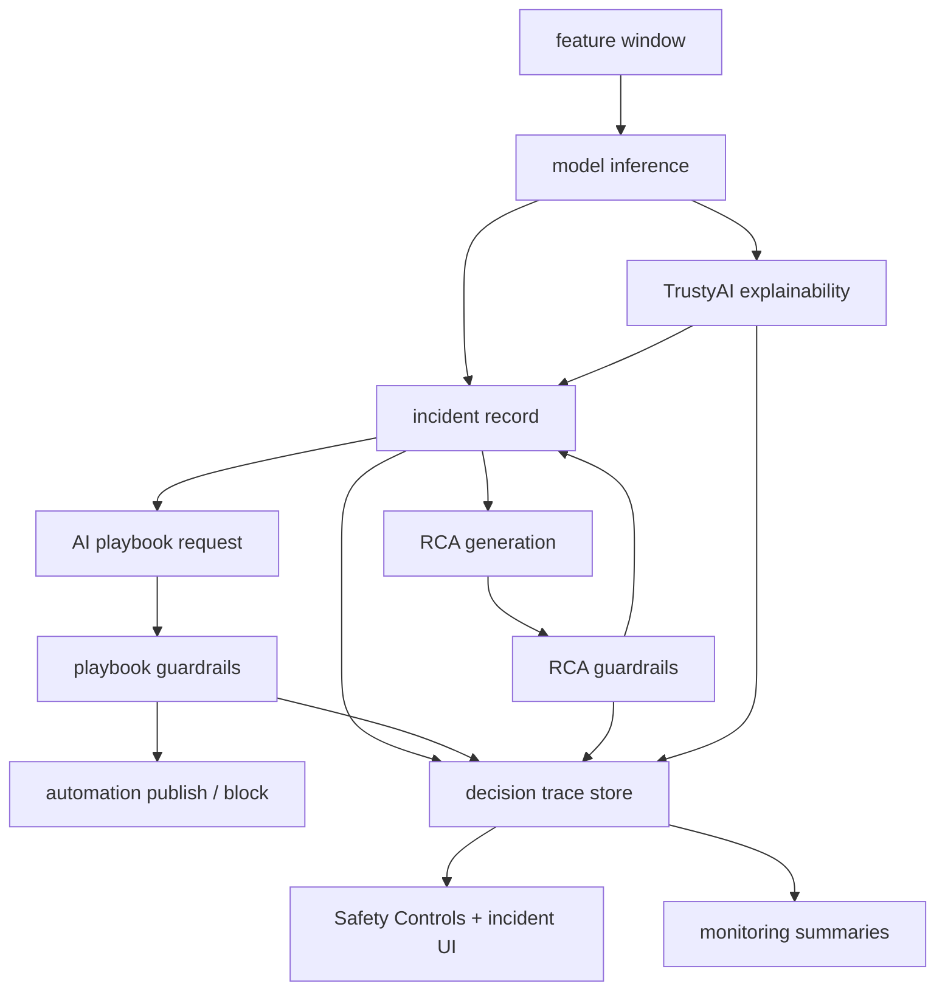

# AI Safety And Trust

## Purpose

This document defines a cross-cutting AI Safety and Trust architecture for ANI so the platform can explain predictions, validate generated content, monitor model behavior, and retain an auditable decision trace from detection through remediation.

Use this file when you need:

- the system-level design that connects TrustyAI explainability, TrustyAI guardrails, monitoring, and governance
- the target backend and storage responsibilities for the `Safety Controls` UI and incident-level trust views
- the recommended API surfaces for trust summaries, monitoring metrics, and decision-trace retrieval
- the rollout path from the current point features into a coherent enterprise trust layer

This design complements [TrustyAI Explainability for Incident Scoring](./trustyai-explainability-for-incident-scoring.md), [TrustyAI Guardrails for RCA](./trustyai-guardrails-for-rca.md), [AI playbook generation](./ai-playbook-generation.md), and [RCA and remediation](./rca-remediation.md). It does not replace those documents.

## Status

This is a proposed cross-phase engineering design.

Current runtime reality:

- live incident scoring can now attach a `model_explanation` envelope to incident records
- RCA generation already has a TrustyAI-backed guardrail boundary
- AI playbook prompt validation already has a TrustyAI-backed guardrail boundary before Kafka publish
- the demo UI now includes a `Safety Controls` page and incident-level trust surfaces
- trust data is still spread across incident records, remediation metadata, service logs, and runtime-derived summaries
- there is no single governance-oriented decision trace that spans prediction, explainability, RCA, guardrails, approval, and action
- monitoring for trust posture is still closer to demo metrics than to a formal AI trust control plane

The design goal here is to unify these pieces into a coherent AI Safety and Trust layer.

## Problem Statement

ANI already shows strong point features:

- anomaly prediction
- prediction-time explanation
- grounded RCA
- guardrailed RCA
- guardrailed AI playbook generation
- human approval before impactful action

What is still missing is a single engineering model for trust.

Today, an operator or reviewer can ask:

- why did the anomaly model choose this class
- why did guardrails allow, review, or block this output
- whether the model or feature distribution is drifting
- which version of the model, policy, and prompt path led to a given action
- who approved the final step and what was executed

Those answers exist in fragments, not as one formal trust layer.

That gap matters because:

- enterprise AI buyers expect more than a working demo; they expect explainability, safety, monitoring, and governance together
- trust posture should be inspectable before remediation, not reconstructed afterward from logs
- model and policy drift should be visible through stable metrics, not only through anecdotal incident review
- auditability should be append-only and correlation-friendly across services

ANI therefore needs a consolidated trust architecture, not just separate explainability and guardrail features.

## Scope

This document covers four trust capabilities:

1. explainability for model predictions
2. safety validation for generated RCA and AI playbook requests
3. monitoring for trust and model-health signals
4. governance through a durable decision trace

This document does not define:

- retraining pipeline changes in detail
- a new model-serving runtime
- a replacement for the current incident workflow
- a generic enterprise compliance platform beyond ANI incident operations

## Current Trust Surfaces

The current trust surfaces already map to different points in the workflow.



Important current boundaries:

- explainability is attached to the prediction path
- RCA guardrails protect the LLM-generated diagnostic path
- playbook guardrails protect the user-editable AI playbook request path
- the UI can already show trust-related status, but backend ownership is still distributed

## Target Safety And Trust Architecture

The target architecture keeps explainability and guardrails at their native workflow boundaries, but adds a unified trust aggregation and governance model above them.



The design intent is:

- explainability remains attached to prediction
- guardrails remain attached to generated or user-authored text
- monitoring aggregates trust signals over time
- governance stores one durable trace for how the system reached a decision

## Design Principles

### Keep Trust Near The Native Boundary

Each control should remain near the workflow step it validates:

- explainability near prediction
- guardrails near generation or prompt editing
- governance above the full flow

### Prefer Aggregation Over Rewrite

The trust layer should not replace `anomaly-service`, `control-plane`, or `rca-service`. It should aggregate, normalize, and persist their trust-relevant outputs.

### TrustyAI Detects, ANI Decides

TrustyAI should generate explanations and detector findings. ANI business logic should decide how those findings affect workflow and operator affordances.

### Persist The Trust Envelope

Explainability, guardrail outcomes, and decision-trace data should be persisted with stable versions and correlation IDs. The UI should not depend on transient recomputation for core trust state.

### Fail Soft For Transparency, Fail Closed For Automation

- if explainability is unavailable, detection should continue with an explicit fallback explanation state
- if guardrails are unavailable for generated content, automation should not continue as `allow`
- governance and metrics ingestion failures should never silently rewrite earlier decisions

### Start In Existing Services

The recommended first implementation keeps aggregation inside the existing platform services, especially `control-plane`. Extract a dedicated `trust-service` only when operational scope justifies it.

## Trust Capability Layers

## 1. Explainability Layer

### Purpose

Explain why the model predicted a given anomaly class.

### Current recommended boundary

- request enters `anomaly-service`
- model inference runs against the active predictive endpoint
- TrustyAI explainability is invoked if configured
- a fallback heuristic explanation is attached when TrustyAI is unavailable
- `control-plane` persists the explanation inside the incident record

### Primary operator questions answered

- what features influenced this prediction
- which features mattered most
- whether the explanation came from TrustyAI or fallback logic
- how confident the platform is in the explanation quality

### Canonical envelope

```json
{
  "provider": {
    "key": "trustyai",
    "label": "TrustyAI Explainability",
    "family": "Explainability"
  },
  "schema_version": "ani.explainability.v1",
  "status": "available",
  "prediction": {
    "anomaly_type": "registration_failure",
    "confidence": 0.90
  },
  "pattern_insight": "Retry Rate and Authentication Timeout are the dominant signals behind the Registration Failure prediction.",
  "explanation_confidence": "high",
  "top_features": [
    {
      "feature": "retry_rate",
      "label": "Retry rate",
      "impact": 0.45,
      "direction": "increase"
    }
  ]
}
```

### Repo ownership

- `services/anomaly-service/`
- `services/shared/explainability.py`
- `services/shared/model_store.py`
- `services/shared/db.py`
- `services/control-plane/`
- `services/demo-ui/components/incident-workflow-detail.tsx`

## 2. Guardrails Layer

### Purpose

Validate AI-generated or AI-directed text before it is trusted by the workflow.

### Current guardrail surfaces

- RCA output validation
- AI playbook request validation

### Recommended decision contract

```json
{
  "status": "allow",
  "provider": {
    "key": "trustyai",
    "label": "TrustyAI Guardrails",
    "family": "Guardrails"
  },
  "policy_version": "v1",
  "reason": "validated",
  "violations": [],
  "detectors": [
    {
      "name": "prompt_injection",
      "result": "pass"
    }
  ]
}
```

### Required persisted fields

- `incident_id`
- `workflow_revision`
- `rca_request_id` or `correlation_id`
- `provider`
- `status`
- `reason`
- `policy_version`
- `violations`
- `updated_at`

### Repo ownership

- `services/shared/guardrails.py`
- `services/rca-service/`
- `services/control-plane/`
- `services/demo-ui/`
- runtime config in `k8s/base/platform/` and `k8s/overlays/gitops/runtime/`

## 3. Monitoring Layer

### Purpose

Track whether the AI system remains healthy, safe, and explainable over time.

### What to monitor

#### Model health

- prediction distribution by anomaly type
- confidence distribution
- operator-confirmed false-positive or false-negative signals when available

#### Data and feature drift

- feature baseline vs current distribution
- feature-window outliers
- per-feature drift score for selected high-value signals

#### Guardrail posture

- RCA allow/review/block totals
- playbook allow/review/block totals
- prompt injection detection count
- guardrail timeout and degraded-mode rate

#### Explainability posture

- TrustyAI explanation success rate
- fallback explanation rate
- top explained features by anomaly type

### Recommended storage model

The first production-ready version should support both:

- low-latency operational metrics in Prometheus-compatible counters and histograms
- durable product-facing summaries in relational storage

Illustrative relational table:

```sql
CREATE TABLE ai_metrics (
  id SERIAL PRIMARY KEY,
  metric_type TEXT NOT NULL,
  metric_name TEXT NOT NULL,
  dimension_json JSONB NOT NULL DEFAULT '{}'::jsonb,
  value DOUBLE PRECISION NOT NULL,
  observed_at TIMESTAMPTZ NOT NULL DEFAULT NOW()
);
```

Examples:

- `metric_type=guardrail`, `metric_name=playbook_block_count`
- `metric_type=drift`, `metric_name=retry_rate_drift_score`
- `metric_type=explainability`, `metric_name=fallback_rate`

### Recommended API surface

```http
GET /trust/summary
GET /trust/monitoring
GET /trust/monitoring/incident-types
```

The first implementation can keep these inside `control-plane`. A dedicated `trust-service` is optional later.

## 4. Governance Layer

### Purpose

Provide a durable, queryable decision trace from prediction through human approval and action.

### Canonical flow

```text
Prediction -> Explanation -> RCA -> Guardrails -> Human -> Action -> Verification
```

### Recommended record model

Each incident should accumulate an append-only trust trace rather than relying on one mutable status blob.

Illustrative table:

```sql
CREATE TABLE ai_decision_trace (
  id SERIAL PRIMARY KEY,
  incident_id TEXT NOT NULL,
  workflow_revision INTEGER NOT NULL,
  stage TEXT NOT NULL,
  trace_id TEXT,
  correlation_id TEXT,
  model_version TEXT,
  provider_key TEXT,
  decision_json JSONB NOT NULL,
  actor TEXT,
  action_taken TEXT,
  created_at TIMESTAMPTZ NOT NULL DEFAULT NOW()
);
```

Illustrative stages:

- `prediction`
- `explainability`
- `rca_generation`
- `rca_guardrails`
- `playbook_guardrails`
- `human_override`
- `automation_execution`
- `verification`

### Required correlation fields

- `incident_id`
- `workflow_revision`
- `trace_id`
- `project`
- `rca_request_id` for RCA
- `correlation_id` for playbook generation

### Recommended API surface

```http
GET /trust/incident/{incident_id}
GET /trust/incident/{incident_id}/trace
GET /decision-trace/{incident_id}
```

The public UI can use the trust incident view. Internal operators and future export workflows can use the full decision trace.

## Backend Service Responsibilities

### Recommended near-term ownership

Keep the first version inside current services:

- `anomaly-service`
  - compute or request explainability
  - attach explanation envelope to scoring response
- `rca-service`
  - enforce RCA trust boundary
  - return authoritative guarded RCA payload
- `control-plane`
  - aggregate trust state
  - persist governance events
  - expose trust summary and incident trust APIs
- `demo-ui`
  - render incident trust surfaces and system-level trust summaries

### Optional extracted service: `trust-service`

Create a dedicated `trust-service` only if ANI needs:

- multiple independent consumers of trust APIs
- separate scaling and ownership for trust aggregation
- more complex drift computation or export pipelines
- tenant-aware trust routing beyond current project scoping

If extracted later, the initial endpoints should remain stable:

```http
GET /trust/summary
GET /trust/monitoring
GET /trust/governance
GET /trust/incident/{id}
```

## UI Integration

### Incident detail page

Required trust sections:

- `Model Explanation`
- RCA safety state
- playbook prompt safety state
- AI decision trace

Recommended behavior:

- explainability appears before RCA and remediation action controls
- guardrail status appears where the user is deciding whether to trust generated content
- decision trace remains secondary but discoverable

### Safety Controls page

The `Safety Controls` page should evolve into the system-wide trust view.

Recommended sections:

- guardrail policy and provider status
- explainability provider status and fallback rate
- trust monitoring metrics
- recent blocked and review-required decisions
- governance export or trace drilldown entry points

## Data Flow



## Failure Behavior

### Explainability unavailable

- continue incident creation
- persist a fallback explanation or explicit unavailable state
- count the event in monitoring

### Guardrails unavailable

- do not silently continue as `allow`
- degrade to `require_review` or `block` based on the guarded path
- record the failure in the decision trace

### Monitoring ingestion delayed

- do not block core incident flow
- keep operational metrics eventually consistent
- preserve decision-trace durability as the higher-priority store

### Governance storage degraded

- never rewrite earlier trace records
- prefer append retry or dead-letter handling over silent drop

## Rollout Plan

### Phase 1: Unify Existing Trust Features

- keep explainability, RCA guardrails, and playbook guardrails in their current services
- expose one normalized trust summary through `control-plane`
- standardize correlation IDs and provider metadata

### Phase 2: Add Monitoring Persistence

- store trust summaries and drift metrics in relational tables
- expand the `Safety Controls` page to show explainability and guardrail health over time

### Phase 3: Add Governance Trace

- persist append-only `ai_decision_trace` records
- add incident-level trust timeline and export API

### Phase 4: Optional Trust-Service Extraction

- extract aggregation from `control-plane` only if trust workflows justify a dedicated service

## Security And Audit

Required controls:

- record who approved or overrode high-impact decisions
- retain model version, policy version, and provider identity with each trust event
- keep trust exports scoped by `project`
- redact secrets and sensitive request content before log or metric persistence
- prefer append-only governance records for audit-sensitive flows

## Demo Mapping

This design should let ANI present one coherent story:

1. the model predicts an incident
2. TrustyAI explains why
3. TrustyAI guardrails validate generated RCA and AI playbook requests
4. the UI shows whether the system is healthy, safe, and reviewable
5. the operator can inspect the full trust trace before approving action

That is the step from “AI-assisted demo” to “governed AI platform.”

## Repo Touchpoints

Expected implementation work for this design spans:

- `services/anomaly-service/`
- `services/control-plane/`
- `services/rca-service/`
- `services/shared/explainability.py`
- `services/shared/guardrails.py`
- `services/shared/db.py`
- `services/demo-ui/app/safety/`
- `services/demo-ui/components/incident-workflow-detail.tsx`
- `k8s/base/platform/`
- `k8s/overlays/gitops/runtime/`

## Related Docs

- [Architecture by phase](./README.md)
- [Engineering specification](./engineering-spec.md)
- [Phase 07 Overview — Real-Time Detection and RCA](./phase-07-overview-real-time-detection-and-rca.md)
- [Phase 08 Overview — Remediation](./phase-08-overview-remediation.md)
- [TrustyAI Explainability for Incident Scoring](./trustyai-explainability-for-incident-scoring.md)
- [TrustyAI Guardrails for RCA](./trustyai-guardrails-for-rca.md)
- [AI playbook generation](./ai-playbook-generation.md)
- [RCA and remediation](./rca-remediation.md)
