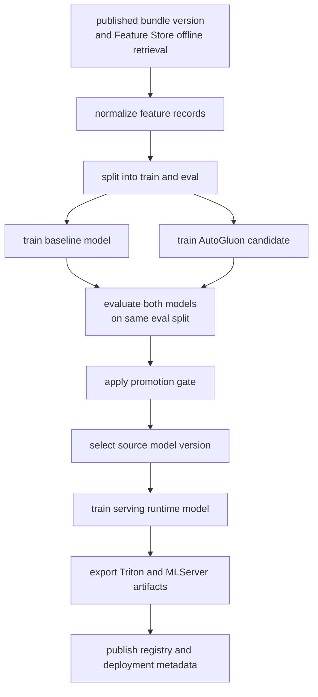

# AutoGluon Training And Model Selection

## Purpose

This document explains how the Phase 3 training pipeline builds a dataset, trains the baseline and AutoGluon candidate models, evaluates both on the same held-out split for direct 12-class incident classification, selects a source model version, and then hands that decision off to a serving-friendly runtime artifact.

## Status

AutoGluon remains the candidate-model engine in the training code, but the preferred cluster workflow is now the feature-store KFP path: `ani-feature-bundle-publish` prepares the bundle, `ani-featurestore-train-and-register` retrieves the training frame through Feature Store, compares the baseline and AutoGluon on canonical `anomaly_type`, and then exports serving-friendly multiclass runtime artifacts for Triton and MLServer instead of deploying the raw AutoGluon predictor directly.

## End-To-End Flow

## Training Data Source

The preferred cluster pipeline starts from a published `bundle_version`, syncs the Feature Store repo, and retrieves the training frame through Feast using feature service `ani_anomaly_scoring_v1`.

Current behavior:

- the feature-store KFP path trains from persisted bundle data retrieved through the Feature Store offline store
- the feature-store KFP path requires the full 12-class taxonomy to meet minimum per-class coverage and fails fast if a class is missing or underfilled
- the older MinIO-backed trainer can still fall back to a synthetic 12-class bootstrap dataset for local or bootstrap-oriented runs

The model contract uses the same nine numeric features throughout training and scoring:

- `register_rate`
- `invite_rate`
- `bye_rate`
- `error_4xx_ratio`
- `error_5xx_ratio`
- `latency_p95`
- `retransmission_count`
- `inter_arrival_mean`
- `payload_variance`

The supervised target is canonical `anomaly_type`:

- `normal_operation`
- `registration_storm`
- `registration_failure`
- `authentication_failure`
- `malformed_sip`
- `routing_error`
- `busy_destination`
- `call_setup_timeout`
- `call_drop_mid_session`
- `server_internal_error`
- `network_degradation`
- `retransmission_spike`

The binary `label` field is still retained as a derived convenience field, but runtime incident creation now uses `predicted_anomaly_type != normal_operation` instead of a threshold crossing against a binary model.

## First Training Run

There are now two distinct first-run behaviors.

For the feature-store KFP path:

- publish or refresh a bundle
- retrieve the training frame through Feature Store
- require every canonical class to meet the minimum coverage rule
- fail fast if taxonomy coverage is incomplete instead of silently inventing labels

For the legacy MinIO-backed helper path:

- if the live dataset is too small, bootstrap synthetic rows can still be generated
- baseline and AutoGluon are then compared on that same train and eval split

This distinction matters because the current cluster-native workflow is intentionally stricter than the local and bootstrap helper path.

## Dataset Split And Evaluation Frame

The pipeline creates one training split and one evaluation split before either model is trained.

Current split behavior:

- records are grouped by `anomaly_type`
- each group is shuffled independently
- each group is split approximately `70%` train and `30%` eval
- if a group has only one record, that record stays in train
- the combined train and eval sets are shuffled again before training and evaluation

This matters because both models are evaluated on the same held-out data rather than on separate or ad hoc samples.

## Baseline Model Path

The baseline model is the first reference model in the pipeline. It is not a previous champion model from production.

The current baseline implementation is `baseline_multiclass_logistic_regression`.

Conceptually it works like this:

- train a multinomial logistic-regression classifier directly on canonical `anomaly_type`
- scale the nine numeric features with `StandardScaler`
- emit a full 12-class probability vector for each feature window
- derive `predicted_anomaly_type`, `predicted_confidence`, and `anomaly_score = 1 - P(normal_operation)`

The baseline serves two roles:

- provide a deterministic first comparison point
- remain available as a fallback if the AutoGluon candidate does not justify promotion

## AutoGluon Candidate Path

The AutoGluon candidate is trained from the same train split used by the baseline model.

The current trainer invokes AutoGluon as a multiclass tabular task with:

- `problem_type="multiclass"`
- `eval_metric="f1_macro"`
- `IMS_AUTOGLUON_PRESET`, default `medium_quality`
- `IMS_AUTOGLUON_TIME_LIMIT`, default `180`

The current implementation still lets AutoGluon decide which tabular model families to try inside the selected preset and time budget. The internal winner of that search is recorded in `best_model`.

This means the AutoGluon candidate path is an AutoML search process, not a fixed single algorithm hardcoded by the repo.

## Evaluation Metrics

After training, both the baseline artifact and the AutoGluon artifact are evaluated on the same held-out eval split.

Each artifact produces a multiclass probability distribution. The evaluation step converts that into `predicted_anomaly_type`, `predicted_confidence`, and a derived `anomaly_score`, then compares predictions against the held-out canonical label.

The current evaluation manifest records:

- macro precision
- macro recall
- macro F1
- weighted F1
- balanced accuracy
- per-class precision and recall
- confusion matrix
- normal-operation false alarm rate
- multiclass log loss and average predicted confidence
- latency p95
- stability score

Current implementation note:

- class metrics, confusion output, and calibration summaries are computed from the eval split
- `latency_p95_ms` is measured from the local evaluation loop
- `stability_score` is derived from how evenly per-class recall holds up across the taxonomy

## Promotion Gate And Winner Selection

The pipeline does not automatically promote the AutoGluon candidate just because AutoGluon found an internal best model.

The current promotion gate checks:

- macro F1 >= `0.65`
- weighted F1 >= `0.75`
- balanced accuracy >= `0.65`
- minimum per-class recall >= `0.45`
- normal-operation false alarm rate <= `0.2`
- multiclass log loss <= `2.5`
- latency p95 <= `50 ms`
- stability score >= `0.85`

The current winner-selection rule is:

- keep the baseline by default
- promote the AutoGluon candidate only if it passes the promotion gate and its `macro_f1` is at least as good as the baseline, with `weighted_f1` used as the tie-breaker
- otherwise retain the baseline

A verified feature-store KFP run already exercised this logic and kept the baseline because the AutoGluon candidate failed the latency and stability gate checks even though its aggregate quality metrics were slightly higher.

The practical comparison is therefore:

- baseline model trained in the current run
- versus AutoGluon candidate trained in the current run
- on the same eval split

## Serving Handoff After Selection

Model selection does not immediately deploy the winning training artifact as-is.

After the pipeline chooses a source model version, it trains a separate serving-oriented multinomial logistic runtime using:

- `StandardScaler`
- `LogisticRegression`

That serving runtime is exported as:

- a Triton repository for `ani-predictive-fs`
- an MLServer sklearn bundle for `ani-predictive-fs-mlserver`

Both exports are published to versioned storage paths and stable `current` aliases. The selected source model version remains the lineage parent recorded in metadata and the model registry.

## Model Identity Terms

The training and deployment lifecycle uses several related identifiers.

### `best_model`

The internal winner reported by AutoGluon inside one candidate training run.

### `selected_model_version`

The source model version chosen by the pipeline after evaluation and promotion-gate checks.

### `deployment_source_model_version`

The selected source version recorded as the lineage parent of the serving export.

### `deployed_model_version`

The runtime artifact version actually exported for serving and referenced by deployment metadata.

## Current Bootstrap And Cluster Snapshot

The repo still carries the older bootstrap artifacts for the legacy Triton bundle under `ai/models/serving/predictive/ims-predictive/` (served in-cluster as `ani-predictive`), including checked-in `baseline-v1` and `predictive-serving-v1` entries. Those remain useful for local bootstrap and compatibility checks.

The live feature-store rollout adds a separate cluster-native path:

- model registry name `ani-anomaly-featurestore`
- Triton serving target `ani-predictive-fs`
- MLServer serving target `ani-predictive-fs-mlserver`
- versioned object-store exports under `predictive-featurestore/...` and `predictive-featurestore-mlserver/...`

Treat those serving target names as deployment topology. They are not the same thing as `best_model`, `selected_model_version`, or the raw AutoGluon predictor identity.

## Repo Touchpoints

- `ai/training/train_and_register.py`
- `ai/training/featurestore_train.py`
- `ai/pipelines/ani_featurestore_pipeline.py`
- `ai/models/artifacts/baseline-v1.json`
- `ai/models/serving/predictive/ims-predictive/1/weights.json`
- `ai/registry/model_registry.json`
- `services/shared/model_store.py`

## Why It Matters

This separation between baseline training, AutoGluon candidate search, pipeline-level selection, and serving export keeps the first training run understandable and keeps later promotion decisions auditable. Without that separation, it is easy to confuse AutoGluon's internal winner with the artifact actually used by the serving runtime.

## Related Docs

- [Phase 03 Overview](./phase-03-overview-model-training-kfp.md)
- [Feature store training path](./feature-store-training-path.md)
- [Phase 05 Overview](./phase-05-overview-model-serving.md)
- [Engineering specification](./engineering-spec.md)
