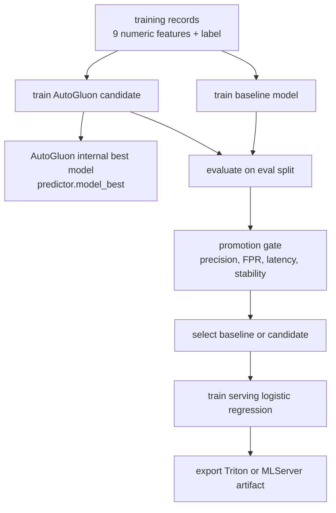

# AutoGluon Training And Model Selection

## Purpose

This document explains how the training pipeline uses AutoGluon, how the pipeline decides whether the AutoGluon candidate should beat the baseline model, and why the final serving artifact is not the same thing as AutoGluon's internal best model.

## Status

AutoGluon is the current candidate-model engine in the training code. The serving path still exports a serving-friendly runtime artifact after selection instead of deploying the raw AutoGluon predictor directly.

## What This Doc Covers

- how the training frame is built for AutoGluon
- how AutoGluon chooses candidate algorithms
- how the baseline and AutoGluon candidate are compared
- why `best_model`, `selected_model_version`, and `deployed_model_version` are different concepts
- what the checked-in repo currently shows as the selected and deployed model state

## Selection Flow

## AutoGluon Training Inputs

The current AutoGluon path trains on the same nine numeric features used by the anomaly contract:

- `register_rate`
- `invite_rate`
- `bye_rate`
- `error_4xx_ratio`
- `error_5xx_ratio`
- `latency_p95`
- `retransmission_count`
- `inter_arrival_mean`
- `payload_variance`

The supervised target is the binary `label` field:

- `0` = normal
- `1` = anomaly

The current trainer calls AutoGluon as a binary tabular problem:

- `problem_type="binary"`
- `IMS_AUTOGLUON_PRESET`, default `medium_quality`
- `IMS_AUTOGLUON_TIME_LIMIT`, default `180`

Important current behavior:

- the code does not pass an explicit `hyperparameters` map
- the code does not pass an explicit AutoGluon `eval_metric`
- AutoGluon therefore chooses which tabular model families to try within the preset and time budget

## How AutoGluon Chooses The Algorithm

The pipeline does not pin AutoGluon to one algorithm such as XGBoost, Random Forest, or KNN. Instead, `TabularPredictor.fit()` runs the AutoML search and records the internal winner in `predictor.model_best`.

That means the AutoGluon answer to "which algorithm won?" is:

- whatever model or ensemble AutoGluon ranked highest inside that run

In the current checked-in candidate artifact, the stored AutoGluon winner is:

- `best_model = WeightedEnsemble_L2`

The stored leaderboard also shows other attempted model entries such as:

- `KNeighbors`
- `RandomForest`
- `ExtraTrees`

So the current AutoGluon candidate is best understood as:

- an AutoGluon tabular run
- with an internal winner of `WeightedEnsemble_L2`
- not a single hand-picked fixed algorithm hardcoded by the repo

## Pipeline Selection After AutoGluon

AutoGluon winning its own leaderboard is only the first decision. The pipeline then compares:

- a baseline threshold model
- an AutoGluon candidate model

The promotion gate currently checks:

- precision >= `0.8`
- false positive rate <= `0.2`
- latency p95 <= `50 ms`
- stability score >= `0.85`

The selection rule is:

- choose the AutoGluon candidate only if it passes the promotion gate and its `f1` is at least as good as the baseline
- otherwise keep the baseline

So the pipeline answer to "which model won?" is:

- whichever artifact satisfies the gate and wins the baseline-versus-candidate comparison

## Serving Export After Selection

The repo has one more step after winner selection that is easy to miss.

After the pipeline selects the source model version, it trains a separate serving model using:

- `StandardScaler`
- `LogisticRegression`

That serving model is then exported as:

- a Triton repository in the legacy path
- a Triton or MLServer serving bundle in the feature-store path

This means the deployed runtime artifact is not the raw AutoGluon predictor. The selected AutoGluon candidate is treated as the winning source model for promotion metadata, but the served artifact is a separate serving-oriented model package.

## Three Layers To Keep Separate

There are three different answers to "which model are we using?":

### 1. AutoGluon Internal Winner

This is AutoGluon's own best model inside the candidate run:

- field: `best_model`
- current checked-in value: `WeightedEnsemble_L2`

### 2. Pipeline-Selected Source Model

This is the training winner chosen by the evaluation and promotion gate:

- field: `selected_model_version`
- current checked-in repo value: `candidate-v1`

### 3. Deployed Runtime Artifact

This is the artifact actually exported for serving:

- field: `deployed_model_version`
- current checked-in repo value: `predictive-serving-v1`
- runtime kind: `triton_python_logistic_regression`

## Current Checked-In Repo Snapshot

The checked-in repo currently shows the following legacy registry state:

- `selected_model_version = candidate-v1`
- `deployment_source_model_version = candidate-v1`
- `deployed_model_version = predictive-serving-v1`

The corresponding model entries show:

- `candidate-v1` -> `autogluon_tabular`
- `candidate-v1.best_model` -> `WeightedEnsemble_L2`
- `predictive-serving-v1` -> `triton_python_logistic_regression`
- `predictive-serving-v1.source_model_version` -> `candidate-v1`

Interpretation:

- the AutoGluon candidate currently wins the training selection in the checked-in registry snapshot
- the deployed legacy runtime artifact is still a Triton logistic regression serving package

One more rollout detail matters: the repo also contains the newer `ims-predictive-fs` serving path for the feature-store rollout. That serving target name is a deployment concern and should not be confused with the AutoGluon selection logic itself.

## Repo Touchpoints

- `ai/training/train_and_register.py`
- `ai/training/featurestore_train.py`
- `ai/models/artifacts/candidate-v1.json`
- `ai/registry/model_registry.json`
- `services/shared/model_store.py`

## Why It Matters

Without separating these layers, it is easy to assume that "AutoGluon chose WeightedEnsemble_L2" means "that exact ensemble is what Triton is serving in production." In this repo, those are related but different lifecycle stages.

## Related Docs

- [Phase 03 Overview](./phase-03-overview-model-training-kfp.md)
- [Feature store training path](./feature-store-training-path.md)
- [Phase 05 Overview](./phase-05-overview-model-serving.md)
- [Engineering specification](./engineering-spec.md)
