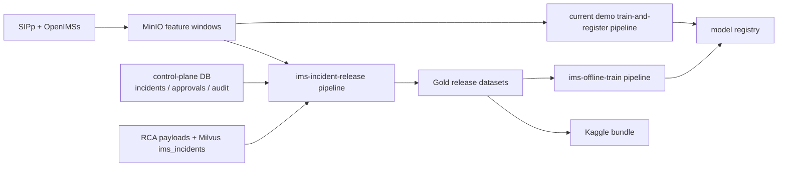

# IMS Incident Release Corpus and Kaggle Training Workflow

## 1. Purpose

This document defines the final production design for the public data-release path of the IMS anomaly platform.

The objective is to produce a Kaggle-ready incident corpus from the data that the platform already persists today, while also creating a clean interface for offline model training and new model-family experimentation.

This workflow must:

- export all existing incidents already stored by the running platform
- preserve linkage to live SIPp/OpenIMS-derived feature windows when available
- package a public, documented, reproducible Kaggle release
- feed a separate offline training workflow that is not coupled to live model deployment

This document intentionally does **not** define a synthetic/scenario data factory, Kafka event bus, or fault-injection platform. Those are separate systems and must not be mixed into the public release corpus workflow.

The implemented runtime may optionally mirror bronze snapshot events and release publication notifications to Kafka for downstream integration. That mirror path is non-authoritative and must never replace the object-storage snapshot, release manifest, validation gates, or published release artifacts.

## 2. Scope

In scope:

- feature-window export from MinIO
- historical incident backfill from the control-plane database
- RCA enrichment export from the control-plane store and Milvus-backed incident documents
- normalization, taxonomy mapping, privacy redaction, and parquet generation
- deterministic split generation for offline model evaluation
- Kaggle bundle packaging and publication contract
- codebase changes required to support offline model families cleanly

Out of scope:

- new synthetic incident generation frameworks
- Kafka-based raw event replay
- network fault injection orchestration
- live serving deployment and runtime rollout
- UI or dashboard design

## 3. Final Boundary

The architecture is split into three distinct flows.



Operationally:

- the current demo pipeline continues to keep the live demo model working
- the new release pipeline owns public corpus creation and Kaggle packaging
- the new offline training pipeline owns model-family experimentation and evaluation

## 4. Source of Truth

The final release workflow is based only on persisted platform artifacts.

| Source | Repository implementation | Role in release workflow |
| --- | --- | --- |
| Feature windows | `services/sipp-runner/run_scenario.py` uploads JSON windows to MinIO under `pipelines/ims-demo-lab/datasets/datasets/<dataset_version>/feature-windows/...` | Primary model-training feature source |
| Incident store | `services/shared/db.py` stores `incidents`, `approvals`, and `audit_events` in the control-plane database | System of record for all historical incidents and operator workflow history |
| RCA enrichment | `services/rca-service/app.py` attaches RCA payloads to incidents and publishes documents to Milvus collection `ims_incidents` | Root-cause, evidence, and retrieval context enrichment |
| Model metadata | `services/shared/model_registry.py` and `ai/registry/model_registry.json` | Feature schema, dataset lineage, selected model, and serving metadata |

Source-of-truth order:

1. control-plane database for incident existence and status
2. MinIO feature windows for training features
3. control-plane RCA payload for incident explanation
4. Milvus `ims_incidents` documents as supplemental enrichment only

Milvus is not authoritative for whether an incident exists.

## 5. Source Snapshot Model

Every release run must start by creating an immutable source snapshot.

Required snapshot properties:

- one `source_snapshot_id`
- one `snapshot_cutoff_ts`
- one consistent export of all incident, approval, and audit rows up to that cutoff
- one MinIO listing of all included feature windows
- one enrichment export of RCA and Milvus documents available at the same cutoff

Rules:

- releases are built from snapshots, not from live mutable reads across the whole pipeline
- the snapshot manifest is the reproducibility anchor for the release
- if Milvus lags behind the control-plane store, the release continues and records the lag explicitly

### 5.1 Release Modes

The workflow supports two operating modes:

- `full_snapshot`
- `incremental_append`

Rules:

- every public Kaggle bundle must be materialized as a logically complete `full_snapshot` release
- `incremental_append` may be used as an internal optimization for intermediate processing, but it must still roll up into a complete gold release before publication
- the release manifest must record which mode was used and which previous release, if any, was used as a comparison baseline

## 6. Dataset Identity and Versioning

The workflow must use strict, non-overlapping identifiers.

| Field | Meaning |
| --- | --- |
| `release_version` | Version of the public dataset bundle, for example `ims-incident-corpus-2026-04` |
| `source_snapshot_id` | Immutable snapshot identifier for the exact export run |
| `source_dataset_version` | Original live feature-window dataset version, such as `live-sipp-v1` |
| `feature_schema_version` | Version of the flattened numeric feature schema |
| `label_taxonomy_version` | Version of anomaly-type normalization and label mapping |
| `split_policy_version` | Version of deterministic train/validation/test split logic |
| `privacy_policy_version` | Version of public-field allowlist and redaction rules |
| `model_contract_version` | Version of the offline training artifact contract |

Rules:

- `release_version` is for public publication and must not be reused for a different bundle
- `source_snapshot_id` changes on every release attempt
- one release may contain more than one `source_dataset_version`
- `dataset_version` from the live demo path is not sufficient as the public release identity

### 6.1 Schema Evolution Rules

Schema changes must be explicit and versioned.

Rules:

- additive columns require a `feature_schema_version` bump
- column removal requires a major schema version bump
- data type changes require a major schema version bump
- semantic meaning changes for an existing column require a major schema version bump
- public release generation must fail if the declared schema version and the actual output schema disagree

### 6.2 Dataset Contract

The release workflow must distinguish stable and unstable properties.

Stable within a schema and taxonomy version:

- public column names
- public column meanings
- label taxonomy mapping rules
- split policy behavior
- release manifest structure

Expected to change between releases:

- row counts
- anomaly-type distribution
- feature distributions
- incident volume
- join coverage

## 7. Release Manifest

Every published bundle must contain a `release_manifest.json` file.

The manifest must include at least:

- `release_version`
- `source_snapshot_id`
- `release_mode`
- `previous_release_version`
- `generated_at`
- `git_commit`
- `container_images`
- `feature_schema_version`
- `label_taxonomy_version`
- `split_policy_version`
- `privacy_policy_version`
- `source_dataset_versions`
- `row_counts` by bronze, silver, and gold layer
- `incident_counts` by status and anomaly type
- `join_coverage`
- `eligibility_counts`
- `filtered_counts`
- `distribution_drift`
- `validation_results`
- `publishing_status`
- `artifact_uris`

Recommended structure:

```json
{
  "release_version": "ims-incident-corpus-2026-04",
  "source_snapshot_id": "snapshot-2026-04-01T12:00:00Z",
  "release_mode": "full_snapshot",
  "previous_release_version": "ims-incident-corpus-2026-03",
  "generated_at": "2026-04-01T12:42:17Z",
  "git_commit": "abc1234",
  "feature_schema_version": "feature_schema_v1",
  "label_taxonomy_version": "label-taxonomy-v1",
  "split_policy_version": "split-policy-v1",
  "privacy_policy_version": "privacy-allowlist-v1",
  "model_contract_version": "offline-model-contract-v1",
  "source_dataset_versions": ["live-sipp-v1"],
  "row_counts": {
    "bronze_feature_windows": 12493,
    "bronze_incidents": 157,
    "gold_incident_history": 157,
    "gold_training_examples": 12493
  },
  "join_coverage": {
    "incident_to_feature_window_ratio": 0.91
  },
  "eligibility_counts": {
    "eligible": 11820,
    "ineligible_missing_features": 522,
    "ineligible_ambiguous_label": 151
  },
  "distribution_drift": {
    "anomaly_type_delta_vs_previous_release": "reported"
  }
}
```

## 8. Dataset Layers

### 8.1 Bronze

Bronze is the immutable export of persisted sources.

Bronze content:

- exported feature-window JSON from MinIO
- exported `incidents` rows from the control-plane database
- exported `approvals` rows
- exported `audit_events` rows
- exported RCA payload snapshots
- exported Milvus `ims_incidents` documents when available

Important:

- bronze is structured JSON and table export, not raw SIP trace capture
- this is intentional because the current code persists feature windows, not full trace archives

### 8.2 Silver

Silver is the normalized internal working layer.

Silver content:

- normalized incident rows
- normalized feature-window rows
- incident-to-window link table
- normalized RCA fields
- taxonomy-mapped labels
- public-ID mapping table
- privacy scrub results

### 8.3 Gold

Gold is the public release layer.

Gold artifacts:

- `ims_incident_history.parquet`
- `ims_training_examples.parquet`
- `ims_training_examples_balanced.parquet`
- `train_split_manifest.parquet`
- `validation_split_manifest.parquet`
- `test_split_manifest.parquet`
- `dataset_card.md`
- `schema.json`
- `feature_dictionary.csv`
- `label_dictionary.csv`
- `quality_report.json`
- `release_manifest.json`

## 9. Historical Incident Inclusion

Historical inclusion is mandatory.

The release workflow must export all existing control-plane incidents, including:

- `open`
- `acknowledged`
- `resolved`

No incident may be silently dropped from `ims_incident_history.parquet`.

The first release stage must export:

- incident identifiers
- project
- status
- anomaly score
- anomaly type
- model version
- feature window identifier when present
- feature snapshot when present
- RCA payload and recommendation when present
- created and updated timestamps
- linked approvals
- linked audit events

If an incident is missing downstream enrichment:

- missing Milvus document does not remove it from the release
- missing RCA payload does not remove it from the release
- missing feature window does not remove it from the release

Instead, the release must mark the relevant status fields explicitly.

## 10. Public Dataset Products

The public release should not force one file to serve every purpose.

### 10.1 `ims_incident_history.parquet`

One row per incident.

Purpose:

- incident analytics
- retrieval experiments
- RCA evaluation
- release-wide historical audit of platform outcomes

Public fields must be allowlisted and safe. Recommended columns:

- `incident_public_id`
- `source_snapshot_id`
- `status`
- `anomaly_type`
- `source_anomaly_type`
- `anomaly_score`
- `model_version`
- `feature_window_public_id`
- `feature_window_available_flag`
- `rca_available_flag`
- `milvus_sync_status`
- `approval_count`
- `latest_audit_event_type`
- `created_at`
- `updated_at`
- `register_rate`
- `invite_rate`
- `bye_rate`
- `error_4xx_ratio`
- `error_5xx_ratio`
- `latency_p95`
- `retransmission_count`
- `inter_arrival_mean`
- `payload_variance`
- `rca_root_cause_redacted`
- `rca_confidence`
- `rca_recommendation_redacted`

The public incident-history file must **not** include raw internal payload JSON by default.

Internal raw fields such as:

- original incident UUID
- raw `feature_snapshot`
- raw RCA payload
- raw audit payload
- raw Milvus content

must remain in bronze or silver only.

### 10.2 `ims_training_examples.parquet`

One row per training candidate.

Recommended unit:

- one feature window, enriched with linked incident metadata when available

This file may include both usable and unusable rows, but every row must carry a deterministic eligibility status.

Required columns:

- `record_public_id`
- `incident_public_id`
- `feature_window_public_id`
- `source_snapshot_id`
- `release_version`
- `source_dataset_version`
- `feature_schema_version`
- `label_taxonomy_version`
- `split_group_id`
- `scenario_name`
- `source_anomaly_type`
- `anomaly_type`
- `label`
- `label_confidence`
- all numeric feature columns
- `linkage_status`
- `training_eligibility_status`
- `model_version`

### 10.3 `ims_training_examples_balanced.parquet`

This is a convenience artifact for researchers and starter notebooks.

Rules:

- derived only from `eligible` rows
- balanced by normalized anomaly type according to publication policy
- never treated as the system of record

### 10.4 Dataset Card Requirements

The published `dataset_card.md` must include:

- dataset origin and source systems
- snapshot and release identity
- public-field and privacy policy summary
- label taxonomy summary
- linkage and eligibility policy
- intended use cases
- non-goals
- known limitations and bias considerations
- reproducibility notes
- contact and ownership information

## 11. Linkage and Eligibility Rules

Every training row must have both a linkage status and an eligibility status.

### 11.1 `linkage_status`

Allowed values:

- `linked_feature_window`
- `reconstructed_from_incident_snapshot`
- `no_feature_data`

### 11.2 Reconstruction Policy

`reconstructed_from_incident_snapshot` exists for historical traceability, not for trusted training.

Rules:

- reconstruction may use only explicitly allowlisted structured incident fields
- free-text RCA content must never be used to reconstruct model features
- reconstructed rows must not be treated as equivalent to linked feature windows
- for this workflow, `reconstructed_from_incident_snapshot` rows are always assigned `training_eligibility_status = ineligible_missing_features`
- reconstructed rows may remain in `ims_training_examples.parquet` for auditability, but they must never appear in split manifests or balanced training export

### 11.3 `training_eligibility_status`

Allowed values:

- `eligible`
- `ineligible_missing_features`
- `ineligible_ambiguous_label`

Rules:

- all rows in `ims_training_examples.parquet` must have one of these three values
- only `eligible` rows may appear in split manifests and balanced training export
- incidents with missing features still appear in `ims_incident_history.parquet`
- incidents with ambiguous taxonomy mapping still appear in `ims_incident_history.parquet`

## 12. Label Taxonomy

The release pipeline must normalize labels from the current platform taxonomy.

At minimum, the normalized taxonomy must support current observed values such as:

- `normal`
- `registration_storm`
- `malformed_sip`

Rules:

- preserve the original label in `source_anomaly_type`
- publish the normalized label in `anomaly_type`
- ship a `label_dictionary.csv` with all mappings
- version the mapping with `label_taxonomy_version`
- never expose generation-only helper fields as model features

## 13. Deterministic Split Policy

Split behavior must be mandatory, deterministic, and persisted.

The split unit is `split_group_id`, not the individual row.

`split_group_id` must be derived from stable lineage fields:

- incident lineage key when an incident exists
- normalized scenario family
- time bucket

Recommended derivation:

```text
split_group_id = sha256(
  incident_or_window_lineage_key +
  "|" + normalized_scenario_family +
  "|" + utc_week_bucket
)
```

Required rules:

- the same `split_group_id` may not appear across more than one split
- split assignment must use stable hashing, not random runtime sampling
- split manifests must be written as release artifacts
- offline model metrics are invalid if the split manifests are not used

Default split ratio:

- train: 70%
- validation: 15%
- test: 15%

## 14. Privacy and Public Release Controls

Kaggle publication must use an allowlist-based export model.

Production rules:

- public export is built only from approved columns defined in `schema.json`
- denylist-only scrubbing is not sufficient
- unexpected columns fail the release
- internal UUIDs must be replaced by stable public IDs
- raw free-text RCA, audit payloads, and internal object-store paths must not be published unless explicitly redacted
- internal service names, cluster routes, namespace names, tokens, and endpoints must not be published

Required controls:

- `privacy_policy_version`
- field allowlist validator
- public-ID hashing policy
- redaction pass for RCA summary text
- final schema diff check before packaging

### 14.1 Public vs Internal Field Mapping

The release must maintain an explicit mapping between internal and public fields.

| Internal field | Public field | Rule |
| --- | --- | --- |
| `incident_id` | `incident_public_id` | hashed or remapped stable public identifier |
| `feature_window_id` | `feature_window_public_id` | hashed or remapped stable public identifier |
| raw `feature_snapshot` JSON | flattened numeric columns | only allowlisted numeric features published |
| raw RCA payload | redacted RCA columns | free text must be redacted before publication |
| audit payload JSON | not published directly | only derived safe aggregates may be exposed |

## 15. Release Pipeline Stages

The release pipeline should be implemented as a dedicated workflow, for example `ims-incident-release`.

Recommended stages:

1. `create-source-snapshot`
   - freeze `source_snapshot_id`
   - record `snapshot_cutoff_ts`

2. `export-feature-windows`
   - export MinIO feature-window objects
   - record source dataset versions included

3. `export-control-plane-history`
   - export `incidents`
   - export `approvals`
   - export `audit_events`

4. `export-rca-enrichment`
   - export attached RCA payloads
   - export Milvus incident documents when available

5. `normalize-and-link`
   - flatten feature snapshots
   - normalize taxonomy
   - build incident-to-window link table

6. `classify-eligibility`
   - set `linkage_status`
   - set `training_eligibility_status`

7. `apply-privacy-policy`
   - create public IDs
   - enforce allowlist
   - redact text

8. `build-gold-artifacts`
   - write parquet outputs
   - write schema and dictionaries

9. `build-splits`
   - compute deterministic split manifests from `eligible` rows

10. `validate-release`
    - run quality gates
    - generate `quality_report.json`

11. `package-kaggle-bundle`
    - assemble release archive
    - attach metadata and documentation

12. `publish-kaggle`
    - publish only after explicit success of all prior gates

### 15.1 Data Quality Ownership

Quality gates are enforced by stage, not only at the end.

- `normalize-and-link` owns deduplication, link-table construction, and join-coverage computation
- `classify-eligibility` owns eligibility completeness and reconstruction-policy enforcement
- `apply-privacy-policy` owns public-schema allowlist enforcement and public-ID mapping
- `validate-release` owns final blocking release decisions and writes the authoritative `quality_report.json`

Every blocking failure must be recorded in:

- `quality_report.json`
- `release_manifest.json.validation_results`
- pipeline stage logs

### 15.2 Deduplication and Join Coverage

Deduplication must use explicit keys.

Required keys:

- incidents: `(source_snapshot_id, incident_id)`
- feature windows: `(source_dataset_version, feature_window_id)`

Join coverage must be measured as:

- `incident_to_feature_window_ratio = linked_incidents / total_incidents`

Thresholds:

- `>= 0.90`: healthy
- `>= 0.80 and < 0.90`: release allowed, but warning recorded in `quality_report.json`
- `< 0.80`: blocking release failure unless an explicit policy override is recorded in the manifest

## 16. Offline Training Contract

Offline training is a separate workflow, for example `ims-offline-train`.

Inputs:

- `release_manifest.json`
- `ims_training_examples.parquet`
- split manifests
- `model_family`
- trainer-specific configuration

Required supported families:

- current baseline model path
- current AutoGluon path
- at least one additional tabular family, such as XGBoost or LightGBM

Offline training rules:

- must train only from release artifacts, not directly from the live MinIO prefix
- must use persisted split manifests
- must not auto-deploy a winning model
- must emit a normalized artifact manifest regardless of model family

Required model artifact fields:

- `training_run_id`
- `release_version`
- `source_snapshot_id`
- `model_family`
- `framework`
- `feature_schema_version`
- `label_taxonomy_version`
- `split_policy_version`
- `metrics`
- `artifact_uri`
- `serving_compatibility`
- `training_completed_at`

## 17. Codebase Changes Required

The current codebase is close, but not clean enough yet.

Required changes:

### 17.1 Dedicated release pipeline

Add a pipeline source such as:

- `ai/pipelines/ims_incident_release_pipeline.py`

### 17.2 Dedicated offline training pipeline

Add a pipeline source such as:

- `ai/pipelines/ims_offline_train_pipeline.py`

### 17.3 Refactor monolithic training logic

`ai/training/train_and_register.py` currently mixes:

- dataset ingest
- feature materialization
- labeling
- model training
- evaluation
- registry updates
- serving artifact packaging
- deployment handoff

It should be split into focused modules, for example:

- `ai/training/release_export.py`
- `ai/training/release_normalize.py`
- `ai/training/offline_train.py`
- `ai/training/model_families.py`
- `ai/training/deploy_handoff.py`

### 17.4 Add control-plane export utility

Add a reusable exporter for:

- `incidents`
- `approvals`
- `audit_events`
- RCA attachment payloads

### 17.5 Extend registry metadata

The model registry should distinguish:

- live demo `dataset_version`
- public `release_version`
- `source_snapshot_id`
- `model_family`
- `model_contract_version`

## 18. Operational Requirements

This workflow must be operationally safe, not only structurally correct.

### 18.1 Idempotency

- a published `release_version` is immutable
- reruns against the same published version must fail unless an explicit draft-replacement mode is used
- `source_snapshot_id` is always unique

### 18.2 Retry behavior

- MinIO export steps retry three times with backoff
- control-plane DB export retries three times with backoff
- Milvus export retries three times with backoff

### 18.3 Partial failure behavior

- missing Milvus documents do not fail the release if the control-plane snapshot is intact
- missing control-plane export fails the release
- failing validation blocks Kaggle packaging and publication

### 18.4 Duration target

For the current expected corpus size, the release pipeline should complete within a controlled batch window and publishable validation should complete in under 60 minutes on the target cluster profile.

### 18.5 Resume behavior

The pipeline should resume from stage boundaries using already materialized outputs whenever possible. It should not require a full source re-export if only packaging or validation failed.

## 19. Quality Gates

The release must fail if any of the following are true:

- incident export count does not match the control-plane snapshot count
- any gold parquet artifact is missing
- schema drift occurs without a version bump
- any public artifact contains non-allowlisted columns
- duplicate public IDs are detected
- split manifests contain overlapping `split_group_id` values

Mandatory release gates:

- 100% of control-plane incidents exported to `ims_incident_history.parquet`
- 100% of training rows assigned a `training_eligibility_status`
- 100% of public rows assigned a `source_snapshot_id`
- 0 unexpected public columns
- 0 duplicate `incident_public_id` values

Training release gates:

- only `eligible` rows may appear in split manifests
- eligibility coverage report must be included in `quality_report.json`
- feature-window linkage coverage must be reported
- publication policy decides whether low linkage coverage blocks release; the threshold must be explicit in the manifest

### 19.1 Drift and Consistency Checks

Every release must compare itself with the previous published release when one exists.

Required checks:

- anomaly-type distribution delta
- incident volume delta
- numeric feature summary drift for published feature columns
- training-eligibility ratio delta

At minimum, the release must report:

- previous release reference
- current versus previous counts
- changed anomaly-type distribution
- changed feature summary statistics

### 19.2 Testing and Validation Strategy

The implementation must include three test layers.

- unit tests for exporters, taxonomy mapping, public-ID mapping, and allowlist enforcement
- integration tests for snapshot export, normalization, linking, and parquet generation
- reproducibility tests showing that the same `source_snapshot_id` and code revision produce the same release outputs

## 20. Acceptance Criteria

This design is considered complete when the platform can:

1. run a separate incident-release pipeline without changing live demo deployment behavior
2. export all existing incidents from the control-plane store into a public history corpus
3. generate deterministic training rows and split manifests from persisted feature windows
4. produce a Kaggle-ready bundle with manifest, schema, dictionary, and quality report
5. train offline against the released dataset with more than one model family
6. keep model deployment promotion separate from public dataset publication

## 21. Recommended Follow-Up

The next document should be an implementation spec for:

- `ai/pipelines/ims_incident_release_pipeline.py`
- `ai/pipelines/ims_offline_train_pipeline.py`
- exporter module boundaries
- release manifest schema
- Kaggle secret handling

That is the correct next step before implementation begins.
