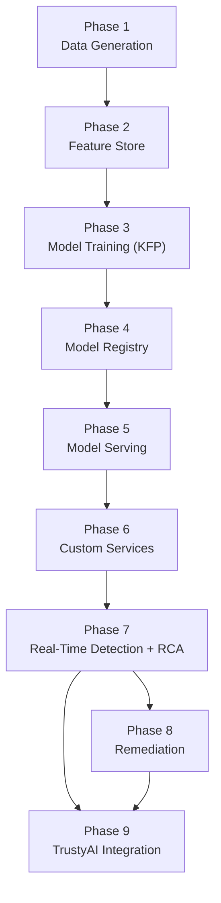
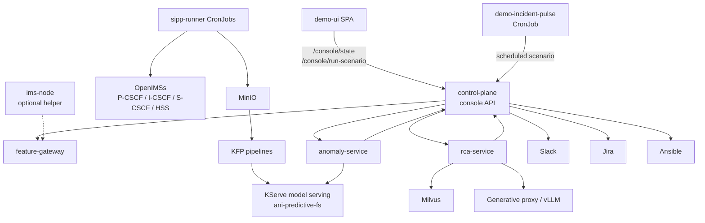
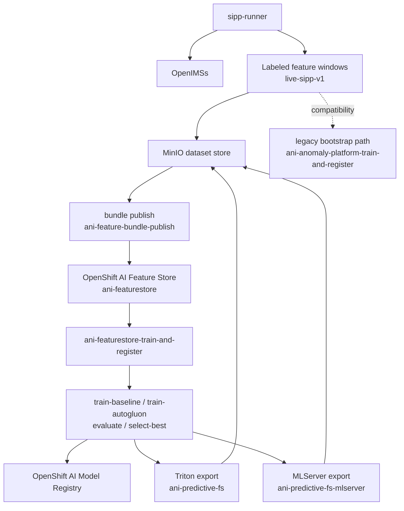
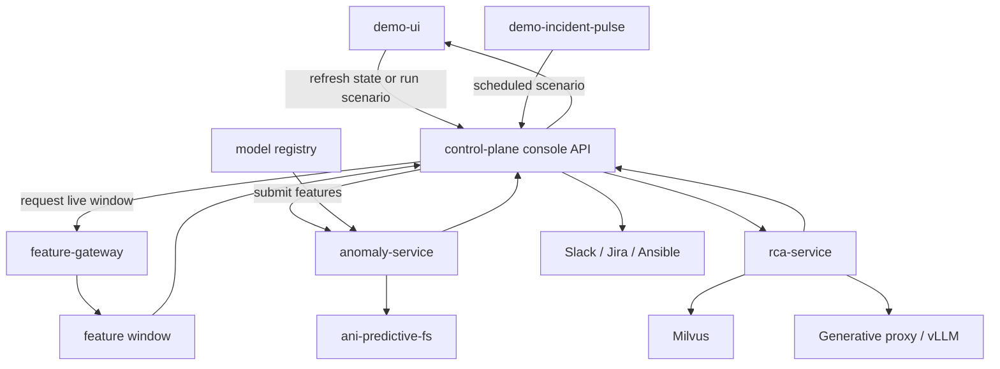
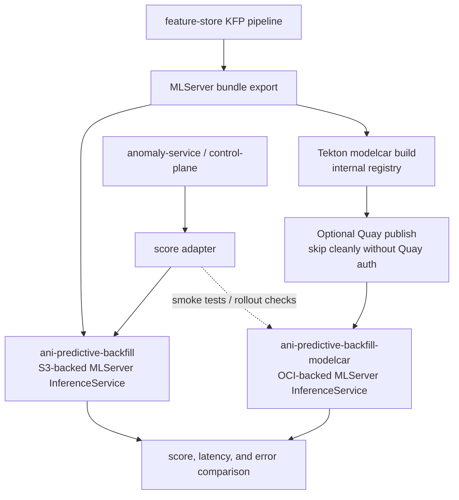

# ANI (Autonomous Network Intelligence) Platform on OpenShift AI

## Engineering Specification (v1.0)

## 1. Overview

### 1.1 Problem Statement

IMS environments generate:

- high-volume SIP signaling traffic
- low-frequency but operationally significant anomalies
- failure propagation across multiple network functions
- slow, manual root cause analysis (RCA)

Conventional monitoring stacks are typically:

- rule-driven, resulting in high false-positive rates
- siloed, which limits cross-component correlation
- reactive, with limited support for repeatable fault analysis

### 1.2 Proposed Solution

Build a cloud-native service assurance platform that:

1. Simulates IMS behavior by using OpenIMSs and SIPp
2. Detects anomalous behavior with baseline ML models and AutoML
3. Produces RCA output by combining topology context, retrieval, and LLM inference
4. Supports operator review before any remediation action is executed

### 1.3 Architectural Principle

Partition the system into four primary planes:

- IMS Lab: telecom system under test
- Traffic and Fault Engine: workload and fault generation
- Intelligence Plane: data processing, model training, inference, and RCA
- Experience Plane: operator-facing APIs and UI

This separation keeps data generation, model lifecycle management, and operator workflows independently testable and deployable.

### 1.4 Phase Breakdown

The same platform is also easier to reason about as nine connected phases:

1. Phase 1: Data Generation
2. Phase 2: Feature Store
3. Phase 3: Model Training (KFP)
4. Phase 4: Model Registry
5. Phase 5: Model Serving
6. Phase 6: Custom Services
7. Phase 7: Real-Time Detection and RCA
8. Phase 8: Remediation
9. Phase 9: TrustyAI Integration



Deep-dive document mapping:

- [Architecture by phase](./README.md) is the directory-level index.
- [Incident release and offline training](./incident-release-corpus-and-offline-training.md) explains persisted source data, release packaging, and offline-training inputs.
- [Feature store training path](./feature-store-training-path.md) explains phases 2 to 5 in detail.
- [TrustyAI Explainability for Incident Scoring](./trustyai-explainability-for-incident-scoring.md) explains how feature attribution should be attached to live anomaly predictions in phase 7.
- [Phase 09 Overview — TrustyAI Integration](./phase-09-overview-trustyai-integration.md) summarizes how TrustyAI explainability, guardrails, monitoring, and governance fit together as a cross-cutting trust layer.
- [AI Safety And Trust](./ai-safety-and-trust.md) explains how explainability, guardrails, monitoring, and governance should be unified across phases 7 and 8.
- [RCA and remediation](./rca-remediation.md) explains phases 6 to 8 in detail.
- [Event-Driven Ansible](./event-driven-ansible.md) explains the event-driven remediation path in Phase 8.

### 1.5 Document Role

Keep this document as the umbrella system reference.

Use this file when you need:

- the end-to-end platform story across all phases
- runtime architecture views that span more than one phase
- repository-to-runtime mapping
- cross-cutting system boundaries, service relationships, and deployment context

Use the `phase-01-overview` through `phase-09-overview` files for fast stage-by-stage reading. They are summaries, not replacements for this deeper reference.

## 2. Goals and Non-Goals

### Goals

- Simulate representative IMS signaling behavior
- Inject repeatable traffic and fault scenarios
- Establish an MLOps workflow with KFP and model registry integration
- Compare AutoGluon AutoML outputs with baseline models
- Support near-real-time anomaly scoring
- Generate RCA output using RAG, vLLM, and structured evidence
- Provide a lightweight operator console for demonstration workflows

### Non-Goals

- Full deep packet inspection
- Fully autonomous remediation
- Production-grade NOC replacement
- Advanced topology rendering
- Graph-neural-network-based RCA in the initial phase

## 3. System Architecture

### 3.1 High-Level Architecture

This architecture is easier to read as a few small views instead of one large diagram.

#### 3.1.1 Runtime Overview



The operator UI now talks only to the `control-plane` console API. A background `demo-incident-pulse` CronJob calls the same scenario endpoint every three minutes and alternates anomaly scenarios so the dashboard keeps moving during a live demo. The control plane publishes a five-second browser refresh cadence in its console state response.

#### 3.1.2 Training and Model Lifecycle



#### 3.1.3 Live Detection and RCA Flow



#### 3.1.4 Repository to Runtime Mapping

```mermaid
flowchart TD
  subgraph Services["services/"]
    DemoUIDir["demo-ui/"]
    FeatureDir["feature-gateway/"]
    AnomalyDir["anomaly-service/"]
    ControlDir["control-plane/"]
    RCADir["rca-service/"]
    SIPPDir["sipp-runner/"]
    IMSNodeDir["ims-node/"]
    SharedDir["shared/"]
  end

  subgraph AI["ai/"]
    PipelinesDir["pipelines/"]
    TrainingDir["training/"]
    ModelsDir["models/serving/predictive/"]
    RegistryDir["registry/"]
    RagDir["rag/"]
  end

  subgraph Manifests["k8s/base/"]
    PlatformDir["platform/"]
  end

  DemoUIDir --> DemoUIRun["demo-ui deployment"]
  FeatureDir --> FeatureRun["feature-gateway deployment"]
  AnomalyDir --> AnomalyRun["anomaly-service deployment"]
  ControlDir --> ControlRun["control-plane deployment + console API"]
  RCADir --> RCARun["rca-service deployment"]
  SIPPDir --> SIPPRun["sipp-runner CronJobs"]
  IMSNodeDir --> IMSNodeRun["ims-node helper"]
  SharedDir --> SharedUse["shared library used by API services"]
  PlatformDir --> PulseRun["demo-incident-pulse CronJob"]

  PipelinesDir --> KFPDef["KFP definition and publisher"]
  TrainingDir --> TrainSteps["training step implementation"]
  ModelsDir --> TritonFiles["served Triton files"]
  RegistryDir --> RegistryMeta["model registry metadata"]
  RagDir --> RagCorpus["Milvus bootstrap corpus and category KB bundles"]
```



### 3.2 Core Domain Entities

The platform operates on a small set of first-class entities. These entities define the contracts between data processing, inference, RCA, and operator workflows.

#### Incident

```yaml
incident:
  id: string
  timestamp: datetime
  node_id: string
  anomaly_score: float
  anomaly_type: string
  model_version: string
  feature_window_id: string
  feature_snapshot: object
  status: [open, acknowledged, resolved]
```

#### FeatureWindow

```yaml
feature_window:
  window_id: string
  start_time: timestamp
  end_time: timestamp
  duration: 30s
  node_id: string
  source: string
  scenario_name: string
  label: 0_or_1
  anomaly_type: string
  features: map<string, float>
  schema_version: string
```

#### ModelVersion

```yaml
model:
  id: string
  version: string
  type: [baseline, autogluon]
  dataset_version: string
  feature_schema_version: string
  metrics:
    precision: float
    recall: float
    f1: float
```

### 3.3 Ownership Boundaries

Each entity has a clear producer and system of record.

| Entity        | Producer                       | System of Record                       | Consumers                                  |
| ------------- | ------------------------------ | -------------------------------------- | ------------------------------------------ |
| FeatureWindow | ingestion and feature pipeline | dataset store                          | training pipeline, scoring services        |
| ModelVersion  | KFP training pipeline          | model registry                         | anomaly-service, UI, deployment automation |
| Incident      | anomaly-service                | incident store                         | rca-service, UI, collaboration, automation |
| RCAResult     | rca-service                    | RCA store or incident enrichment layer | UI, approval workflow, audit pipeline      |

## 4. Workstream Breakdown

### 4.1 IMS Lab (OpenIMSs)

#### Responsibilities

- Deploy core IMS functions
- Expose signaling endpoints for test execution
- Emit logs, metrics, and operational events

#### Minimum Components

- P-CSCF
- S-CSCF
- HSS

#### Outputs

- SIP signaling exchanges
- node-level metrics
- fault and degradation signals

### 4.2 Traffic and Fault Engine (SIPp)

#### Responsibilities

- Generate nominal traffic patterns
- Inject abnormal and degraded scenarios
- Produce labeled feature windows from real SIPp-driven IMS traffic

#### Scenario Types

| Type        | Example                            |
| ----------- | ---------------------------------- |
| Normal      | steady REGISTER and INVITE traffic |
| Stress      | burst load                         |
| Fault       | malformed SIP messages             |
| Degradation | latency injection                  |
| Regression  | replay of known scenarios          |

#### Output Contract

```json
{
  "scenario": "registration_storm",
  "timestamp": "...",
  "expected_label": "anomaly",
  "dataset_version": "live-sipp-v1"
}
```

### 4.3 AI and MLOps (OpenShift AI)

#### 4.3.0 Data Flow Contract

```text
IMS (OpenIMSs)
  -> SIP signaling events from SIPp scenarios
  -> captured as labeled feature windows
  -> stored as dataset version X
  -> consumed by KFP pipelines
  -> produces model version Y
  -> deployed to inference service
  -> generates incidents
  -> consumed by RCA service
```

The demo implementation target is:

- SIPp CronJobs generate real traffic against OpenIMSs
- the scenario runner emits labeled feature windows into MinIO
- KFP `ingest-data` reads stored feature windows first
- synthetic data remains only as a bootstrap fallback when the live dataset is empty or undersized

#### 4.3.1 Feature Window Model

All raw traffic and platform signals are normalized into time-windowed feature sets.

Example schema:

```yaml
window:
  start: timestamp
  duration: 30s

features:
  register_rate: float
  invite_rate: float
  bye_rate: float
  error_4xx_ratio: float
  error_5xx_ratio: float
  latency_p95: float
  retransmission_count: int
  inter_arrival_mean: float
  payload_variance: float
  node_id: string
  node_role: string

labels:
  anomaly: true_or_false
  anomaly_type: optional
```

#### 4.3.1.1 Feature Schema Versioning

- Every feature schema is versioned
- Models are tightly coupled to the feature schema version used during training
- Schema changes require retraining before promotion

```text
feature_schema_v1 -> model_v1
feature_schema_v2 -> retrain required
```

#### 4.3.2 Model Selection Strategy

The platform maintains two model paths:

- a baseline anomaly model, required as the fallback path
- an AutoML path used to generate and rank candidate models

AutoGluon is used as a candidate model generation engine, not as an unbounded primary detection mechanism.

AutoGluon is responsible for:

- training multiple model families
- ranking candidates using evaluation metrics
- producing optimized models for tabular IMS feature data

The system enforces:

- a baseline model is always available as fallback
- AutoGluon outputs must pass evaluation gates before promotion

#### 4.3.3 Training Modes

| Mode                 | Description |
| -------------------- | ----------- |
| supervised-multiclass | current training mode on canonical `anomaly_type` |
| feature-store-offline | current cluster path using Feast historical retrieval from bundle data |
| bootstrap-supervised  | legacy MinIO helper path can synthesize balanced coverage for local or bootstrap runs |
| forecasting           | reserved future extension for trend-deviation detection |

#### 4.3.4 KFP Pipeline

```yaml
pipelines:
  bundle_publish:
    name: ani-feature-bundle-publish
    steps:
      - build-bundle
      - validate-bundle
  featurestore_train_register:
    name: ani-featurestore-train-and-register
    steps:
      - resolve-bundle
      - validate-bundle
      - sync-feature-store-definitions
      - retrieve-training-dataset
      - train-baseline
      - train-automl
      - evaluate
      - select-best
      - export-serving-artifact-triton
      - export-serving-artifact-mlserver
      - register-model-version
      - publish-deployment-manifest-triton
      - publish-deployment-manifest-mlserver
```

#### 4.3.5 Model Evaluation Gate

A model is eligible for promotion only if it satisfies the required evaluation gates.

```yaml
conditions:
  min_macro_f1: 0.65
  min_weighted_f1: 0.75
  min_balanced_accuracy: 0.65
  min_class_recall: 0.45
  max_normal_false_alarm_rate: 0.20
  max_multiclass_log_loss: 2.5
  max_latency_p95_ms: 50
  min_stability_score: 0.85
```

#### 4.3.6 Model Registry

Track the following metadata:

- model version
- selected source model version
- bundle version
- feature schema version
- feature service name
- class labels and normal-class identity
- evaluation metrics
- serving runtime, model format, and protocol
- deployment readiness status

Promotion path:

```text
selected source model -> serving export -> model registry record -> serving alias update
```

#### 4.3.7 Serving Architecture

##### Modes

| Mode               | Description                             |
| ------------------ | --------------------------------------- |
| synchronous        | real-time scoring via API               |
| batch              | scheduled scoring over feature windows  |
| streaming (future) | event-driven scoring over a message bus |

##### Services

| Service         | Purpose |
| --------------- | ------- |
| anomaly-service | synchronous or batch scoring, remote KServe inference, and incident creation |
| rca-service     | RCA generation, retrieval, and evidence packaging |

##### Inference Flow

```text
FeatureWindow -> /score -> remote-kserve multiclass prediction -> Incident created -> RCA triggered
```

##### API Contracts

###### POST `/score`

```json
{
  "project": "ani-demo",
  "scenario_name": "registration_storm",
  "feature_window_id": "fw-123",
  "features": {
    "register_rate": 6.0,
    "invite_rate": 0.2,
    "bye_rate": 0.1,
    "error_4xx_ratio": 0.05,
    "error_5xx_ratio": 0.02,
    "latency_p95": 180.0,
    "retransmission_count": 12.0,
    "inter_arrival_mean": 0.8,
    "payload_variance": 60.0
  }
}
```

Response:

```json
{
  "anomaly_score": 0.99,
  "is_anomaly": true,
  "incident_id": "uuid",
  "anomaly_type": "network_degradation",
  "predicted_anomaly_type": "network_degradation",
  "predicted_confidence": 0.99,
  "class_probabilities": {
    "network_degradation": 0.99,
    "normal_operation": 0.01
  },
  "top_classes": [
    {
      "anomaly_type": "network_degradation",
      "probability": 0.99
    }
  ],
  "model_version": "ani-predictive-fs",
  "scoring_mode": "remote-kserve",
  "created_at": "..."
}
```

##### Incident Creation Contract

```json
{
  "incident_id": "uuid",
  "project": "ani-demo",
  "model_version": "ani-predictive-fs",
  "feature_window_id": "fw-123",
  "anomaly_score": 0.99,
  "anomaly_type": "network_degradation",
  "predicted_confidence": 0.99,
  "class_probabilities": {
    "network_degradation": 0.99,
    "normal_operation": 0.01
  },
  "top_classes": [
    {
      "anomaly_type": "network_degradation",
      "probability": 0.99
    }
  ],
  "is_anomaly": true,
  "created_at": "..."
}
```

###### POST `/rca`

```json
{
  "incident_id": "...",
  "context": {}
}
```

Response:

```json
{
  "root_cause": "HSS latency",
  "confidence": 0.84,
  "evidence": [
    {
      "type": "metric",
      "reference": "hss-latency-p95",
      "weight": 0.61
    },
    {
      "type": "log",
      "reference": "hss-timeout-log",
      "weight": 0.39
    }
  ],
  "recommendation": "increase connection pool"
}
```

##### Current Runtime Status In This Repo

The checked-in implementation is now MLServer-first for the feature-store path, with a separate OCI modelcar branch for backfill reuse.

- `k8s/base/serving/featurestore-serving.yaml` binds `ani-predictive-fs` to `ani-autogluon-mlserver-runtime` with `modelFormat.name: autogluon`
- `k8s/base/serving/featurestore-serving-backfill-modelcar.yaml` defines `ani-predictive-backfill-modelcar` as an MLServer endpoint backed by `storageUri: oci://...`
- `ai/training/featurestore_train.py` exports MLServer bundles to MinIO and can now repackage the same trained backfill bundle into a modelcar build context under `/models`
- the same training path generates deployment metadata for both the `s3://` and `oci://` artifact variants
- `services/shared/model_store.py` calls the V2 endpoint at `/v2/models/{model_name}/infer`, accepts `class_probabilities` or `predict_proba`, and uses `anomaly_score` when the runtime provides it

This means the current serving path is built around a shared KServe V2 contract with storage-specific artifact layouts.

##### MLServer Parity Path

MLServer is no longer only a design target. It is the checked-in runtime for the current feature-store path and now also supports a side-by-side modelcar variant for the backfill-trained model.

##### Can Triton Be Replaced In Place?

| Layer | Simple swap? | Why |
| --- | --- | --- |
| KServe V2 REST and gRPC protocol | mostly yes | both runtimes can expose the V2 inference protocol |
| existing client URL shape | partially | the current client can keep using `/v2/models/{model_name}/infer`, but output tensor semantics must still match |
| current model artifact layout | no | Triton expects a Triton model repository, while MLServer expects framework-native artifacts plus MLServer model settings |
| ServingRuntime manifest | no | image, environment variables, supported model formats, and metrics conventions differ |
| training and deployment pipeline | no | the current export pipeline writes separate Triton and MLServer artifacts, so an in-place swap still couples runtime choice with serving-alias cutover |
| safe rollout strategy | no | replacing Triton in place would combine runtime, artifact, client, and observability changes in one step |

Decision:

- keep the legacy Triton endpoint available where already deployed
- use MLServer as the default runtime for the feature-store-backed paths
- add a modelcar branch so a trained backfill model can be promoted once and reused on other demo clusters without regenerating the large dataset

##### Current Side-by-Side Serving Design



##### MLServer Artifact Contract

Recommended storage layout:

```text
s3://ani-models/predictive-featurestore/ani-predictive-backfill/current/
  serving-metadata.json
  ani-predictive-backfill/
    model-settings.json
    predictor/

oci://quay.io/autonomousnetworkintelligence/ani-predictive-backfill-modelcar:latest
  /models/serving-metadata.json
  /models/ani-predictive-backfill-modelcar/model-settings.json
  /models/ani-predictive-backfill-modelcar/predictor/
```

Minimal `model-settings.json`:

```json
{
  "name": "ani-predictive-fs-mlserver",
  "implementation": "mlserver_sklearn.SKLearnModel",
  "parameters": {
    "uri": "./model.joblib",
    "version": "current"
  }
}
```

Required rules:

- preserve the exact numeric feature order already used by the Triton path
- preserve the same class-label order and `normal_operation` identity in `serving-metadata.json`
- return a full probability vector; an explicit `anomaly_score` tensor is optional because the client can derive it
- do not point MLServer at the existing Triton repository prefix

##### ServingRuntime and InferenceService Resources

Checked-in resources:

- `k8s/base/serving/featurestore-serving.yaml`
- `k8s/base/serving/featurestore-serving-backfill-modelcar.yaml`
- `k8s/base/serving/autogluon-mlserver-runtime.yaml`

Deployment notes:

- `ani-predictive-fs` is the current default MLServer-backed remote-scoring endpoint
- `ani-predictive-backfill` remains the MinIO-backed backfill path produced by the current backfill workflow
- `ani-predictive-backfill-modelcar` is the OCI-packaged variant meant for reuse across demo clusters after one training run
- the Tekton modelcar branch builds in the internal registry first, then attempts a non-blocking publish to Quay so fresh clusters can serve from `quay.io/...:latest`

##### Implemented Repo Changes And Remaining Hardening

1. Training export
   - `ai/training/featurestore_train.py` supports the MLServer export path used by the feature-store workflow
   - `_export_autogluon_mlserver_bundle()` writes `model-settings.json`, the predictor directory, and `serving-metadata.json`
   - `_prepare_modelcar_context_step()` rewrites that exported bundle into a `/models` OCI layout for modelcar publication
2. Registry and metadata
   - registry payloads record `serving_runtime`, `serving_model_format`, `serving_protocol`, and `serving_storage_backend`
   - the same logical backfill model can now register either an `s3://` or `oci://` artifact URI
3. Scoring client
   - `services/shared/model_store.py` stays on the V2 `/infer` endpoint
   - the client validates `class_probabilities` or `predict_proba` output semantics
   - remaining cleanup is to remove leftover score-only assumptions from older smoke-check helpers
4. Smoke tests
   - Triton and MLServer can already be compared on the same feature vectors
   - remaining hardening is to expand parity automation around latency, errors, and rollout policy
5. Observability
   - Triton observability stays unchanged
   - MLServer-specific dashboards and monitors remain optional follow-up work

##### Inference Endpoint Contract For MLServer

Active Triton path:

- `http://ani-predictive-fs-predictor.ani-demo-lab.svc.cluster.local:8080`

Live MLServer parity path:

- `http://ani-predictive-fs-mlserver-predictor.ani-demo-lab.svc.cluster.local:8080`

Request contract should remain:

```json
{
  "inputs": [
    {
      "name": "predict",
      "shape": [1, 9],
      "datatype": "FP32",
      "data": [[0.0, 0.0, 0.0, 0.0, 0.0, 0.0, 0.0, 0.0, 0.0]]
    }
  ]
}
```

Response acceptance rules:

- accept `class_probabilities` or `predict_proba` as the primary probability tensor
- expected probability shape is `[1, 12]`
- an optional `anomaly_score` tensor may accompany the probabilities
- the client derives predicted class and anomaly score from probabilities when needed
- the client must reject unexpected output names or shapes instead of silently accepting nested values

##### Recommended Rollout Decision

- keep Triton as the current production/default runtime
- introduce MLServer as a side-by-side candidate runtime
- do not perform an in-place Triton-to-MLServer swap until artifact layout, response semantics, and observability are aligned

## 5. RCA Architecture (vLLM and Milvus)

### 5.1 Data Sources for Milvus

Milvus is the retrieval layer for RCA. It stores semantic knowledge that helps explain an anomaly. It is not the system of record for raw IMS traffic, feature windows, or metric time series.

Primary source categories:

- curated operational knowledge articles and runbooks
- historical incident records and incident logs
- topology metadata
- SIP traces and signaling patterns

Operational guidance for indexed content:

- `ani_runbooks` stores stable operator-authored knowledge, including category-specific KB articles for signaling, authentication, validation, routing, session, server, and network incidents
- the category KB is seeded from `ai/rag/runbooks/*-knowledge.json`, with at least ten articles per incident category so the demo can always surface relevant operational guidance
- legacy markdown runbooks remain valid seed input and are still embedded into `ani_runbooks`
- historical incidents are stored as symptom, root cause, and resolution narratives with incident metadata
- topology metadata is stored as dependency-aware service relationships and path context
- logs and SIP traces are stored as selective extracted snippets or summarized patterns, not as full raw streams

Representative incident record:

```json
{
  "incident_id": "123",
  "symptoms": ["high 5xx", "latency spike"],
  "root_cause": "HSS overload",
  "resolution": "increase pool size"
}
```

### 5.1.1 Milvus Scope Boundaries

Milvus must not be used as a general-purpose telemetry store.

Explicit exclusions:

- raw SIP traffic streams
- full metrics time series
- feature windows used by the ML pipeline
- model outputs and scoring history

These data types remain in their respective operational systems, such as Prometheus, the feature store or dataset layer, and the incident or audit store.

### 5.2 Role of Milvus

Milvus functions as the RCA knowledge retrieval layer.

Clean separation of responsibilities:

| Layer            | Purpose                                               |
| ---------------- | ----------------------------------------------------- |
| predictive model | detect anomaly                                        |
| Milvus           | retrieve relevant RCA context                         |
| LLM              | reason over retrieved context and generate RCA output |

For the demo profile, the Milvus corpus should remain intentionally small and preloaded. A few hundred documents is sufficient.

Recommended logical collections:

- `ani_runbooks`
- `incident_evidence`
- `incident_reasoning`
- `incident_resolution`
- `ani_topology`
- `ani_signal_patterns`

The practical retrieval split is:

- `ani_runbooks`: reusable category-based KB articles and stable operator-authored runbooks
- `incident_evidence`: normalized observed incident facts and feature summaries
- `incident_reasoning`: RCA and remediation reasoning records
- `incident_resolution`: verified outcomes that should rank highest for future reuse
- `ani_topology` and `ani_signal_patterns`: smaller supporting context collections for path and pattern grounding

### 5.2.1 Bootstrap and New Cluster Readiness

The demo must load KB content automatically when a new cluster is created.

Current bootstrap contract:

- the `rca-service` image contains the `ai/rag` corpus, including the category KB bundles
- `k8s/base/milvus/milvus-stack.yaml` defines a `milvus-bootstrap` job that waits for Milvus readiness and runs `python ai/rag/bootstrap_knowledge.py`
- the bootstrap job recreates the expected collections and seeds the corpus into Milvus
- a fresh cluster is demo-ready only after the latest `rca-service` image and the Milvus bootstrap job have both run successfully

This means the KB is not a manual post-install content load. It is part of the platform bootstrap path and should be treated as a required demo dependency.

### 5.3 Processing Flow

```text
1. anomaly detected
2. incident created
3. incident category resolved from anomaly taxonomy
4. RCA query built from incident facts, feature deviations, and recommendation context
5. Milvus searched for stage-specific evidence, reasoning, and verified resolution records
6. `ani_runbooks` searched for category-matched KB articles
7. supporting context retrieved and ranked
8. prompt assembled
9. LLM inference executed
10. structured RCA output returned
11. control-plane exposes related knowledge back to the UI
```

Retrieved context should preferentially include:

- category-matched operational knowledge articles and runbooks
- similar historical incidents
- topology relationships
- selective supporting logs or SIP patterns

### 5.4 Prompt Inputs

Prompt construction includes:

- alarm and incident data
- runtime context
- topology relationships
- incident-category KB articles from `ani_runbooks`
- retrieved reference material

The output must be grounded in retrieved evidence and returned in a structured schema.

### 5.5 RCA Output Contract

RCA responses must conform to a strict output schema.

```json
{
  "root_cause": "string",
  "confidence": 0.0,
  "evidence": [
    {
      "type": "metric|log|doc",
      "reference": "string",
      "weight": 0.0
    }
  ],
  "recommendation": "string"
}
```

### 5.6 RCA Validation Rules

- RCA output must include at least two evidence sources
- RCA output must reference retrieved documents or runtime artifacts
- Confidence must be derived from a defined scoring method rather than free-form generation

## 6. Demo Console

### 6.1 Design Principle

The UI is a thin orchestration layer. It should expose system state and operator actions without attempting to replace native OpenShift observability or administration interfaces.

### 6.2 Screens

#### 1. Overview

- traffic status
- anomaly count
- active incidents
- deployed model version

#### 2. Incident Detail

- anomaly score
- impacted nodes
- RCA output
- evidence set
- recommended action
- related knowledge articles that operators can open directly from the incident workflow

#### 3. MLOps View

- pipeline runs
- model versions
- deployment status

#### 4. Action and Collaboration

- send incident to Slack
- open Jira ticket
- approve remediation step

## 7. Automation Layer

### 7.1 Candidate Actions

- quarantine IMSI
- apply rate limiting
- scale S-CSCF

### 7.2 Execution Flow

```text
RCA recommendation -> operator approval -> automation execution
```

## 8. Observability

### Metrics

- anomaly rate
- false-positive rate
- model inference latency
- RCA confidence distribution
- pipeline success rate

### Logs

- inference logs
- RCA request and response logs
- pipeline execution logs

## 9. Security and Invariants

### 9.1 Security Considerations

- API access requires authentication
- model endpoints are namespace-isolated
- RCA data access is scoped per project or tenant
- audit logs are mandatory for inference, RCA, and automation actions

### 9.2 Invariants

- A model must be registered before it can be served
- The feature schema must be versioned and traceable
- RCA output must include both confidence and evidence
- LLM inference must not be used for primary anomaly detection
- Remediation actions require explicit human approval

## 10. Failure Modes

| Failure Mode     | Mitigation                                 |
| ---------------- | ------------------------------------------ |
| noisy data       | smoothing and feature stabilization        |
| model drift      | retraining and threshold review            |
| hallucinated RCA | retrieval grounding and evidence checks    |
| missing features | fallback rules and degraded inference mode |
| false positives  | threshold tuning and model comparison      |

## 11. Repository Structure

```text
IMS-Anomaly-Detection-with-Red-Hat-OpenShift-AI/
  ai/
    models/
    pipelines/
    rag/
    registry/
    training/
  automation/
  docs/
    architecture/
    labs/
  k8s/
    base/
    overlays/
  lab-assets/
    sipp/
  services/
    shared/
    ims-node/
    sipp-runner/
    control-plane/
    feature-gateway/
    anomaly-service/
    rca-service/
    demo-ui/
```

## 12. Phased Delivery Plan

### Phase 1: Foundation

- deploy OpenIMSs
- implement SIPp scenarios
- build feature generation pipeline
- train baseline and AutoGluon models
- register and serve selected model
- expose anomaly scoring endpoint

### Phase 2: RCA

- deploy Milvus
- deploy vLLM
- implement RCA service and retrieval flow

### Phase 3: Experience

- build demo UI
- wire end-to-end incident workflow
- integrate Slack and Jira actions

### Phase 4: Automation

- integrate Ansible-based execution
- add approval workflow for remediation actions

## 13. Demo Flow

1. Deploy the OpenIMSs lab
2. Start baseline SIP traffic through SIPp
3. Persist labeled feature windows from the SIPp/OpenIMS run into MinIO
4. Inject a fault scenario such as a registration storm
5. Generate feature windows from the resulting traffic
6. Call `/score` and detect the anomaly
7. Create an Incident object
8. Trigger the RCA service
9. Retrieve supporting context from Milvus
10. Generate structured RCA output through vLLM
11. Display the anomaly, evidence, and recommendation in the UI
12. Route the incident to Slack or an approval workflow
13. Optionally execute a remediation action through Ansible

## 14. Acceptance Criteria

### Phase 1

- anomaly detection identifies real SIPp-driven fault scenarios
- pipeline runs successfully end to end
- selected model is registered and deployed

### Phase 2

- RCA output is generated with evidence references
- retrieval behavior is visible and auditable

### Phase 3

- UI presents the full detection-to-RCA flow
- Slack or Jira integration can be triggered from the console

### 14.1 Demo Access Inventory

The demo environment publishes a small set of known access points and credentials so the runbook does not depend on ad hoc discovery during customer delivery.

| Component              | Access Pattern                                                                                | Credentials                                                                          |
| ---------------------- | --------------------------------------------------------------------------------------------- | ------------------------------------------------------------------------------------ |
| Demo Console UI        | OpenShift route for `demo-ui`                                                                 | none                                                                                 |
| API services           | OpenShift routes for `feature-gateway`, `anomaly-service`, `control-plane`, and `rca-service` | `demo-token` (admin), `demo-operator-token` (operator), `demo-viewer-token` (viewer) |
| MinIO console          | OpenShift route for `model-storage-minio-console`                                             | `minioadmin` / `minioadmin`                                                          |
| Milvus UI (Attu)       | OpenShift route for `milvus-attu`                                                             | no separate UI username or password in this demo                                     |
| Gitea                  | OpenShift route for `gitea-gitea`                                                             | `gitadmin` / `GiteaAdmin123!`                                                        |
| Slack and Jira actions | control-plane demo relay when external endpoints are not configured                           | no additional credentials in demo relay mode                                         |
| Automation approvals   | control-plane approval endpoint with simulated execution by default                           | `demo-token`                                                                         |

## 15. Positioning

This PoC demonstrates:

- telecom-oriented data simulation
- a complete MLOps lifecycle instead of notebook-only experimentation
- AutoML with model governance
- GenAI applied to RCA rather than primary detection
- an architecture that maps cleanly onto OpenShift AI

## 16. Key Statement

> This PoC is not a model showcase. It is an engineering demonstration of an AI-assisted telecom operations platform.
