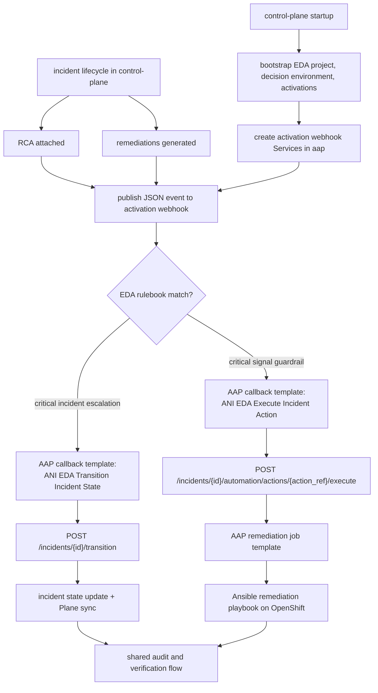

# Event-Driven Ansible in This Project

## Purpose

This document explains the Event-Driven Ansible path used by the current ANI (Autonomous Network Intelligence) platform. It focuses on how the control-plane publishes internal webhook events into AAP EDA, how rulebooks decide whether to act, and how EDA re-enters the same control-plane workflow instead of bypassing the platform.

This document is about AAP EDA webhook activations. It is separate from Plane webhooks.

## Current Implementation Summary

The current project uses AAP Event-Driven Ansible for two allowlisted remediation cases:

- `ANI Critical Incident Escalation`
- `ANI Critical Signal Guardrail`

The control-plane bootstraps these resources on startup:

- EDA project `ANI Incident Event Policies`
- decision environment `ANI Incident Decisions`
- running activations for both rulebooks
- controller callback templates used by the rulebooks
- in-cluster Services that expose each activation webhook in the `aap` namespace

The rulebooks are stored in this repository and imported from the in-cluster Gitea source, so a fresh cluster can reconcile the same EDA setup without hand-built rulebook content.

## Components

| Component | Current role |
| --- | --- |
| `services/control-plane/` | creates incidents, attaches RCA, ranks remediations, and publishes EDA events |
| `services/shared/eda.py` | bootstraps EDA project, decision environment, activations, and webhook Services; publishes webhook events |
| `rulebooks/critical-incident-escalation.yml` | escalates selected critical incidents after RCA is attached |
| `rulebooks/critical-signal-guardrail.yml` | auto-applies the guarded `rate_limit_pcscf` path for selected critical signaling incidents |
| `services/shared/aap.py` | bootstraps controller job templates and callback templates |
| `automation/eda/playbooks/transition-incident-state.yml` | callback playbook that calls the control-plane transition API |
| `automation/eda/playbooks/execute-incident-action.yml` | callback playbook that calls the control-plane action execution API |
| `automation/ansible/playbooks/*.yaml` | actual remediation playbooks that touch OpenShift resources |

## How Bootstrap Works

On control-plane startup, `services/shared/eda.py` reconciles the EDA side of the platform:

1. Ensure the EDA project exists and sync it from the in-cluster Gitea repository.
2. Ensure the decision environment exists.
3. Ensure an AWX token exists so EDA can launch AAP Controller job templates.
4. Ensure the activations exist, are enabled, and carry the right extra vars.
5. Create or patch Kubernetes Services in the `aap` namespace that point to the running activation jobs.

The activation extra vars include:

- `control_plane_url`
- `control_plane_api_key`
- `approved_by`
- `source_url`
- `policy_key`
- `policy_name`
- `controller_job_template_name`
- `controller_organization_name`

This keeps EDA stateless from the repo point of view. The repo defines the policies and callback behavior, while the control-plane injects the live cluster endpoints and credentials.

## Webhook Model

The current EDA integration uses `eda.builtin.webhook` as the event source for both rulebooks.

Current webhook listeners:

| Rulebook | Policy name | Port | Trigger event |
| --- | --- | --- | --- |
| `rulebooks/critical-incident-escalation.yml` | `ANI Critical Incident Escalation` | `5000` | `rca_attached` |
| `rulebooks/critical-signal-guardrail.yml` | `ANI Critical Signal Guardrail` | `5001` | `remediations_generated` |

The control-plane does not send events to a public URL. Instead, `services/shared/eda.py` discovers the activation delivery URLs and also creates an internal cluster URL of the form:

```text
http://<activation-service>.<namespace>.svc.cluster.local:<webhook_port>
```

The control-plane then posts JSON incident events directly to those activation webhook Services.

## When EDA Triggers

EDA is triggered only after the control-plane publishes one of the allowlisted event types.

### 1. `rca_attached`

This event is published right after the control-plane stores RCA for an incident through `POST /incidents/{incident_id}/rca`.

The event includes fields such as:

- `event_type`
- `incident_id`
- `anomaly_type`
- `severity`
- `status`
- `workflow_revision`
- `anomaly_score`

The `ANI Critical Incident Escalation` rulebook acts only when all of the following are true:

- `event.payload.event_type == "rca_attached"`
- `event.payload.severity == "Critical"`
- `event.payload.anomaly_type` is one of `authentication_failure`, `server_internal_error`, or `network_degradation`
- `event.payload.status` is not already `ESCALATED`, `VERIFIED`, or `CLOSED`

When the rule matches, EDA launches the callback template that tells the control-plane to transition the incident to `ESCALATED`. That transition path also creates or syncs the Plane ticket.

### 2. `remediations_generated`

This event is published after the control-plane ranks and stores remediation suggestions from the RCA context.

In addition to the common incident fields, the payload includes remediation-derived fields such as:

- `top_action_ref`
- `available_actions`
- `rate_limit_pcscf_available`
- `scale_scscf_available`
- `quarantine_imsi_available`

The `ANI Critical Signal Guardrail` rulebook acts only when all of the following are true:

- `event.payload.event_type == "remediations_generated"`
- `event.payload.severity == "Critical"`
- `event.payload.rate_limit_pcscf_available == true`
- `event.payload.anomaly_type` is one of `registration_storm`, `retransmission_spike`, or `network_degradation`
- `event.payload.status` is not already `EXECUTING`, `EXECUTED`, `VERIFIED`, or `CLOSED`

When the rule matches, EDA launches the callback template that asks the control-plane to execute the allowlisted `rate_limit_pcscf` action.

## Why The Callback Template Matters

EDA does not directly change incident state or directly run arbitrary Kubernetes changes from the rulebook.

Instead, EDA launches one of two controller callback templates:

- `ANI EDA Transition Incident State`
- `ANI EDA Execute Incident Action`

Those templates run small playbooks that call the control-plane APIs:

- `POST /incidents/{incident_id}/transition`
- `POST /incidents/{incident_id}/automation/actions/{action_ref}/execute`

This is the key safety pattern in the project:

- the control-plane remains the workflow owner
- manual UI actions and event-driven actions share the same audit path
- ticket synchronization still happens in the same platform logic
- verification still happens in the same incident workflow
- EDA can only re-enter through the allowlisted control-plane APIs

For the guardrail case, the control-plane then launches the normal AAP remediation job template for `rate_limit_pcscf`, or its runner-job fallback if controller writes are blocked by the current license.

## Flow Diagram



## Failure Behavior

EDA publishing is best-effort in the control-plane. If webhook delivery fails, the platform logs the failure and records the integration status, but the main incident flow continues. This is important for demo stability because RCA attachment and remediation generation should not fail just because EDA is temporarily unavailable.

## Current Repo Touchpoints

- `services/shared/eda.py`
- `services/shared/aap.py`
- `services/control-plane/app.py`
- `rulebooks/critical-incident-escalation.yml`
- `rulebooks/critical-signal-guardrail.yml`
- `automation/eda/playbooks/transition-incident-state.yml`
- `automation/eda/playbooks/execute-incident-action.yml`
- `automation/ansible/playbooks/rate-limit-pcscf.yaml`
- `docs/architecture/phase-08-overview-remediation.md`
- `docs/architecture/rca-remediation.md`
