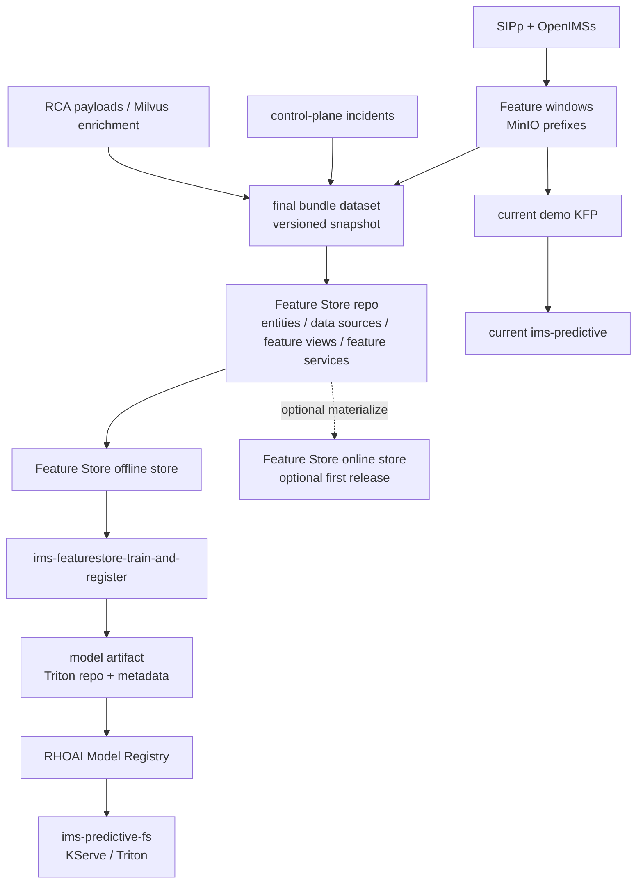

# Feature Store Training, Model Registry, and Serving Path

## 1. Purpose

This document defines the next architecture for the IMS anomaly platform after the current live-demo path.

The objective is to prepare for actual model training while incident collection is still in progress, and then introduce a separate Red Hat OpenShift AI Feature Store and Model Registry workflow without breaking the existing demo pipeline.

This architecture must:

- preserve the current `ims-anomaly-platform-train-and-register` path until the new path is proven
- continue collecting incidents, RCA payloads, and feature windows in the running platform
- create a final, versioned bundle dataset that is ready to publish into Feature Store
- define how that dataset maps to Feature Store data sources, features, feature views, and feature services
- introduce a new Kubeflow pipeline that reads from Feature Store, trains a model, and publishes a model version into the Red Hat OpenShift AI Model Registry
- deploy the new model into a serving runtime and expose it without breaking the current `ims-predictive` service

This document extends the current [engineering specification](./engineering-spec.md) and the release-oriented [incident release and offline training contract](./incident-release-corpus-and-offline-training.md).

### 1.1 Phase Alignment

This document is the primary deep dive for the middle model-lifecycle phases:

- Phase 2: Feature Store
- Phase 3: Model Training (KFP)
- Phase 4: Model Registry
- Phase 5: Model Serving

It assumes Phase 1 data has already been persisted by the live platform and does not redefine the RCA or remediation workflow handled later in [rca-remediation](./rca-remediation.md).

### 1.2 Document Role

Keep this document as the detailed transition plan for phases 2 to 5.

Use this file when you need:

- the target Feature Store architecture
- bundle dataset structure and Feature Store projection rules
- new Kubeflow pipeline boundaries and inputs
- model registry transition details and serving rollout options

Use the phase overview files for concise summaries. They do not replace the design detail, milestones, and transition constraints captured here.

## 2. Product Notes

The Red Hat OpenShift AI documentation currently describes Feature Store as a Feast-based capability with offline and online stores, a registry, a UI, and feature services. The official documentation we reviewed also describes Feature Store as Technology Preview in some product versions.

Relevant references:

- [Overview of machine learning features and Feature Store](https://docs.redhat.com/en/documentation/red_hat_openshift_ai_self-managed/3.0/html/working_with_machine_learning_features/overview-of-ml-features-and-feature-store.adoc_featurestore)
- [Defining machine learning features](https://docs.redhat.com/en/documentation/red_hat_openshift_ai_self-managed/2.25/html/working_with_machine_learning_features/defining-ml-features_featurestore)
- [Retrieving features for model training](https://docs.redhat.com/en/documentation/red_hat_openshift_ai_self-managed/2.25/html/working_with_machine_learning_features/retrieving-features-for-model-training_featurestore)
- [Working with model registries](https://docs.redhat.com/en/documentation/red_hat_openshift_ai_self-managed/3.2/html/working_with_model_registries/working-with-model-registries_model-registry)

Rules for this repo:

- treat Feature Store as an additive path until the target cluster version and support posture are confirmed
- keep the current MinIO-backed training and Triton serving path operational during the transition
- avoid any design that requires deleting or rewriting the current demo model lifecycle before the new path is validated

## 3. Current State

Today the platform trains and serves from MinIO-backed feature windows directly.

Current runtime facts:

- `services/sipp-runner/run_scenario.py` writes JSON feature windows to MinIO under `pipelines/ims-demo-lab/datasets/datasets/<dataset_version>/feature-windows/...`
- `ai/training/train_and_register.py` reads those feature-window objects from MinIO, falls back to synthetic data if the dataset is too small, trains the model, evaluates it, writes registry metadata, and uploads the serving artifact into `s3://ims-models/predictive/`
- the current Kubeflow pipeline is `ims-anomaly-platform-train-and-register`
- the current model registry is a repo-managed JSON document plus object storage artifacts
- the current serving target is the `ims-predictive` Triton-backed `InferenceService`

This current path remains the default demo path until the new path is proven.

## 4. Design Principles

- do not break the existing demo path
- keep data collection and training architecture separate from public release packaging
- create immutable bundle datasets instead of training directly from mutable live prefixes
- make feature contracts explicit and versioned
- introduce Feature Store first as a dataset and feature-definition layer, then grow into online inference usage
- use a new KFP pipeline and a new serving endpoint so that rollback remains simple
- publish to the Red Hat OpenShift AI Model Registry as the new model system of record, but keep a compatibility bridge to the current JSON registry until runtime consumers are updated

## 5. Target Architecture

The target architecture adds a second, explicit path next to the current live-demo path.



Operationally:

- the current MinIO-to-KFP-to-Triton flow stays intact
- the new path consumes a versioned bundle dataset, not the mutable live prefix directly
- the new path introduces Feature Store concepts and a new model lifecycle
- the new path deploys to a separate serving endpoint first

## 6. Bundle Dataset Architecture

### 6.1 Why a Bundle Dataset

While we are still collecting incidents, the live feature-window prefixes remain the system of capture, not the final training contract.

The new path should train from a bundle dataset because it gives us:

- one immutable snapshot of the exact training input
- consistent joins between feature windows, incident labels, and RCA metadata
- a dataset that can be validated, documented, and later published
- a stable batch data source for Feature Store

### 6.2 Bundle Identity

The bundle dataset must be versioned independently from the live MinIO dataset prefixes.

Required identifiers:

- `bundle_version`
- `source_snapshot_id`
- `source_dataset_versions`
- `feature_schema_version`
- `label_taxonomy_version`
- `bundle_contract_version`
- `generated_at`
- `git_commit`

Recommended naming examples:

- `ims-feature-bundle-2026-04-01`
- `ims-feature-bundle-v1`

### 6.3 Bundle Contents

The bundle dataset should be stored as an internal, feature-store-ready snapshot in object storage.

Recommended structure:

```text
s3://ims-models/feature-bundles/<bundle_version>/
  manifest.json
  dataset_card.md
  quality_report.json
  parquet/
    window_features.parquet
    window_context.parquet
    window_labels.parquet
    incidents.parquet
    rca_summary.parquet
  feature_store/
    entity_rows.parquet
    offline_source.parquet
```

Recommended rules:

- use Parquet for the bundle tables because the Feature Store docs support file-backed batch sources and Parquet is a good fit for reproducible batch retrieval
- keep labels and RCA enrichments in the bundle even if the first model version only uses numeric scoring features
- preserve the original `window_id`, `incident_id`, timestamps, scenario names, and dataset lineage
- keep one manifest that records row counts, source URIs, schema versions, and validation results

### 6.4 Minimum Bundle Schema

At minimum the feature bundle should preserve:

- `window_id`
- `event_timestamp`
- `created_timestamp`
- `dataset_version`
- `source_snapshot_id`
- `scenario_name`
- `label`
- `anomaly_type`
- the current numeric model inputs:
  - `register_rate`
  - `invite_rate`
  - `bye_rate`
  - `error_4xx_ratio`
  - `error_5xx_ratio`
  - `latency_p95`
  - `retransmission_count`
  - `inter_arrival_mean`
  - `payload_variance`

Optional but useful:

- `incident_id`
- `approval_status`
- `rca_status`
- `contributing_conditions`
- `call_limit`
- `rate`
- `transport`

## 7. Feature Store Projection

### 7.1 Feature Store Scope in This Repo

The first Feature Store milestone is not to replace the current runtime inference path. It is to:

- register the feature definitions against the final bundle dataset
- generate reproducible training datasets from the offline store
- define a versioned feature contract that can later be reused by serving

### 7.2 Proposed Feature Store Objects

The Feature Store path should map the bundle dataset into the following objects.

| Feature Store object | Proposal for this repo |
| --- | --- |
| Project / repo | `ai/featurestore/feature_repo/` |
| Batch data source | Parquet files from `s3://ims-models/feature-bundles/<bundle_version>/parquet/` |
| Entity | `feature_window` with join key `window_id` |
| Primary feature view | `ims_window_numeric_v1` |
| Context feature view | `ims_window_context_v1` |
| Training label view | `ims_training_label_v1` |
| Feature service | `ims_anomaly_scoring_v1` |
| Offline retrieval | feature service plus label join for training |
| Online store | optional in first release; enable after live push flow is defined |

### 7.3 Proposed Feature Views

#### `ims_window_numeric_v1`

Purpose:

- holds the numeric model inputs used by the current anomaly model
- becomes the first stable scoring contract

Suggested fields:

- `register_rate`
- `invite_rate`
- `bye_rate`
- `error_4xx_ratio`
- `error_5xx_ratio`
- `latency_p95`
- `retransmission_count`
- `inter_arrival_mean`
- `payload_variance`

Timestamp:

- `event_timestamp` derived from the window end or capture time

#### `ims_window_context_v1`

Purpose:

- keeps contextual columns that are useful for analysis, filtering, future feature expansion, or model-family experiments

Suggested fields:

- `scenario_name`
- `transport`
- `call_limit`
- `rate`
- `dataset_version`
- `source_snapshot_id`

#### `ims_training_label_v1`

Purpose:

- keeps supervised labels and training metadata out of the serving contract while still making the training dataset reproducible

Suggested fields:

- `label`
- `anomaly_type`
- `incident_id`
- `approval_status`

This view is intended for offline training only and must not be part of the serving feature service.

### 7.4 Proposed Feature Service

The initial feature service should represent the model input contract, not the entire bundle schema.

Recommended initial feature service:

- `ims_anomaly_scoring_v1`

This feature service should include only the numeric features that the model consumes. Labels, RCA, and incident metadata remain outside the feature service.

This gives us:

- a named feature contract per model family or model version
- a clean bridge between offline training and future online serving
- a stable feature group that can be attached to model-registry metadata

### 7.5 Offline and Online Stores

Initial recommendation:

- start with offline-store-backed training first
- treat online-store materialization as a second-phase enhancement

Reason:

- our current inference path already computes live feature vectors directly
- we can demonstrate Feature Store objects and training integration before we commit to a new live online retrieval path
- once live feature push semantics are defined, we can materialize the same feature views to an online store and use the feature server for online inference

## 8. New Kubeflow Pipeline Design

### 8.1 Pipeline Boundary

We should create a new training pipeline rather than extending the current one in place.

Recommended new pipeline name:

- `ims-featurestore-train-and-register`

Optional precursor pipeline:

- `ims-feature-bundle-publish`

Rules:

- the current `ims-anomaly-platform-train-and-register` pipeline remains untouched
- the new pipeline consumes a `bundle_version`, not a raw `dataset_version`
- the new pipeline writes to the Red Hat OpenShift AI Model Registry
- the new pipeline prepares artifacts for a separate serving endpoint

### 8.2 Proposed Pipeline Steps

Recommended step sequence:

1. `resolve-bundle`
2. `validate-bundle`
3. `sync-feature-store-definitions`
4. `retrieve-training-dataset`
5. `train-baseline`
6. `train-automl`
7. `evaluate`
8. `select-best`
9. `export-serving-artifact`
10. `register-model-version`
11. `publish-deployment-manifest`

Expected behavior:

- `sync-feature-store-definitions` runs `feast apply` against the feature repo
- `retrieve-training-dataset` uses the bundle dataset and Feature Store offline retrieval to create the training frame
- `register-model-version` creates a new model and model version entry in the Red Hat OpenShift AI Model Registry and points that version to the object-storage artifact location
- `publish-deployment-manifest` writes the metadata needed by the serving path without mutating the current live service

### 8.3 Pipeline Inputs

Required pipeline inputs:

- `bundle_version`
- `feature_store_project`
- `feature_service_name`
- `baseline_version`
- `candidate_version`
- `automl_engine`
- `model_name`
- `model_version_name`
- `serving_target_name`

Recommended metadata captured at runtime:

- bundle manifest URI
- feature view list
- feature service name
- training row count
- evaluation metrics
- selected model kind
- serving artifact URI
- model registry URI or identifier

## 9. Model Registry Architecture

### 9.1 Objective

The new path should publish models to the Red Hat OpenShift AI Model Registry instead of relying only on the repo-managed JSON registry.

The registry entry should become the authoritative model lifecycle record for the new path.

### 9.2 Registration Contract

Each model version registered by the new pipeline should include:

- model name
- version name
- source model format
- source model format version
- object-storage model location
- bundle version
- feature schema version
- feature service name
- pipeline run ID
- selected metrics
- deployment readiness status

Recommended model naming:

- model: `ims-anomaly-featurestore`
- versions: dataset- or date-scoped, for example `bundle-2026-04-01-v1`

### 9.3 Compatibility Bridge

The current runtime still relies on the repo JSON model registry and the MinIO `predictive/` prefix.

Therefore the first release of the new path should:

- register the model version in the Red Hat OpenShift AI Model Registry
- continue writing a compatibility manifest or compatibility JSON for the current runtime if needed
- avoid switching anomaly-service and control-plane consumers to the new registry until the serving rollout is proven

## 10. Serving and Exposure

### 10.1 Serving Strategy

The first deployment from the new path should use a separate serving target.

Recommended names:

- `ims-predictive-fs`
- or `ims-predictive-v2`

Rules:

- do not replace `ims-predictive` on the first rollout
- keep the current serving runtime available for fallback
- expose the new service independently and compare readiness, metrics, and model outputs before cutover

### 10.2 Serving Artifact

The serving artifact should remain compatible with the current Triton-based serving design unless there is a clear reason to change formats.

Initial recommendation:

- keep exporting a Triton-serving repository for the first new path
- store the artifact in object storage
- register the artifact location in the Red Hat OpenShift AI Model Registry

### 10.3 Inference Integration Options

There are two acceptable transition modes.

#### Mode A: Offline Feature Store only, current online scoring contract preserved

- the training pipeline uses Feature Store
- the runtime inference path continues to send raw feature vectors directly to Triton as it does today
- the feature service exists for contract definition and future online use

This is the lowest-risk transition and the recommended first milestone.

#### Mode B: Feature Store for both training and online inference

- live feature vectors are pushed or materialized into an online store
- anomaly-service or feature-gateway retrieves features through the feature server
- serving and training both use the same feature service contract end to end

This is the long-term target, but it should follow after the offline training path is stable.

## 11. Proposed Repo Additions

The first code-preparation phase should add new files instead of overloading the existing training path.

Recommended new areas:

```text
docs/architecture/feature-store-training-path.md
ai/featurestore/
  feature_repo/
    feature_store.yaml
    entities.py
    feature_views.py
    feature_services.py
ai/training/
  build_feature_bundle.py
  featurestore_train.py
  model_registry_client.py
ai/pipelines/
  ims_featurestore_pipeline.py
  generated/ims_featurestore_pipeline.yaml
k8s/base/
  feature-store/
  kfp/assets/ims_featurestore_pipeline.yaml
  serving/featurestore-serving.yaml
```

Rules:

- the current `train_and_register.py` path remains intact
- common training utilities can be shared later, but the new feature-store flow starts as a separate code path
- deployment manifests for the new serving endpoint stay separate until promotion is explicit

## 12. Milestones

### Milestone 1: Freeze the training contract while collection continues

Deliverables:

- bundle schema
- manifest contract
- versioning rules
- feature selection for `ims_window_numeric_v1`

### Milestone 2: Build the final bundle dataset

Deliverables:

- bundle exporter
- Parquet output
- validation report
- dataset manifest

### Milestone 3: Stand up Feature Store objects

Deliverables:

- feature repo
- data source definitions
- entities
- feature views
- feature service

### Milestone 4: New KFP training pipeline

Deliverables:

- new compiled pipeline
- training retrieval from Feature Store
- evaluation and model selection
- artifact export
- model registry publication

### Milestone 5: Side-by-side serving rollout

Deliverables:

- new `InferenceService`
- health and smoke checks
- comparison against current service
- optional route exposure

## 13. Open Questions

- Which exact Red Hat OpenShift AI version will be the target for Feature Store, and what is the support posture in that version?
- Do we want the first feature-store release to support offline training only, or do we also want an online store in the first iteration?
- Should labels remain in a dedicated bundle table that is joined after feature retrieval, or should we model them as an offline-only feature view?
- What is the preferred programmatic interface for creating model and model-version entries in the Red Hat OpenShift AI Model Registry from the KFP pipeline?
- Do we want the new serving deployment to continue using Triton, or is there a separate runtime format we want to evaluate once the registry integration is working?

## 14. Immediate Next Steps

The next implementation work should follow this order:

1. define the final bundle schema and manifest contract
2. scaffold `ai/featurestore/feature_repo/` with entities, feature views, and one feature service
3. create the new `ims-featurestore-train-and-register` pipeline source without modifying the current pipeline
4. add a model-registry publication layer that records model versions and artifact URIs
5. deploy the first new model to a separate `InferenceService`

That order keeps the current demo stable while moving the codebase toward actual model training on top of Red Hat OpenShift AI Feature Store and Model Registry.
