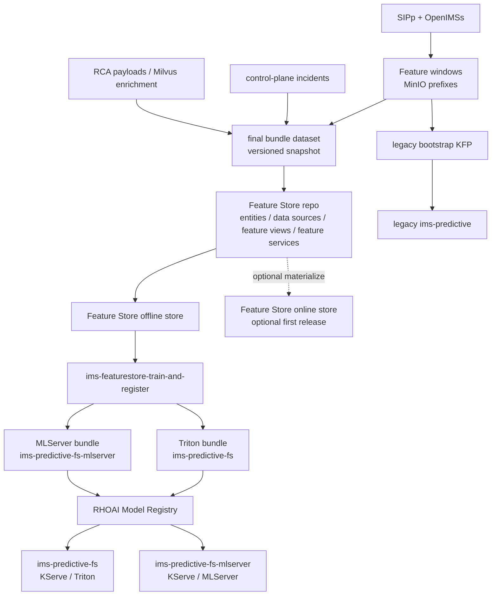

# Feature Store Training, Model Registry, and Serving Path

## 1. Purpose

This document defines the live feature-store-backed architecture for the IMS anomaly platform across Feature Store, KFP training, model registry, and serving.

The objective is no longer to sketch a hypothetical next path. The bundle publication pipeline, the `ims-featurestore` Feast deployment, the `ims-featurestore-train-and-register` pipeline, the OpenShift AI Model Registry publication step, and the dual Triton and MLServer serving exports are now part of the current rollout.

This architecture must:

- keep the legacy `ims-anomaly-platform-train-and-register` path available as a compatibility bridge
- continue collecting incidents, RCA payloads, and feature windows in the running platform
- create a final, versioned bundle dataset that is ready to publish into Feature Store
- define how that dataset maps to Feature Store data sources, features, feature views, and feature services
- run a cluster-native Kubeflow pipeline that reads from Feature Store, trains a model, and publishes a model version into the Red Hat OpenShift AI Model Registry
- deploy the feature-store-trained model into serving runtimes without breaking the legacy `ims-predictive` service

This document extends the current [engineering specification](./engineering-spec.md) and the release-oriented [incident release and offline training contract](./incident-release-corpus-and-offline-training.md).

### 1.1 Phase Alignment

This document is the primary deep dive for the middle model-lifecycle phases:

- Phase 2: Feature Store
- Phase 3: Model Training (KFP)
- Phase 4: Model Registry
- Phase 5: Model Serving

It assumes Phase 1 data has already been persisted by the live platform and does not redefine the RCA or remediation workflow handled later in [rca-remediation](./rca-remediation.md).

### 1.2 Document Role

Keep this document as the detailed reference for the current phases 2 to 5 implementation and its remaining compatibility constraints.

Use this file when you need:

- the live Feature Store architecture
- bundle dataset structure and Feature Store projection rules
- feature-store KFP pipeline boundaries and inputs
- model registry and serving rollout details, including what remains transitional

Use the phase overview files for concise summaries. They do not replace the design detail, rollout status, and remaining transition constraints captured here.

## 2. Product Notes

The Red Hat OpenShift AI documentation currently describes Feature Store as a Feast-based capability with offline and online stores, a registry, a UI, and feature services. The official documentation we reviewed also describes Feature Store as Technology Preview in some product versions.

Relevant references:

- [Overview of machine learning features and Feature Store](https://docs.redhat.com/en/documentation/red_hat_openshift_ai_self-managed/3.0/html/working_with_machine_learning_features/overview-of-ml-features-and-feature-store.adoc_featurestore)
- [Defining machine learning features](https://docs.redhat.com/en/documentation/red_hat_openshift_ai_self-managed/2.25/html/working_with_machine_learning_features/defining-ml-features_featurestore)
- [Retrieving features for model training](https://docs.redhat.com/en/documentation/red_hat_openshift_ai_self-managed/2.25/html/working_with_machine_learning_features/retrieving-features-for-model-training_featurestore)
- [Working with model registries](https://docs.redhat.com/en/documentation/red_hat_openshift_ai_self-managed/3.2/html/working_with_model_registries/working-with-model-registries_model-registry)

Rules for this repo:

- keep the legacy MinIO-backed training and Triton bootstrap path operational as a compatibility bridge
- treat the feature-store KFP path, model registry, and serving exports as the preferred cluster workflow
- avoid any design that removes the legacy bridge before the remaining rollout cleanup is complete

## 3. Current State

Today the platform supports both the legacy direct MinIO path and the feature-store-backed cluster path.

Current runtime facts:

- `services/sipp-runner/run_scenario.py` writes JSON feature windows to MinIO under `pipelines/ims-demo-lab/datasets/datasets/<dataset_version>/feature-windows/...`
- `ai/training/build_feature_bundle.py` and the release tooling create versioned bundle datasets under `pipelines/ims-demo-lab/datasets/feature-bundles/<bundle_version>/`
- `k8s/base/feature-store/featurestore-instance.yaml` deploys `ims-featurestore` through OpenShift AI Feature Store / Feast
- `ai/pipelines/ims_feature_bundle_pipeline.py` publishes and validates bundle versions
- `ai/pipelines/ims_featurestore_pipeline.py` resolves bundles, syncs Feast definitions, retrieves the training frame, trains and evaluates the baseline and AutoGluon candidate, exports Triton and MLServer bundles, and registers the selected model in OpenShift AI Model Registry
- the live feature-store serving targets are `ims-predictive-fs` (Triton) and `ims-predictive-fs-mlserver` (MLServer)
- `services/shared/model_store.py` and `anomaly-service` consume the feature-store serving path through the KServe V2 `/infer` contract
- the older `ims-anomaly-platform-train-and-register` pipeline and `ims-predictive` service remain available as a compatibility and bootstrap path

The legacy path is still available, but the feature-store path is now the preferred cluster-native model lifecycle.

## 4. Design Principles

- do not break the existing demo path
- keep data collection and training architecture separate from public release packaging
- create immutable bundle datasets instead of training directly from mutable live prefixes
- make feature contracts explicit and versioned
- introduce Feature Store first as a dataset and feature-definition layer, then grow into online inference usage
- use a new KFP pipeline and a new serving endpoint so that rollback remains simple
- publish to the Red Hat OpenShift AI Model Registry as the new model system of record, but keep a compatibility bridge to the current JSON registry until runtime consumers are updated

## 5. Current Dual-Path Architecture

The current architecture keeps a compatibility path next to the live feature-store path.



Operationally:

- the legacy MinIO-to-KFP-to-Triton flow stays intact as a compatibility bridge
- the feature-store path consumes a versioned bundle dataset, not the mutable live prefix directly
- the feature-store path is the preferred cluster lifecycle for training, registry publication, and serving export
- the feature-store path deploys to separate Triton and MLServer endpoints while preserving a simple fallback path

## 6. Bundle Dataset Architecture

### 6.1 Why a Bundle Dataset

While we are still collecting incidents, the live feature-window prefixes remain the system of capture, not the final training contract.

The new path should train from a bundle dataset because it gives us:

- one immutable snapshot of the exact training input
- consistent joins between feature windows, incident labels, and RCA metadata
- a dataset that can be validated, documented, and later published
- a stable batch data source for Feature Store

### 6.2 Bundle Identity

The bundle dataset must be versioned independently from the live MinIO dataset prefixes.

Required identifiers:

- `bundle_version`
- `source_snapshot_id`
- `source_dataset_versions`
- `feature_schema_version`
- `label_taxonomy_version`
- `bundle_contract_version`
- `generated_at`
- `git_commit`

Recommended naming examples:

- `ims-feature-bundle-2026-04-01`
- `ims-feature-bundle-v1`

### 6.3 Bundle Contents

The bundle dataset should be stored as an internal, feature-store-ready snapshot in object storage.

Recommended structure:

```text
s3://ims-models/feature-bundles/<bundle_version>/
  manifest.json
  dataset_card.md
  quality_report.json
  parquet/
    window_features.parquet
    window_context.parquet
    window_labels.parquet
    incidents.parquet
    rca_summary.parquet
  feature_store/
    entity_rows.parquet
    offline_source.parquet
```

Recommended rules:

- use Parquet for the bundle tables because the Feature Store docs support file-backed batch sources and Parquet is a good fit for reproducible batch retrieval
- keep labels and RCA enrichments in the bundle even if the first model version only uses numeric scoring features
- preserve the original `window_id`, `incident_id`, timestamps, scenario names, and dataset lineage
- keep one manifest that records row counts, source URIs, schema versions, and validation results

### 6.4 Minimum Bundle Schema

At minimum the feature bundle should preserve:

- `window_id`
- `event_timestamp`
- `created_timestamp`
- `dataset_version`
- `source_snapshot_id`
- `scenario_name`
- `label`
- `anomaly_type`
- the current numeric model inputs:
  - `register_rate`
  - `invite_rate`
  - `bye_rate`
  - `error_4xx_ratio`
  - `error_5xx_ratio`
  - `latency_p95`
  - `retransmission_count`
  - `inter_arrival_mean`
  - `payload_variance`

Optional but useful:

- `incident_id`
- `approval_status`
- `rca_status`
- `contributing_conditions`
- `call_limit`
- `rate`
- `transport`

## 7. Feature Store Projection

### 7.1 Feature Store Scope in This Repo

The Feature Store path in this repo now:

- registers the feature definitions against the bundle dataset
- generates reproducible training datasets from the offline store
- exposes the Feast registry and UI for inspection
- keeps a versioned feature contract that can later be reused by online retrieval

### 7.2 Proposed Feature Store Objects

The Feature Store path should map the bundle dataset into the following objects.

| Feature Store object | Proposal for this repo |
| --- | --- |
| Project / repo | `ai/featurestore/feature_repo/` |
| Batch data source | Parquet files from `s3://ims-models/feature-bundles/<bundle_version>/parquet/` |
| Entity | `feature_window` with join key `window_id` |
| Primary feature view | `ims_window_numeric_v1` |
| Context feature view | `ims_window_context_v1` |
| Training label view | `ims_training_label_v1` |
| Feature service | `ims_anomaly_scoring_v1` |
| Offline retrieval | feature service plus label join for training |
| Online store | optional in first release; enable after live push flow is defined |

### 7.3 Proposed Feature Views

#### `ims_window_numeric_v1`

Purpose:

- holds the numeric model inputs used by the current anomaly model
- becomes the first stable scoring contract

Suggested fields:

- `register_rate`
- `invite_rate`
- `bye_rate`
- `error_4xx_ratio`
- `error_5xx_ratio`
- `latency_p95`
- `retransmission_count`
- `inter_arrival_mean`
- `payload_variance`

Timestamp:

- `event_timestamp` derived from the window end or capture time

#### `ims_window_context_v1`

Purpose:

- keeps contextual columns that are useful for analysis, filtering, future feature expansion, or model-family experiments

Suggested fields:

- `scenario_name`
- `transport`
- `call_limit`
- `rate`
- `dataset_version`
- `source_snapshot_id`

#### `ims_training_label_v1`

Purpose:

- keeps supervised labels and training metadata out of the serving contract while still making the training dataset reproducible

Suggested fields:

- `label`
- `anomaly_type`
- `incident_id`
- `approval_status`

This view is intended for offline training only and must not be part of the serving feature service.

### 7.4 Proposed Feature Service

The initial feature service should represent the model input contract, not the entire bundle schema.

Recommended initial feature service:

- `ims_anomaly_scoring_v1`

This feature service should include only the numeric features that the model consumes. Labels, RCA, and incident metadata remain outside the feature service.

This gives us:

- a named feature contract per model family or model version
- a clean bridge between offline training and future online serving
- a stable feature group that can be attached to model-registry metadata

### 7.5 Offline and Online Stores

Initial recommendation:

- start with offline-store-backed training first
- treat online-store materialization as a second-phase enhancement

Reason:

- our current inference path already computes live feature vectors directly
- we can demonstrate Feature Store objects and training integration before we commit to a new live online retrieval path
- once live feature push semantics are defined, we can materialize the same feature views to an online store and use the feature server for online inference

## 8. New Kubeflow Pipeline Design

### 8.1 Pipeline Boundary

We now run a dedicated feature-store training pipeline rather than extending the legacy one in place.

Recommended new pipeline name:

- `ims-featurestore-train-and-register`

Companion bundle pipeline:

- `ims-feature-bundle-publish`

Rules:

- the legacy `ims-anomaly-platform-train-and-register` pipeline remains untouched
- the new pipeline consumes a `bundle_version`, not a raw `dataset_version`
- the new pipeline writes to the Red Hat OpenShift AI Model Registry
- the new pipeline prepares artifacts for separate Triton and MLServer serving endpoints

### 8.2 Proposed Pipeline Steps

Current step sequence:

1. `resolve-bundle`
2. `validate-bundle`
3. `sync-feature-store-definitions`
4. `retrieve-training-dataset`
5. `train-baseline`
6. `train-automl`
7. `evaluate`
8. `select-best`
9. `export-serving-artifact` (Triton)
10. `export-serving-artifact` (MLServer)
11. `register-model-version`
12. `publish-deployment-manifest` (Triton)
13. `publish-deployment-manifest` (MLServer)

Expected behavior:

- `sync-feature-store-definitions` runs `feast apply` against the feature repo
- `retrieve-training-dataset` uses the bundle dataset and Feature Store offline retrieval to create the training frame
- `export-serving-artifact` runs once per serving backend and both artifacts carry the selected source model version as lineage
- `register-model-version` creates a new model and model version entry in the Red Hat OpenShift AI Model Registry and points that version to the object-storage artifact location
- `publish-deployment-manifest` writes separate deployment metadata for Triton and MLServer without mutating the live endpoints directly

### 8.3 Pipeline Inputs

Required pipeline inputs:

- `bundle_version`
- `feature_store_project`
- `feature_service_name`
- `baseline_version`
- `candidate_version`
- `automl_engine`
- `model_name`
- `model_version_name`
- Triton serving-target configuration
- MLServer serving-target configuration

Recommended metadata captured at runtime:

- bundle manifest URI
- feature view list
- feature service name
- training row count
- evaluation metrics
- selected model kind
- serving artifact URI
- model registry URI or identifier

## 9. Model Registry Architecture

### 9.1 Objective

The new path should publish models to the Red Hat OpenShift AI Model Registry instead of relying only on the repo-managed JSON registry.

The registry entry should become the authoritative model lifecycle record for the new path.

### 9.2 Registration Contract

Each model version registered by the new pipeline should include:

- model name
- version name
- source model format
- source model format version
- object-storage model location
- bundle version
- feature schema version
- feature service name
- pipeline run ID
- selected metrics
- deployment readiness status

Recommended model naming:

- model: `ims-anomaly-featurestore`
- versions: dataset- or date-scoped, for example `bundle-2026-04-01-v1`

### 9.3 Compatibility Bridge

The live feature-store path registers versions in OpenShift AI Model Registry, but the repo JSON registry and older MinIO `predictive/` prefixes still exist as compatibility bridges.

Therefore the current rollout should:

- register the model version in the Red Hat OpenShift AI Model Registry
- keep compatibility JSON only for older bootstrap or local consumers that still need it
- prefer serving metadata and stable object-storage aliases for feature-store KServe consumers

## 10. Serving and Exposure

### 10.1 Serving Strategy

The live feature-store rollout uses separate serving targets.

Current names:

- `ims-predictive-fs`
- `ims-predictive-fs-mlserver`

Rules:

- do not replace `ims-predictive` on the first rollout
- keep the legacy serving runtime available for fallback and bootstrap
- use `ims-predictive-fs` as the current default remote-scoring endpoint
- keep `ims-predictive-fs-mlserver` available for side-by-side parity validation
- do not attempt an in-place Triton-to-MLServer cutover

### 10.2 Serving Artifact

The serving layer now exports separate artifacts for Triton and MLServer rather than trying to force one runtime format onto both backends.

Current exports:

- a Triton-serving repository for `ims-predictive-fs`
- an MLServer sklearn bundle for `ims-predictive-fs-mlserver`
- versioned and stable `current` aliases in object storage
- model-registry lineage that points back to the selected source model version

MLServer evaluation note:

- MLServer remains a side-by-side runtime rather than the default serving target
- MLServer uses a dedicated sklearn bundle and must not point at the Triton repository directly

### 10.3 Inference Integration Options

There are still two useful integration modes.

#### Mode A: Offline Feature Store only, current online scoring contract preserved

- the training pipeline uses Feature Store
- the runtime inference path continues to send raw feature vectors directly to Triton as it does today
- the feature service exists for contract definition and future online use

This is the current live rollout.

#### Mode B: Feature Store for both training and online inference

- live feature vectors are pushed or materialized into an online store
- anomaly-service or feature-gateway retrieves features through the feature server
- serving and training both use the same feature service contract end to end

This is the long-term target, but it should follow after the offline training path is stable.

## 11. Implemented Repo Areas

These repo areas now carry the feature-store implementation:

```text
docs/architecture/feature-store-training-path.md
ai/featurestore/
  feature_repo/
    feature_store.yaml
    entities.py
    feature_views.py
    feature_services.py
ai/training/
  build_feature_bundle.py
  featurestore_train.py
  model_registry_client.py
ai/pipelines/
  ims_featurestore_pipeline.py
  generated/ims_featurestore_pipeline.yaml
k8s/base/
  feature-store/
  kfp/assets/ims_featurestore_pipeline.yaml
  serving/featurestore-serving.yaml
  serving/featurestore-serving-mlserver.yaml
```

Notes:

- the legacy `train_and_register.py` path remains intact
- the feature-store flow stays as a separate code path with selectively shared utilities
- deployment manifests for the feature-store endpoints stay separate from the legacy bootstrap service

## 12. Rollout Milestones And Current Status

### Milestone 1: Freeze the training contract while collection continues (implemented)

Deliverables:

- bundle schema
- manifest contract
- versioning rules
- feature selection for `ims_window_numeric_v1`

### Milestone 2: Build the final bundle dataset (implemented)

Deliverables:

- bundle exporter
- Parquet output
- validation report
- dataset manifest

### Milestone 3: Stand up Feature Store objects (implemented)

Deliverables:

- feature repo
- data source definitions
- entities
- feature views
- feature service

### Milestone 4: New KFP training pipeline (implemented)

Deliverables:

- new compiled pipeline
- training retrieval from Feature Store
- evaluation and model selection
- artifact export
- model registry publication

### Milestone 5: Side-by-side serving rollout (implemented)

Deliverables:

- new `InferenceService`
- health and smoke checks
- comparison against current service
- dual Triton and MLServer serving exports

## 13. Remaining Questions

- Which exact Red Hat OpenShift AI version and support posture should be the long-term Feature Store target for this demo?
- Do we want to keep the first operator-facing release on offline Feature Store only, or introduce online-store materialization next?
- When should the repo-managed JSON registry compatibility bridge be retired?
- Should MLServer remain a parity path, or is there a future runtime-cutover plan after more smoke-test and observability hardening?

## 14. Near-Term Follow-Up

The remaining implementation cleanup should follow this order:

1. remove leftover score-only and legacy binary assumptions from smoke checks and helper paths
2. decide whether online-store materialization is in scope for the next iteration
3. decide whether MLServer remains a parity path or becomes a promoted runtime
4. reduce compatibility dependence on the repo-managed JSON registry where cluster-native metadata is already sufficient

That order keeps the current demo stable while trimming the remaining transition-only code and documentation.
