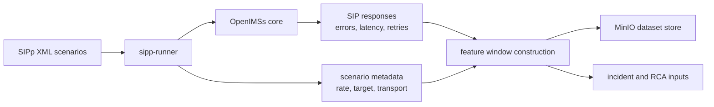

# Phase 01 Overview — Data Generation

## Purpose

This phase generates realistic IMS signaling behavior and fault conditions so the rest of the platform has trustworthy source data to learn from, score against, and explain later.

## Status

This is an active part of the current demo stack.

## What This Phase Covers

- OpenIMSs provides the IMS core runtime
- SIPp drives normal and fault scenarios
- XML scenarios encode expected flows and fault injections
- scenario execution produces signaling behavior, errors, latency patterns, and retransmission patterns
- runtime artifacts are turned into feature windows and persisted for downstream use

## Stage Diagram

## Inputs

- SIPp XML scenario definitions
- OpenIMSs runtime endpoints
- scenario execution parameters such as rate, transport, and target

## Outputs

- persisted feature windows
- scenario metadata and labels
- raw runtime evidence for incident analysis
- repeatable normal and fault conditions for training and demo playback

## Current Repo Touchpoints

- `services/sipp-runner/`
- `lab-assets/`
- `k8s/`
- `docs/labs/03-ims-and-sipp-lab.md`

## Why It Matters

Every later phase depends on this phase being deterministic enough to reproduce useful scenarios and realistic enough to generate meaningful anomalies. If the traffic generation phase is weak, feature quality, model quality, RCA quality, and remediation relevance all degrade.

## Related Docs

- [Architecture by phase](./README.md)
- [Engineering specification](./engineering-spec.md)
- [Incident release and offline training contract](./incident-release-corpus-and-offline-training.md)
