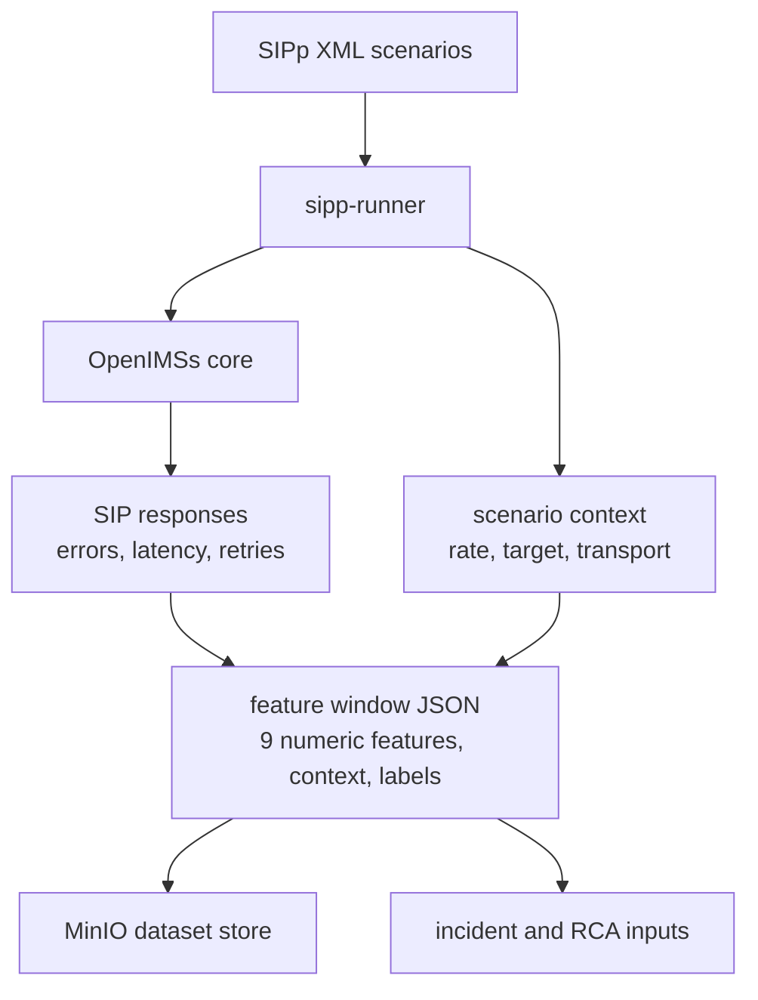

# Phase 01 Overview — Data Generation

## Purpose

This phase generates repeatable IMS signaling behavior and fault conditions, then materializes each run as a labeled feature-window record. That persisted record becomes the shared contract that later phases use for training, scoring, RCA, and demo playback.

## Status

This is an active part of the current demo stack.

## What This Phase Covers

- OpenIMSs provides the IMS core runtime that SIPp targets
- SIPp drives both baseline and fault scenarios through scheduled jobs
- The active XML scenario catalog lives in `k8s/base/traffic/scenarios/`
- `lab-assets/sipp/` is only a starter subset with three example XML files, not the full deployed catalog
- Scenario execution is persisted as feature-window JSON that separates numeric features, execution context, and labels
- The current schema carries the same nine numeric model inputs already used by training and serving: `register_rate`, `invite_rate`, `bye_rate`, `error_4xx_ratio`, `error_5xx_ratio`, `latency_p95`, `retransmission_count`, `inter_arrival_mean`, and `payload_variance`

## Stage Diagram

## Current XML Scenario Catalog

The deployed Phase 01 catalog currently contains 12 XML scenarios mounted through the `sipp-scenarios` ConfigMap:

- `register-normal.xml` -> `normal_operation`
- `register-storm.xml` -> `registration_storm`
- `invite-malformed.xml` -> `malformed_invite`
- `register-authentication-failure.xml` -> `authentication_failure`
- `register-failure.xml` -> `registration_failure`
- `invite-routing-error.xml` -> `routing_error`
- `invite-busy-destination.xml` -> `busy_destination`
- `invite-call-setup-timeout.xml` -> `call_setup_timeout`
- `bye-call-drop.xml` -> `call_drop_mid_session`
- `options-server-error.xml` -> `server_internal_error`
- `register-network-degradation.xml` -> `network_degradation`
- `invite-retransmission-spike.xml` -> `retransmission_spike`

The lab walkthrough and `lab-assets/sipp/` still highlight only three representative examples for brevity, but the running platform uses the full catalog above.

## Persisted Feature Window Contract

Every persisted window written by `services/sipp-runner/run_scenario.py` follows the same high-level shape so later phases do not need to rediscover semantics from raw SIP traces.

### Numeric Features

- `register_rate`: REGISTER traffic rate in the window
- `invite_rate`: INVITE traffic rate in the window
- `bye_rate`: BYE traffic rate in the window
- `error_4xx_ratio`: ratio of 4xx responses in the window
- `error_5xx_ratio`: ratio of 5xx responses in the window
- `latency_p95`: tail latency summary for the window
- `retransmission_count`: retransmissions observed during the run
- `inter_arrival_mean`: average spacing between messages
- `payload_variance`: spread of SIP payload sizes

### Context and Lineage

- Window identity and timing: `window_id`, `window_start`, `window_end`, `captured_at`
- Dataset and producer lineage: `source`, `feature_source`, `schema_version`, `dataset_version`
- Scenario execution context: `scenario_name`, `transport`, `call_limit`, `rate`, `target`, `scenario_file`
- Supporting runtime evidence: `response_codes` and `sipp_summary`

### Labels

- `label`: binary supervision target where `0` means normal and `1` means anomaly
- `anomaly_type`: normalized scenario label from the active catalog above, such as `normal_operation`, `registration_storm`, `routing_error`, or `network_degradation`
- `label_confidence`: deterministic confidence assigned by the scenario pipeline
- `contributing_conditions`: supporting conditions such as `retry_spike`, `4xx_burst`, `latency_high`, or `payload_anomaly`
- Nested `labels`: grouped label object containing `anomaly`, `anomaly_type`, and `contributing_conditions`

## Inputs

- XML scenario definitions from `k8s/base/traffic/scenarios/`
- OpenIMSs runtime endpoints
- Scenario execution parameters such as rate, transport, call limit, and target

## Outputs

- Feature-window JSON persisted to the MinIO dataset store under dataset versions such as `live-sipp-v1`
- The nine numeric model inputs in the `features` map
- Scenario context and lineage fields needed for filtering, joins, and reproducibility
- Binary and categorical labels plus contributing conditions derived from the scenario catalog
- SIP response, latency, retry, and payload-derived runtime evidence for incident analysis
- Optional control-plane incident inputs when scenario runs emit scoring and incident records

## Current Repo Touchpoints

- `services/sipp-runner/`
- `services/feature-gateway/`
- `k8s/base/traffic/scenarios/`
- `k8s/base/traffic/sipp.yaml`
- `k8s/base/traffic/sipp-categories.yaml`
- `lab-assets/sipp/` for the smaller starter subset
- `docs/labs/03-ims-and-sipp-lab.md`

## Why It Matters

Every later phase depends on this phase being deterministic enough to reproduce useful scenarios and realistic enough to generate meaningful anomalies. If the traffic generation phase is weak, feature quality, model quality, RCA quality, and remediation relevance all degrade.

## Related Docs

- [Architecture by phase](./README.md)
- [Engineering specification](./engineering-spec.md)
- [Incident release and offline training contract](./incident-release-corpus-and-offline-training.md)
