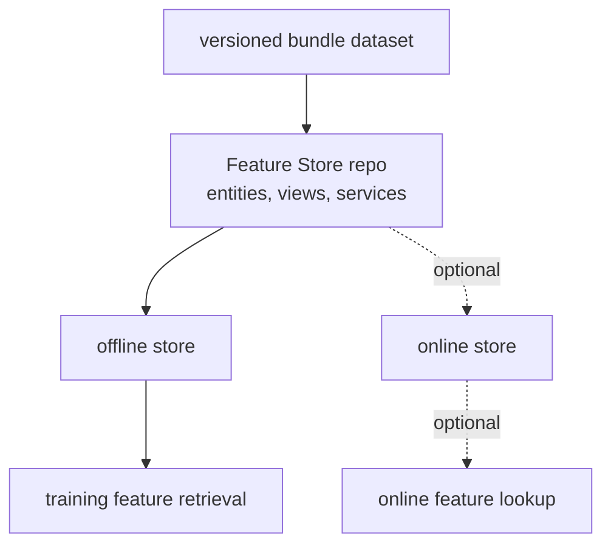

# Phase 02 Overview — Feature Store

## Purpose

This phase turns persisted runtime data into explicit feature definitions so training and future online inference can use the same feature contract instead of relying on loosely coupled JSON payloads.

## Status

This phase is live. `ims-featurestore` is deployed through OpenShift AI Feature Store / Feast, its registry and UI are available in-cluster, and the KFP training path now syncs definitions and retrieves training data from the Feature Store offline path. Online materialization remains optional.

## What This Phase Covers

- define entities such as feature-window lineage
- project bundle data into stable numeric, context, and label feature views
- sync the repo feature definitions into the managed Feature Store
- keep offline training retrieval and future online serving retrieval aligned
- version the feature contract so model lineage stays auditable

## Stage Diagram

## Inputs

- versioned feature-bundle data and schema definitions
- label and lineage contracts
- feature repo definitions and cluster Feature Store configuration

## Outputs

- managed Feature Store project and repo definitions
- entities, data sources, feature views, and feature services
- offline retrieval used by the feature-store KFP training pipeline
- optional online-store materialization path
- Feast registry and UI metadata that operators can inspect

## Current Repo Touchpoints

- `ai/featurestore/feature_repo/`
- `ai/training/featurestore_train.py`
- `k8s/base/feature-store/`
- `docs/architecture/feature-store-training-path.md`

## Why It Matters

The Feature Store creates a stable feature interface between bundle publication, model training, and future online retrieval. Without it, training can drift from serving behavior and every model iteration has to rediscover feature semantics from raw exports.

## Related Docs

- [Architecture by phase](./README.md)
- [Engineering specification](./engineering-spec.md)
- [Feature store training path](./feature-store-training-path.md)
- [Incident release and offline training contract](./incident-release-corpus-and-offline-training.md)
