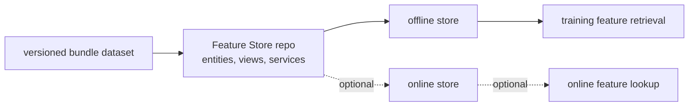

# Phase 02 Overview — Feature Store

## Purpose

This phase turns persisted runtime data into explicit feature definitions so training and, later, online inference can use the same feature contract instead of relying on loosely coupled JSON payloads.

## Status

This is a target and transition phase. The current demo still uses MinIO-backed feature windows directly, while the Feature Store path is the planned next architecture.

## What This Phase Covers

- define entities such as call, session, or feature window lineage
- project raw runtime data into stable feature views
- separate numeric features, context features, and labels
- keep offline training retrieval and future online serving retrieval aligned
- version the feature contract so model lineage stays auditable

## Stage Diagram

## Inputs

- versioned feature windows from Phase 1
- release-ready bundle data and schema definitions
- label and lineage contracts

## Outputs

- entities
- data sources
- feature views
- feature services
- offline and optional online feature retrieval paths

## Current Repo Touchpoints

- `docs/architecture/feature-store-training-path.md`
- `ai/`
- `services/`

## Why It Matters

The Feature Store creates a stable feature interface between data generation and model lifecycle work. Without it, training can drift from future online scoring behavior and every model iteration has to rediscover feature semantics from raw exports.

## Related Docs

- [Architecture by phase](./README.md)
- [Engineering specification](./engineering-spec.md)
- [Feature store training path](./feature-store-training-path.md)
- [Incident release and offline training contract](./incident-release-corpus-and-offline-training.md)
