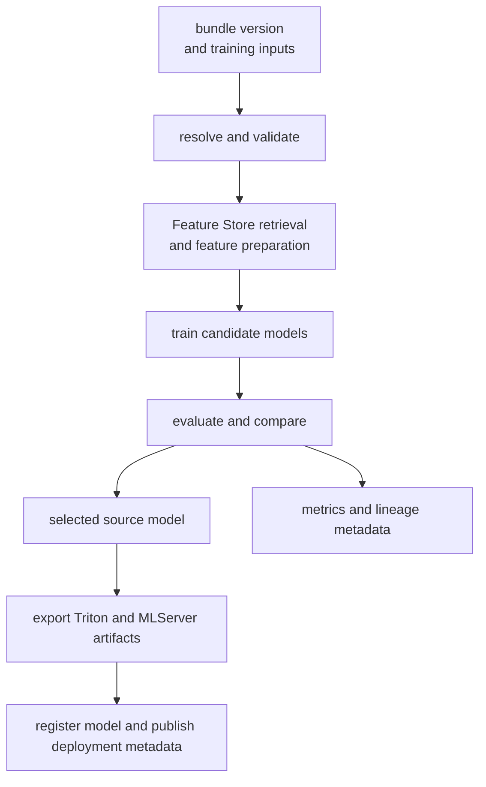

# Phase 03 Overview — Model Training (KFP)

## Purpose

This phase trains and evaluates anomaly models through reproducible Kubeflow Pipelines so model quality, lineage, selection decisions, and serving handoff are explicit.

## Status

This phase is live through both `ims-feature-bundle-publish` and `ims-featurestore-train-and-register`. The feature-store-backed KFP workflow is now the preferred cluster training path, while the older MinIO-only trainer remains available as a compatibility and bootstrap path.

## What This Phase Covers

- resolve and validate a published bundle version
- sync Feature Store definitions and retrieve the offline training frame
- train the multiclass baseline path plus the current AutoGluon multiclass candidate path
- evaluate macro quality, per-class quality, and select a winning source artifact
- export serving artifacts for Triton and MLServer, then register and publish deployment metadata
- keep the workflow automated and reproducible

## Stage Diagram

## Inputs

- published bundle version and manifest
- Feature Store project and feature-service configuration
- canonical anomaly labels and split manifests
- trainer configuration and model-family settings

## Outputs

- training manifests and split datasets
- trained multiclass model artifacts
- evaluation metrics, confusion output, and calibration summaries
- selected winner metadata
- Triton and MLServer serving export metadata
- reproducible training run records

## Current Repo Touchpoints

- `ai/pipelines/ims_feature_bundle_pipeline.py`
- `ai/pipelines/ims_featurestore_pipeline.py`
- `ai/training/featurestore_train.py`
- `k8s/base/kfp/assets/`
- `docs/architecture/feature-store-training-path.md`
- `docs/architecture/incident-release-corpus-and-offline-training.md`

## Why It Matters

This phase is the boundary between stored evidence and deployable intelligence. If training, selection, and export are not reproducible, later claims about drift, accuracy, or promotion quality become difficult to trust.

## Related Docs

- [Architecture by phase](./README.md)
- [AutoGluon training and model selection](./autogluon-training-and-model-selection.md)
- [Engineering specification](./engineering-spec.md)
- [Feature store training path](./feature-store-training-path.md)
- [Incident release and offline training contract](./incident-release-corpus-and-offline-training.md)
