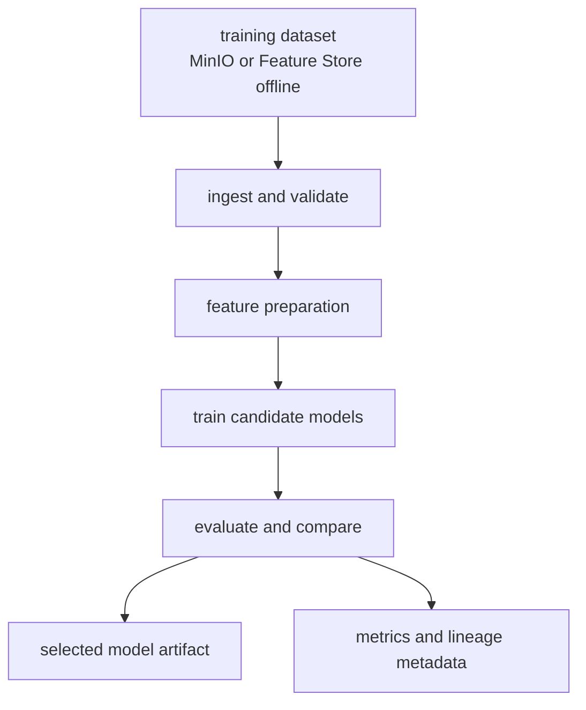

# Phase 03 Overview — Model Training (KFP)

## Purpose

This phase trains and evaluates anomaly models through reproducible Kubeflow Pipelines so model quality, lineage, and selection decisions are explicit.

## Status

This phase is live today through the current MinIO-backed training path. A second Feature-Store-backed pipeline is planned as an additive evolution.

## What This Phase Covers

- load persisted training inputs from object storage or Feature Store offline retrieval
- materialize training tables and labels
- train one or more candidate model families
- evaluate metrics and select a winning artifact
- keep the workflow automated and reproducible

## Stage Diagram

## Inputs

- persisted feature windows or bundle datasets
- training labels and split manifests
- trainer configuration and model-family settings

## Outputs

- trained model artifacts
- evaluation metrics
- selected winner metadata
- reproducible training run records

## Current Repo Touchpoints

- `ai/pipelines/`
- `ai/training/train_and_register.py`
- `docs/architecture/feature-store-training-path.md`
- `docs/architecture/incident-release-corpus-and-offline-training.md`

## Why It Matters

This phase is the boundary between stored evidence and deployable intelligence. If training is not reproducible, later claims about drift, accuracy, or promotion quality become difficult to trust.

## Related Docs

- [Architecture by phase](./README.md)
- [Engineering specification](./engineering-spec.md)
- [Feature store training path](./feature-store-training-path.md)
- [Incident release and offline training contract](./incident-release-corpus-and-offline-training.md)
