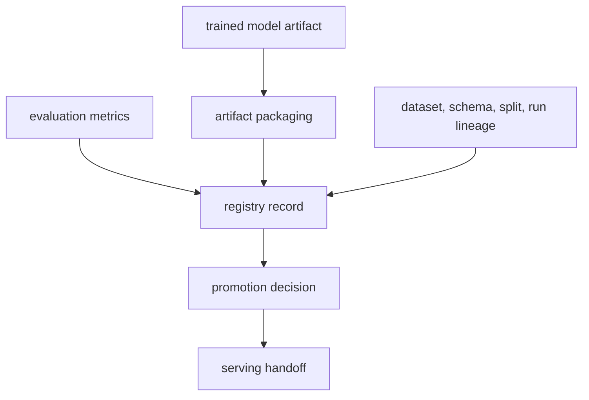

# Phase 04 Overview — Model Registry

## Purpose

This phase records which trained model exists, where its artifact lives, which dataset and schema produced it, and whether it is suitable for promotion.

## Status

This phase is in transition. The current demo uses repo-managed metadata plus MinIO-backed artifacts, while the target architecture adds Red Hat OpenShift AI Model Registry as the stronger system of record.

## What This Phase Covers

- register trained model versions
- attach lineage to dataset, schema, and training run
- persist performance and compatibility metadata
- distinguish candidate models from promoted models
- support promotion decisions without forcing automatic deployment

## Stage Diagram

## Inputs

- selected model artifact from training
- evaluation metrics
- release, schema, and split lineage

## Outputs

- model version records
- lineage metadata
- promotion-ready registry entries
- serving handoff metadata

## Current Repo Touchpoints

- `ai/registry/model_registry.json`
- `services/shared/model_registry.py`
- `docs/architecture/feature-store-training-path.md`

## Why It Matters

The registry is where model lifecycle discipline becomes visible. It prevents the platform from treating a trained artifact as self-explanatory and creates the metadata bridge between training, serving, and auditability.

## Related Docs

- [Architecture by phase](./README.md)
- [Engineering specification](./engineering-spec.md)
- [Feature store training path](./feature-store-training-path.md)
- [Incident release and offline training contract](./incident-release-corpus-and-offline-training.md)
