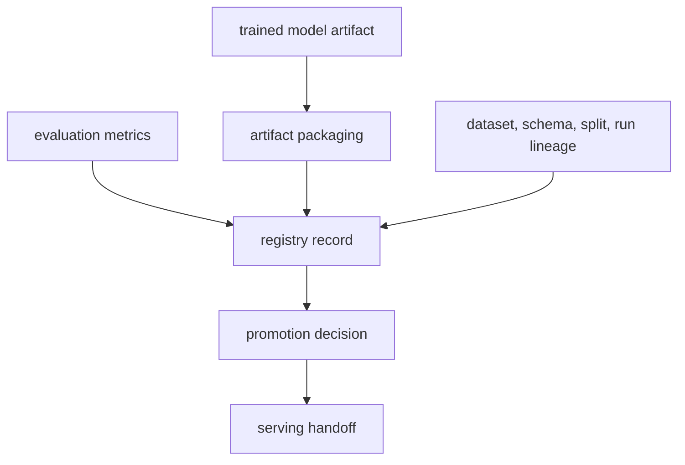

# Phase 04 Overview — Model Registry

## Purpose

This phase records which trained model exists, where its artifacts live, which dataset and schema produced it, and whether it is suitable for promotion and serving handoff.

## Status

This phase is live in the feature-store KFP path. The cluster now registers model versions in Red Hat OpenShift AI Model Registry, while the repo-managed JSON metadata remains as a compatibility bridge for older bootstrap and local paths.

## What This Phase Covers

- register trained model versions
- attach lineage to dataset, schema, and training run
- persist multiclass performance, calibration, compatibility, and serving-runtime metadata
- distinguish candidate models from promoted models
- support promotion decisions without forcing automatic deployment

## Stage Diagram

## Inputs

- selected model artifact from training
- evaluation metrics, confusion outputs, and calibration summaries
- release, schema, split, and label-taxonomy lineage

## Outputs

- OpenShift AI Model Registry records
- lineage metadata
- promotion-ready registry entries with class labels, normal-class identity, and runtime format
- serving handoff metadata for deployment manifests and stable aliases

## Current Repo Touchpoints

- `ai/registry/model_registry.json`
- `ai/training/featurestore_train.py`
- `services/shared/model_registry.py`
- `k8s/base/rhoai/`
- `docs/architecture/feature-store-training-path.md`

## Why It Matters

The registry is where model lifecycle discipline becomes visible. It prevents the platform from treating a trained artifact as self-explanatory and creates the metadata bridge between training, serving, deployment automation, and auditability.

## Related Docs

- [Architecture by phase](./README.md)
- [Engineering specification](./engineering-spec.md)
- [Feature store training path](./feature-store-training-path.md)
- [Incident release and offline training contract](./incident-release-corpus-and-offline-training.md)
