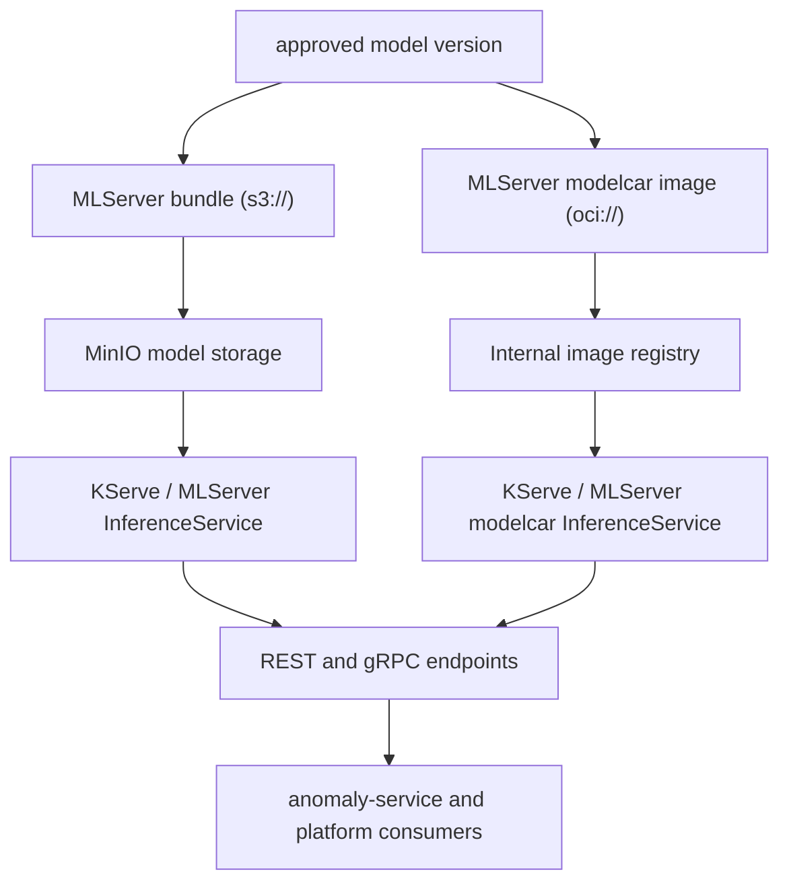

# Phase 05 Overview — Model Serving

## Purpose

This phase exposes the selected anomaly model through a stable inference runtime so live platform services can predict one canonical incident class per traffic window, plus confidence, probabilities, and top alternatives.

## Status

This phase is live through the legacy `ani-predictive` Triton path plus the MLServer-based feature-store endpoints `ani-predictive-fs`, `ani-predictive-backfill`, and `ani-predictive-backfill-modelcar`. The default remote-scoring runtime for the current feature-store path is MLServer, and the modelcar branch provides a reusable OCI-packaged variant of the trained backfill model.

## What This Phase Covers

- package the winning model for serving
- publish versioned and stable-alias artifacts into object storage or an OCI image registry
- expose the runtime through OpenShift AI model serving
- provide stable REST and gRPC inference endpoints for multiclass probabilities and derived incident signals
- support side-by-side serving when a new runtime or artifact-delivery path is introduced

## Stage Diagram

## Inputs

- approved source model artifact and metadata
- serving compatibility contract including class order, normal-class identity, and probability output shape
- runtime configuration for KServe, MLServer, and modelcar paths

## Outputs

- deployed inference runtimes
- stable inference endpoints
- serving metadata that downstream services can trust, including class labels and taxonomy version
- side-by-side comparison path across MinIO-backed and OCI-backed MLServer deployments

## Current Repo Touchpoints

- `ai/training/featurestore_train.py`
- `services/shared/model_store.py`
- `k8s/base/serving/`
- `k8s/overlays/gitops/tekton/`
- `k8s/manual/demo-triggers/`
- `docs/architecture/feature-store-training-path.md`
- `docs/architecture/engineering-spec.md`

## Why It Matters

Serving is where model lifecycle work becomes operational behavior. If serving contracts drift from training or registry metadata, anomaly scoring results become difficult to interpret and troubleshoot.

## Related Docs

- [Architecture by phase](./README.md)
- [Engineering specification](./engineering-spec.md)
- [Feature store training path](./feature-store-training-path.md)
