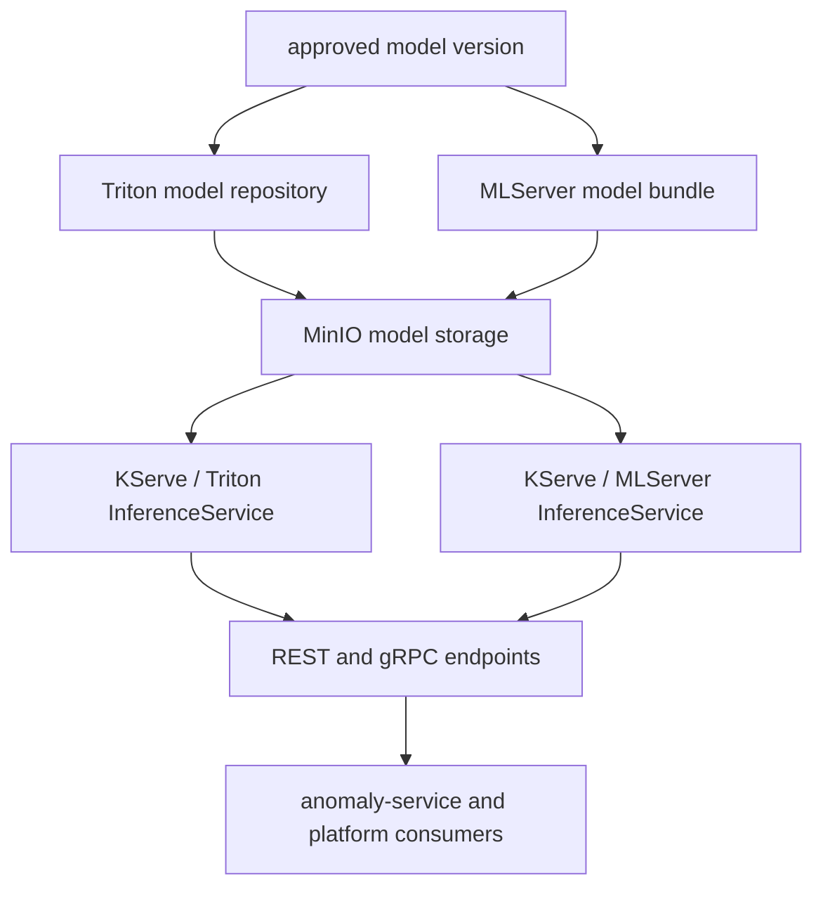

# Phase 05 Overview — Model Serving

## Purpose

This phase exposes the selected anomaly model through a stable inference runtime so live platform services can score traffic windows consistently.

## Status

This phase is live in the current demo through the `ims-predictive` and `ims-predictive-fs` Triton-backed serving paths. A side-by-side MLServer candidate path is the next serving experiment, but Triton remains the active default runtime.

## What This Phase Covers

- package the winning model for serving
- publish the model into the active serving artifact layout
- expose the runtime through OpenShift AI model serving
- provide stable REST and gRPC inference endpoints
- support side-by-side serving when a new runtime path is introduced

## Stage Diagram

## Inputs

- approved model artifact and metadata
- serving compatibility contract
- runtime configuration for KServe, Triton, and candidate MLServer paths

## Outputs

- deployed inference runtime
- stable inference endpoints
- serving metadata that downstream services can trust
- side-by-side comparison path when a new runtime is introduced

## Current Repo Touchpoints

- `ai/models/`
- `k8s/`
- `docs/architecture/feature-store-training-path.md`
- `docs/architecture/engineering-spec.md`

## Why It Matters

Serving is where model lifecycle work becomes operational behavior. If serving contracts drift from training or registry metadata, anomaly scoring results become difficult to interpret and troubleshoot.

## Related Docs

- [Architecture by phase](./README.md)
- [Engineering specification](./engineering-spec.md)
- [Feature store training path](./feature-store-training-path.md)
