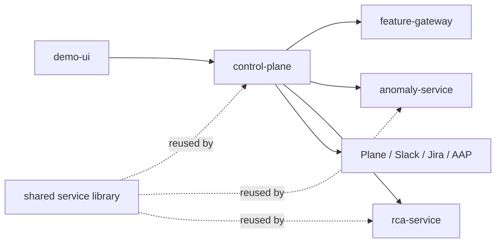

# Phase 06 Overview — Custom Services

## Purpose

This phase connects generated traffic, live feature collection, anomaly scoring, RCA orchestration, ticketing, automation, and the operator UI into one usable runtime system.

## Status

This is an active part of the current platform.

## What This Phase Covers

- expose the operator-facing UI and console APIs
- collect or proxy feature windows into the scoring path
- orchestrate anomaly scoring, RCA, workflow state, and integrations
- keep shared service logic reusable across API services
- provide the operational bridge between platform components

## Stage Diagram

## Inputs

- live feature windows
- model-serving responses
- RCA and retrieval context
- human operator actions

## Outputs

- incident records
- workflow state
- UI-facing console data
- ticket and automation integration events

## Current Repo Touchpoints

- `services/demo-ui/`
- `services/control-plane/`
- `services/feature-gateway/`
- `services/anomaly-service/`
- `services/rca-service/`
- `services/shared/`

## Why It Matters

These services are the runtime glue of the platform. Without them, the earlier ML phases remain isolated assets rather than a working incident-management system.

## Related Docs

- [Architecture by phase](./README.md)
- [Engineering specification](./engineering-spec.md)
- [RCA and remediation](./rca-remediation.md)
