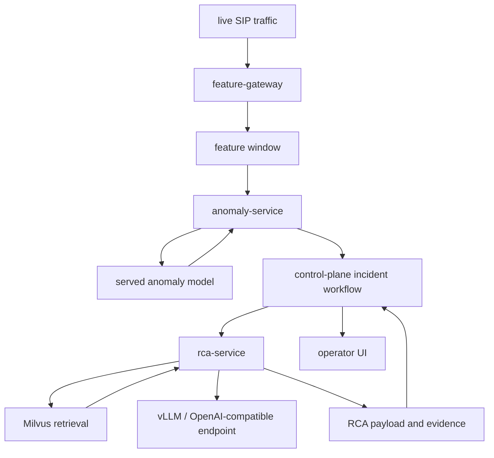

# Phase 07 Overview — Real-Time Detection and RCA

## Purpose

This phase detects anomalies from live traffic, retrieves relevant prior knowledge, and produces grounded RCA output that operators can act on.

## Status

This is an active part of the current platform and one of the primary differentiators of the demo. `anomaly-service` now scores through KServe V2 against the deployed multiclass feature-store serving path and persists the returned class probabilities with each incident.

## What This Phase Covers

- simulate or collect live traffic behavior
- score live windows against the deployed multiclass anomaly model through remote KServe inference
- create incidents when the predicted class is not `normal_operation`
- retrieve similar evidence and prior outcomes from Milvus
- generate RCA using deterministic evidence plus LLM-assisted reasoning

## Stage Diagram

## Embedding Stages

This phase uses multiple embedding layers rather than treating all text as one generic knowledge bucket.

| Collection | What gets embedded | Why it exists |
| --- | --- | --- |
| `ani_runbooks` | curated operational guidance, stable runbooks, and category-specific KB articles | gives the retrieval layer stable operator-authored background knowledge and ensures each incident category has reusable demo-ready guidance |
| `incident_evidence` | incident facts, feature patterns, and evidence summaries | supports diagnosis from concrete observed signals |
| `incident_reasoning` | normalized RCA reasoning and explanation text | supports similarity across RCA narratives |
| `incident_resolution` | verified fixes, outcomes, and resolution summaries | supports remediation ranking and learning from successful outcomes |

## Inputs

- live feature windows
- predicted class, predicted confidence, class probabilities, top alternatives, and model metadata
- incident context from the control plane
- retrieved evidence and runbooks
- category-matched KB articles from Milvus

## Outputs

- multiclass incident predictions
- incident records
- per-incident confidence and class-probability context
- RCA payloads with evidence and recommendation fields
- retrieval context that can be shown back to operators
- clickable knowledge article links in the incident UI

## Demo and Cluster Readiness

The Milvus knowledge base is now part of the bootstrap path, not a manual demo-prep step.

- `ai/rag/runbooks/*-knowledge.json` provides category-based KB bundles
- the `rca-service` image carries the corpus into the cluster
- `milvus-bootstrap` loads the corpus into Milvus for a fresh environment
- the incident UI can request category-scoped articles and open the full article content directly

## Current Repo Touchpoints

- `services/anomaly-service/`
- `services/control-plane/`
- `services/rca-service/`
- `services/shared/rag.py`
- `docs/architecture/rca-remediation.md`

## Why It Matters

This phase is where the platform moves beyond simple alerting. The value is not only detecting that something is wrong, but explaining why it is likely wrong using evidence that can be reviewed, challenged, and improved over time.

## Related Docs

- [Architecture by phase](./README.md)
- [Engineering specification](./engineering-spec.md)
- [TrustyAI Explainability for Incident Scoring](./trustyai-explainability-for-incident-scoring.md)
- [RCA and remediation](./rca-remediation.md)
