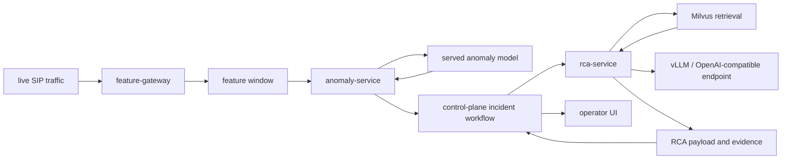

# Phase 07 Overview — Real-Time Detection and RCA

## Purpose

This phase detects anomalies from live traffic, retrieves relevant prior knowledge, and produces grounded RCA output that operators can act on.

## Status

This is an active part of the current platform and one of the primary differentiators of the demo.

## What This Phase Covers

- simulate or collect live traffic behavior
- score live windows against the deployed anomaly model
- create incidents when anomaly thresholds are exceeded
- retrieve similar evidence and prior outcomes from Milvus
- generate RCA using deterministic evidence plus LLM-assisted reasoning

## Stage Diagram

## Embedding Stages

This phase uses multiple embedding layers rather than treating all text as one generic knowledge bucket.

| Collection | What gets embedded | Why it exists |
| --- | --- | --- |
| `ims_runbooks` | curated operational guidance and known procedures | gives the retrieval layer stable operator-authored background knowledge |
| `incident_evidence` | incident facts, feature patterns, and evidence summaries | supports diagnosis from concrete observed signals |
| `incident_reasoning` | normalized RCA reasoning and explanation text | supports similarity across RCA narratives |
| `incident_resolution` | verified fixes, outcomes, and resolution summaries | supports remediation ranking and learning from successful outcomes |

## Inputs

- live feature windows
- anomaly scores and model metadata
- incident context from the control plane
- retrieved evidence and runbooks

## Outputs

- anomaly decisions
- incident records
- RCA payloads with evidence and recommendation fields
- retrieval context that can be shown back to operators

## Current Repo Touchpoints

- `services/anomaly-service/`
- `services/control-plane/`
- `services/rca-service/`
- `services/shared/rag.py`
- `docs/architecture/rca-remediation.md`

## Why It Matters

This phase is where the platform moves beyond simple alerting. The value is not only detecting that something is wrong, but explaining why it is likely wrong using evidence that can be reviewed, challenged, and improved over time.

## Related Docs

- [Architecture by phase](./README.md)
- [Engineering specification](./engineering-spec.md)
- [RCA and remediation](./rca-remediation.md)
