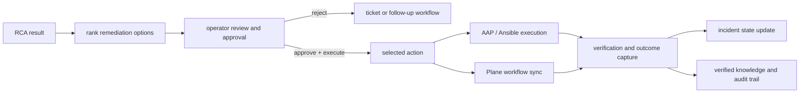

# Phase 08 Overview — Remediation

## Purpose

This phase turns RCA into human-reviewed action by suggesting remediations, capturing approval, executing the selected path, verifying the result, and learning from the outcome.

## Status

This is active in the current platform. The `scale_scscf` path is already wired to live AAP-backed execution with runner-job fallback when controller writes are license-blocked.

## What This Phase Covers

- generate remediation suggestions from RCA and prior knowledge
- keep approval explicitly human-controlled
- execute the chosen action through manual, ticketing, or automation paths
- sync relevant status into Plane and other workflow surfaces
- record verification results and reusable knowledge

## Stage Diagram

## Inputs

- RCA payloads
- remediation ranking logic
- operator approval and notes
- automation configuration and RBAC

## Outputs

- remediation suggestions
- approvals and action records
- execution status and verification results
- updated incident workflow state
- reusable resolution knowledge

## Current Repo Touchpoints

- `services/control-plane/`
- `services/shared/aap.py`
- `services/shared/tickets.py`
- `automation/ansible/playbooks/scale-scscf.yaml`
- `k8s/base/platform/aap-remediation-rbac.yaml`
- `docs/architecture/rca-remediation.md`

## Why It Matters

This phase closes the loop. It is where the platform proves that its analysis can lead to controlled action, not just observation. Human approval remains the guardrail that keeps automation safe and auditable.

## Related Docs

- [Architecture by phase](./README.md)
- [Engineering specification](./engineering-spec.md)
- [RCA and remediation](./rca-remediation.md)
