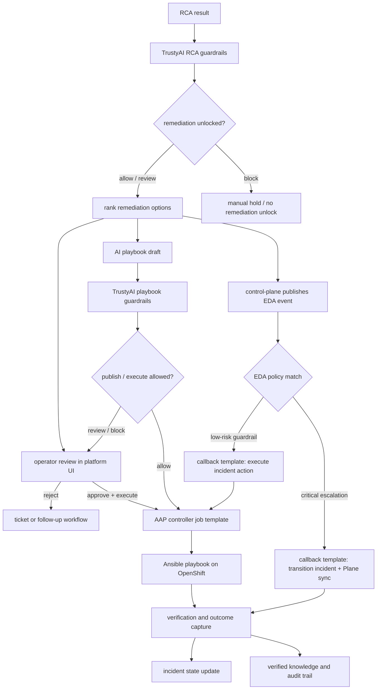

# Phase 08 Overview — Remediation

## Purpose

This phase turns RCA into controlled action by suggesting remediations, capturing human approval where required, executing the selected path, verifying the result, and learning from the outcome.

## Status

This is active in the current platform. The control-plane now bootstraps AAP Controller and Event-Driven Ansible resources on startup, wires live OpenShift credentials into controller job templates, and supports both human-approved remediation from the UI and selective low-risk event-driven execution.

Current live coverage:

- manual UI execution through AAP Controller for `scale_scscf`, `rate_limit_pcscf`, and `quarantine_imsi`
- optional AI playbook generation after remediation suggestions, using Kafka request delivery and a control-plane callback
- TrustyAI RCA guardrail decisions that determine whether remediation can unlock without an additional manual hold
- TrustyAI playbook draft validation that gates preview, publish, and execute behavior for AI-generated playbooks
- controller callback templates for event-driven incident transitions and event-driven action execution
- EDA policy `ANI Critical Incident Escalation` for critical RCA-attached incidents that should move to `ESCALATED` and sync Plane
- EDA policy `ANI Critical Signal Guardrail` for selected critical signaling incidents that can auto-apply `rate_limit_pcscf`
- runner-job fallback when controller write operations are blocked by the current AAP license

## What This Phase Covers

- generate remediation suggestions from RCA and prior knowledge
- respect TrustyAI RCA guardrail outcomes before remediation is unlocked
- keep high-impact approval explicitly human-controlled while allowing selected low-risk policy automation
- validate AI-generated playbook drafts with TrustyAI before publish or execution
- execute the chosen action through manual, ticketing, or automation paths
- sync relevant status into Plane and other workflow surfaces
- record verification results and reusable knowledge

## Stage Diagram

## Inputs

- RCA payloads
- RCA guardrail decisions
- remediation ranking logic
- AI playbook draft guardrail decisions
- operator approval and notes
- automation bootstrap configuration, AAP/EDA project sync, and callback templates
- OpenShift RBAC and dynamic Kubernetes credentials for controller execution

## Outputs

- remediation suggestions
- approvals, action records, and AAP job identifiers
- playbook guardrail outcomes and publish decisions
- execution status, Plane comments, and verification results
- updated incident workflow state
- reusable resolution knowledge

## Current Repo Touchpoints

- `services/control-plane/`
- `services/shared/guardrails.py`
- `services/shared/aap.py`
- `services/shared/eda.py`
- `services/shared/tickets.py`
- `automation/ansible/playbooks/scale-scscf.yaml`
- `automation/ansible/playbooks/rate-limit-pcscf.yaml`
- `automation/ansible/playbooks/quarantine-imsi.yaml`
- `automation/eda/playbooks/transition-incident-state.yml`
- `automation/eda/playbooks/execute-incident-action.yml`
- `rulebooks/critical-incident-escalation.yml`
- `rulebooks/critical-signal-guardrail.yml`
- `k8s/base/platform/aap-remediation-rbac.yaml`
- `k8s/base/platform/platform-services.yaml`
- `docs/architecture/rca-remediation.md`
- `docs/architecture/ai-playbook-generation.md`

## Why It Matters

This phase closes the loop. It is where the platform proves that its analysis can lead to controlled action, not just observation. Human approval remains the default guardrail for impactful remediation, while carefully selected EDA policies show how the same control-plane can also automate low-risk response and escalation without bypassing audit, ticket sync, or verification.

## Related Docs

- [Architecture by phase](./README.md)
- [Engineering specification](./engineering-spec.md)
- [AI Safety And Trust](./ai-safety-and-trust.md)
- [Phase 09 Overview — TrustyAI Integration](./phase-09-overview-trustyai-integration.md)
- [RCA and remediation](./rca-remediation.md)
- [TrustyAI Guardrails for RCA](./trustyai-guardrails-for-rca.md)
- [Remediation suggestions and playbooks](./remediation-suggestions-and-playbooks.md)
- [AI playbook generation](./ai-playbook-generation.md)
- [Event-Driven Ansible](./event-driven-ansible.md)
