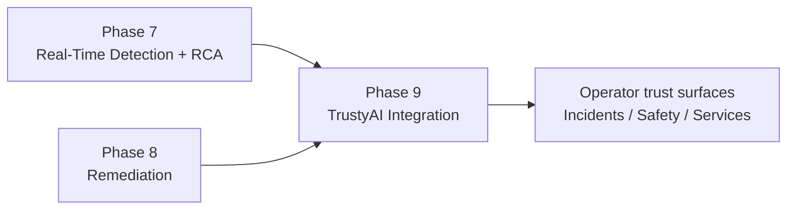
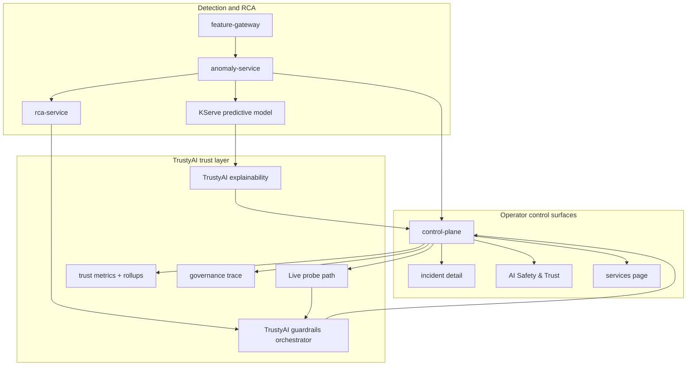
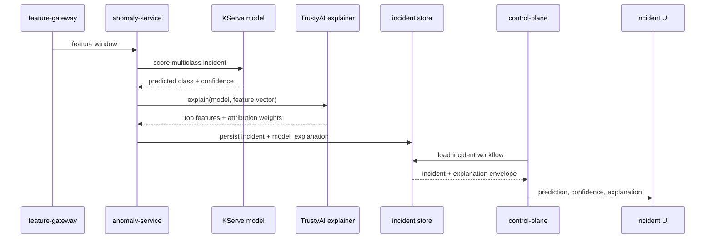
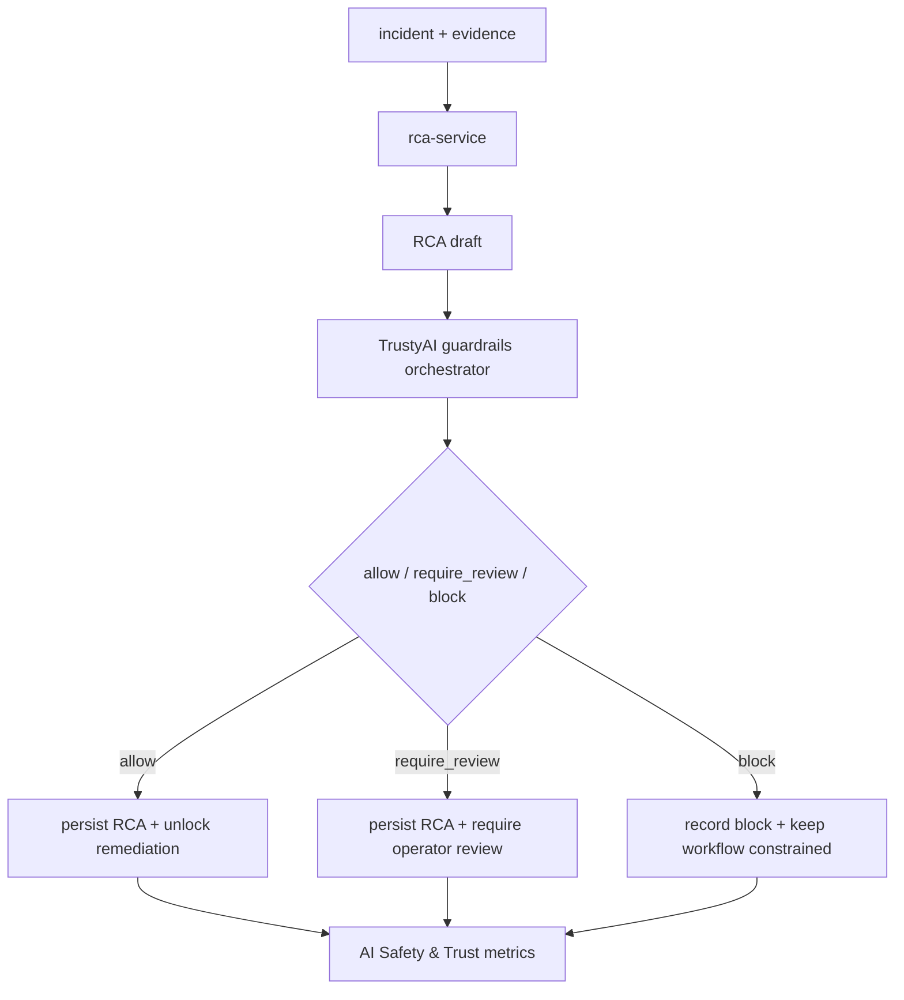
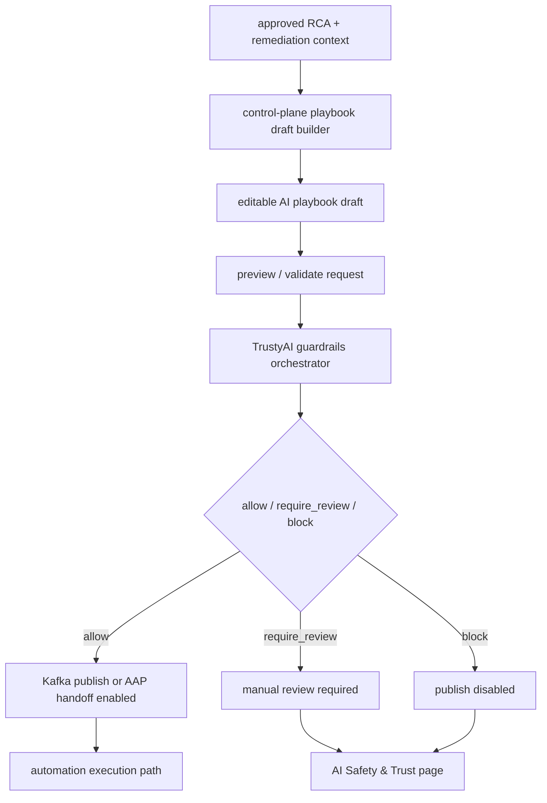
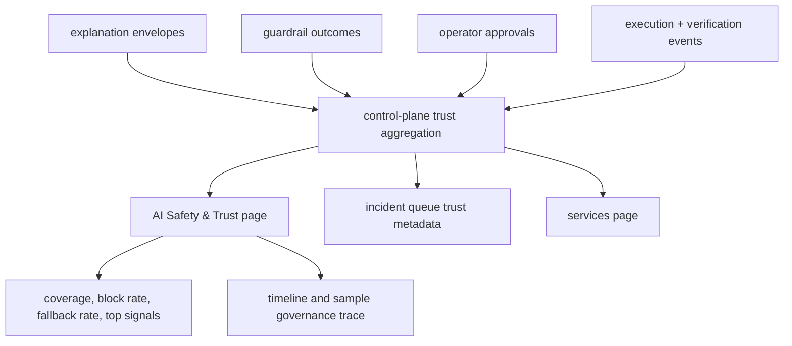

# Phase 09 Overview — TrustyAI Integration

## Purpose

This phase adds the TrustyAI-based trust layer on top of live detection, RCA, and remediation. Its purpose is to make the platform explainable, policy-controlled, monitorable, and auditable before operators act on AI output.

## Status

This is active in the current platform.

Current live coverage includes:

- TrustyAI explainability attached to incident scoring and persisted with the incident record
- TrustyAI guardrails for RCA and AI playbook-generation decision points
- a TrustyAI-backed `AI Safety & Trust` page for provider status, monitoring, governance, and live probes
- service visibility for TrustyAI guardrails and explainability surfaces in the `/services` page

## What This Phase Covers

- explainability for live anomaly predictions
- guardrails for RCA generation and remediation unlock
- guardrails for AI playbook draft validation and publish control
- monitoring for explanation mode, fallback rate, policy outcomes, and operator-facing trust metrics
- governance traces that capture prediction, explanation, RCA, approval, and execution stages

## Phase Placement

This phase is cross-cutting. It sits on top of the real-time detection and remediation phases rather than replacing them.

## Trust Layer Overview

## Explainability Flow

This flow explains why the model predicted a specific anomaly class.

Key behavior:

- the explanation is persisted with the incident instead of computed only at render time
- the incident UI can show provider, explanation confidence, and top contributing signals
- the `AI Safety & Trust` page can roll up real recent explanation output instead of demo-only static content

## RCA Guardrails Flow

This flow controls whether RCA output should be allowed, reviewed, or blocked before it unlocks remediation.

Key behavior:

- TrustyAI becomes the decision boundary between RCA generation and downstream actionability
- the decision is persisted and counted for monitoring and governance
- blocked or review-required RCA output is visible to operators instead of silently discarded

## AI Playbook Guardrails Flow

This flow controls manual edits, validation, and publish eligibility for AI-generated playbooks.

Key behavior:

- draft edits invalidate stale safety decisions
- reset-to-generated-draft can restore an already validated `allow` state
- blocked drafts cannot be executed or published
- playbook guardrail outcomes are persisted for monitoring and audit

## Monitoring and Governance Flow

This flow explains how trust data becomes operator-visible rollups and traces.

Key behavior:

- monitoring is derived from real persisted trust records, not static examples
- governance traces combine prediction, explanation, RCA, approval, and action stages
- service visibility gives operators the current TrustyAI surfaces and route entry points

## Inputs

- multiclass prediction outputs from the deployed model
- incident feature vectors and model metadata
- RCA drafts and associated evidence
- AI playbook drafts and operator edits
- approvals, execution results, and verification events

## Outputs

- persisted model explanation envelopes
- TrustyAI provider metadata and top feature attributions
- RCA guardrail decisions
- playbook guardrail decisions
- trust metrics, top-signal rollups, and governance traces
- operator-visible TrustyAI routes and service status

## Current Repo Touchpoints

- `services/shared/explainability.py`
- `services/shared/guardrails.py`
- `services/anomaly-service/`
- `services/control-plane/`
- `services/demo-ui/app/safety/page.tsx`
- `services/demo-ui/app/services/page.tsx`
- `services/demo-ui/components/incident-workflow-detail.tsx`
- `docs/architecture/trustyai-explainability-for-incident-scoring.md`
- `docs/architecture/trustyai-guardrails-for-rca.md`
- `docs/architecture/ai-safety-and-trust.md`
- `k8s/overlays/gitops/trustyai/`
- `k8s/base/serving/`

## Why It Matters

This phase is where the demo stops being just “AI plus automation” and becomes a governed AI system. It shows that the platform can explain predictions, apply safety policy before action, expose trust metrics to operators, and keep an audit trail across the entire incident lifecycle.

## Related Docs

- [Architecture by phase](./README.md)
- [Engineering specification](./engineering-spec.md)
- [AI Safety And Trust](./ai-safety-and-trust.md)
- [TrustyAI Explainability for Incident Scoring](./trustyai-explainability-for-incident-scoring.md)
- [TrustyAI Guardrails for RCA](./trustyai-guardrails-for-rca.md)
- [AI playbook generation](./ai-playbook-generation.md)
- [RCA and remediation](./rca-remediation.md)
