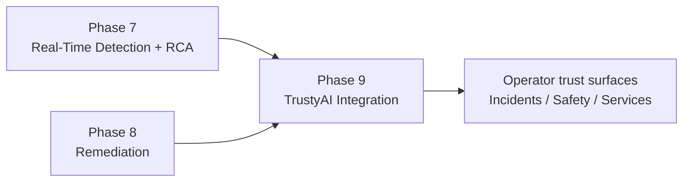
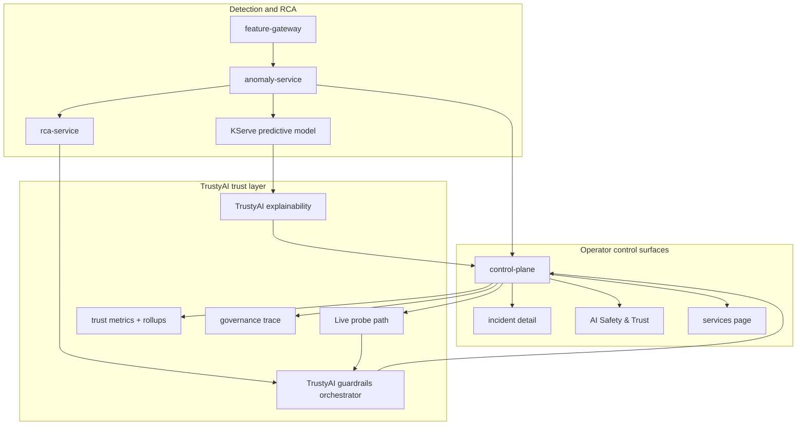
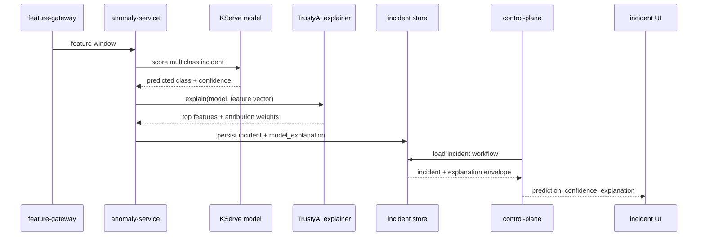
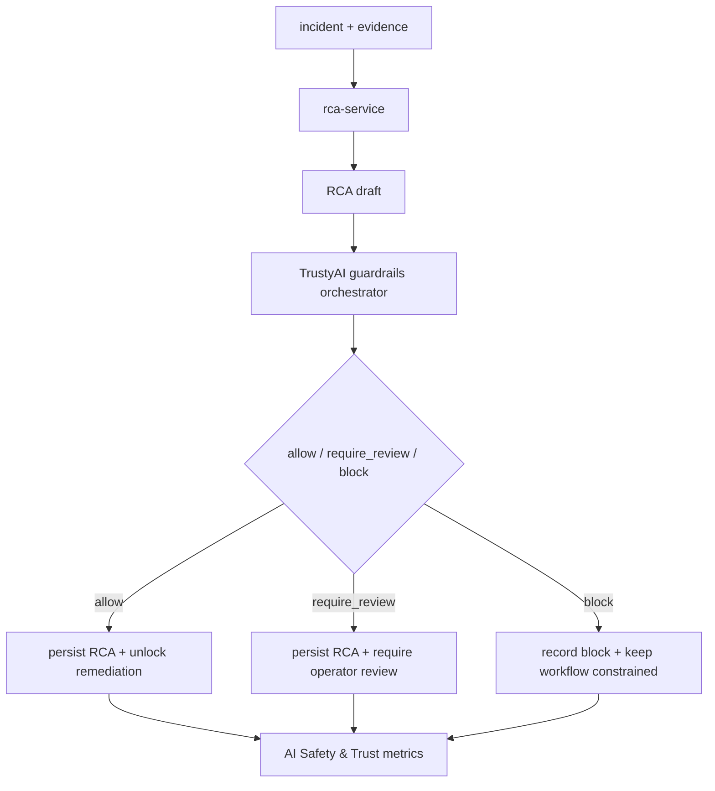
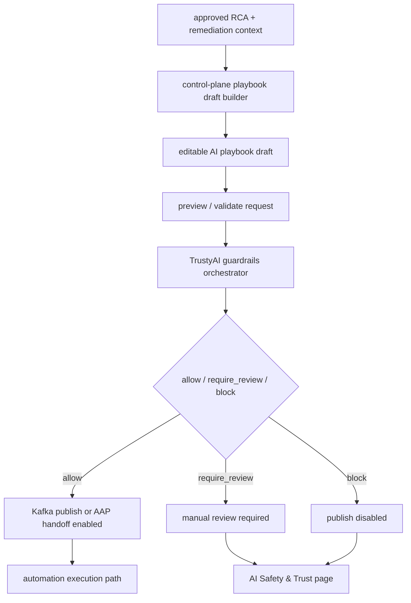
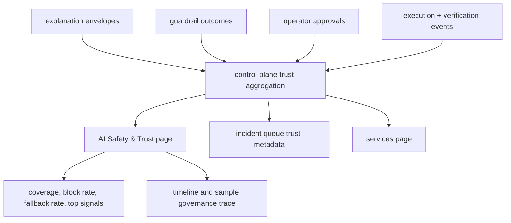

# Phase 09 Overview — TrustyAI Integration

## Purpose

This phase adds the TrustyAI-based trust layer on top of live detection, RCA, and remediation. Its purpose is to make the platform explainable, policy-controlled, monitorable, and auditable before operators act on AI output.

## Status

This is active in the current platform.

Current live coverage includes:

- TrustyAI explainability attached to incident scoring and persisted with the incident record
- TrustyAI guardrails for RCA and AI playbook-generation decision points
- a TrustyAI-backed `AI Safety & Trust` page for provider status, monitoring, governance, and live probes
- service visibility for TrustyAI guardrails and explainability surfaces in the `/services` page

## What This Phase Covers

- explainability for live anomaly predictions
- guardrails for RCA generation and remediation unlock
- guardrails for AI playbook draft validation and publish control
- monitoring for explanation mode, fallback rate, policy outcomes, and operator-facing trust metrics
- governance traces that capture prediction, explanation, RCA, approval, and execution stages

## Phase Placement

This phase is cross-cutting. It sits on top of the real-time detection and remediation phases rather than replacing them.



## Trust Layer Overview



## Explainability Flow

This flow explains why the model predicted a specific anomaly class.



Key behavior:

- the explanation is persisted with the incident instead of computed only at render time
- the incident UI can show provider, explanation confidence, and top contributing signals
- the `AI Safety & Trust` page can roll up real recent explanation output instead of demo-only static content

## RCA Guardrails Flow

This flow controls whether RCA output should be allowed, reviewed, or blocked before it unlocks remediation.



Key behavior:

- TrustyAI becomes the decision boundary between RCA generation and downstream actionability
- the decision is persisted and counted for monitoring and governance
- blocked or review-required RCA output is visible to operators instead of silently discarded

## AI Playbook Guardrails Flow

This flow controls manual edits, validation, and publish eligibility for AI-generated playbooks.



Key behavior:

- draft edits invalidate stale safety decisions
- reset-to-generated-draft can restore an already validated `allow` state
- blocked drafts cannot be executed or published
- playbook guardrail outcomes are persisted for monitoring and audit

## Monitoring and Governance Flow

This flow explains how trust data becomes operator-visible rollups and traces.



Key behavior:

- monitoring is derived from real persisted trust records, not static examples
- governance traces combine prediction, explanation, RCA, approval, and action stages
- service visibility gives operators the current TrustyAI surfaces and route entry points

## Injection Into The Workflow

### 1. Explainability

TrustyAI explainability is injected at the predictive serving boundary, not added later in the UI.

- the TrustyAI explainer is attached directly to the predictive `InferenceService`
- the MLServer runtime starts `ai.featurestore.trustyai_v1_adapter:app` on port `8081` so the explainer can talk to a TrustyAI-compatible v1 endpoint while the model still serves v2
- `ani-platform-config` publishes the active predictor and explainer endpoints for the selected classifier profile
- `anomaly-service` calls `current_predictive_profile()` and `build_model_explanation(...)`, then persists the resulting `model_explanation` envelope with the incident
- `services/shared/explainability.py` falls back to the local heuristic explanation when TrustyAI is unavailable so incident creation continues

```yaml
# k8s/base/serving/featurestore-serving.yaml
explainer:
  containers:
    - name: kserve-container
      image: quay.io/trustyai/trustyai-kserve-explainer:latest
      args:
        - --model_name
        - ani-predictive-fs
        - --predictor_host
        - ani-predictive-fs-predictor.$(POD_NAMESPACE).svc.cluster.local:8081
```

```yaml
# k8s/base/serving/autogluon-mlserver-runtime.yaml
command:
  - /bin/sh
  - -lc
  - mkdir -p /tmp/mlserver-metrics /tmp/mlserver-envs && uvicorn ai.featurestore.trustyai_v1_adapter:app --host 0.0.0.0 --port 8081 --http h11 --workers 4 --timeout-keep-alive 30 & exec mlserver start /mnt/models
```

```yaml
# k8s/base/platform/platform-runtime-config.yaml
PREDICTIVE_ACTIVE_PROFILE: live
PREDICTIVE_ENDPOINT_LIVE: http://ani-predictive-fs-predictor.ani-demo-lab.svc.cluster.local:8080
PREDICTIVE_EXPLAINABILITY_ENDPOINT_LIVE: http://ani-predictive-fs-explainer.ani-demo-lab.svc.cluster.local:8080
```

### 2. Guardrails

TrustyAI guardrails are injected at two text-generation boundaries: RCA generation and AI playbook request validation.

- GitOps deploys `GuardrailsOrchestrator`, its configuration, and the prompt-injection detector through the `ani-trustyai` application
- the orchestrator sends chat generation to `ani-generative-proxy` and detector calls to the dedicated prompt-injection `InferenceService`
- `llm-provider-config` rewires `rca-service` to call the Guardrails gateway at `/rca` instead of calling the model directly
- `control-plane` separately calls `evaluate_ai_playbook_generation_guardrails(...)` before preview, publish, or override flows for AI playbook generation
- both paths persist an explicit `guardrails` decision envelope so `allow`, `require_review`, `block`, and `error` remain visible to operators

```yaml
# k8s/overlays/gitops/runtime/llm-provider-config.yaml
LLM_ENDPOINT: http://guardrails-orchestrator-service.ani-datascience.svc.cluster.local:8090/rca
TRUSTYAI_ORCHESTRATOR_ENDPOINT: https://guardrails-orchestrator-service.ani-datascience.svc.cluster.local:8032
TRUSTYAI_ORCHESTRATOR_VERIFY_TLS: "false"
ANI_PLAYBOOK_GUARDRAILS_TRUSTYAI_ENABLED: "true"
```

```yaml
# k8s/base/trustyai/orchestrator-config.yaml
chat_generation:
  service:
    hostname: ani-generative-proxy.ani-datascience.svc.cluster.local
    port: 80
detectors:
  prompt_injection:
    service:
      hostname: prompt-injection-detector-predictor.ani-datascience.svc.cluster.local
      port: 8000
```

```yaml
# k8s/base/trustyai/gateway-config.yaml
routes:
  - name: rca
    detectors:
      - prompt-injection-input
      - pii-output
```

### 3. Monitoring

Monitoring is injected in two layers: runtime metrics at the serving edge and trust rollups in `control-plane`.

- the predictive runtime and TrustyAI detector runtime export Prometheus-friendly metrics
- the predictive `InferenceService` is scraped through a `PodMonitor`, so inference and explainer behavior are available as service metrics
- `control-plane` aggregates persisted explanation envelopes, RCA guardrail outcomes, playbook guardrail outcomes, approvals, and audit events into the `AI Safety & Trust` status payload
- the `AI Safety & Trust` page exposes rates such as explanation fallback rate, RCA allow rate, playbook block rate, prompt-injection detections, approval count, and action execution count
- the `/services` page separately surfaces active explainability endpoints and guardrails routes so operators can see whether the TrustyAI surfaces are actually configured

```yaml
# k8s/base/serving/featurestore-serving.yaml
kind: PodMonitor
spec:
  podMetricsEndpoints:
    - path: /metrics
      targetPort: 8082
      interval: 30s
```

```json
{
  "monitoring": {
    "summary": {
      "trust_metadata_coverage_rate": 0.0,
      "explanation_fallback_rate": 0.0,
      "rca_allow_rate": 0.0,
      "playbook_block_rate": 0.0,
      "prompt_injection_detections": 0,
      "approval_count": 0,
      "action_execution_count": 0
    }
  }
}
```

### 4. Governance

Governance is injected as a trace-building layer in `control-plane`, not as a separate workflow engine.

- `_build_governance_trace(...)` combines prediction, explainability, RCA guardrails, playbook guardrails, approval, and action execution into one sample trust trace
- lineage metadata records the active classifier profile, feature service, explainability provider, RCA guardrails provider, playbook guardrails provider, LLM model, and guardrail policy version
- approvals and executed actions come from audit events, so TrustyAI findings stay tied to operator decisions and downstream execution
- the `AI Safety & Trust` page renders the governance lineage and sample trace directly from persisted trust metadata

```json
{
  "governance": {
    "lineage": {
      "active_model_version": "ani-predictive-fs",
      "feature_service": "ani_anomaly_scoring_v1",
      "explainability_provider": "TrustyAI Explainability",
      "rca_guardrails_provider": "TrustyAI Guardrails",
      "playbook_guardrails_provider": "TrustyAI Guardrails",
      "guardrail_policy": "v1"
    },
    "sample_trace": {
      "stages": [
        { "key": "prediction" },
        { "key": "explainability" },
        { "key": "rca_guardrails" },
        { "key": "playbook_guardrails" },
        { "key": "approval" },
        { "key": "action" }
      ]
    }
  }
}
```

## Inputs

- multiclass prediction outputs from the deployed model
- incident feature vectors and model metadata
- RCA drafts and associated evidence
- AI playbook drafts and operator edits
- approvals, execution results, and verification events

## Outputs

- persisted model explanation envelopes
- TrustyAI provider metadata and top feature attributions
- RCA guardrail decisions
- playbook guardrail decisions
- trust metrics, top-signal rollups, and governance traces
- operator-visible TrustyAI routes and service status

## Current Repo Touchpoints

- `services/shared/explainability.py`
- `services/shared/guardrails.py`
- `services/anomaly-service/`
- `services/control-plane/`
- `services/demo-ui/app/safety/page.tsx`
- `services/demo-ui/app/services/page.tsx`
- `services/demo-ui/components/incident-workflow-detail.tsx`
- `docs/architecture/trustyai-explainability-for-incident-scoring.md`
- `docs/architecture/trustyai-guardrails-for-rca.md`
- `docs/architecture/ai-safety-and-trust.md`
- `k8s/overlays/gitops/trustyai/`
- `k8s/base/serving/`

## Why It Matters

This phase is where the demo stops being just “AI plus automation” and becomes a governed AI system. It shows that the platform can explain predictions, apply safety policy before action, expose trust metrics to operators, and keep an audit trail across the entire incident lifecycle.

## Related Docs

- [Architecture by phase](./README.md)
- [Engineering specification](./engineering-spec.md)
- [AI Safety And Trust](./ai-safety-and-trust.md)
- [TrustyAI Explainability for Incident Scoring](./trustyai-explainability-for-incident-scoring.md)
- [TrustyAI Guardrails for RCA](./trustyai-guardrails-for-rca.md)
- [AI playbook generation](./ai-playbook-generation.md)
- [RCA and remediation](./rca-remediation.md)
