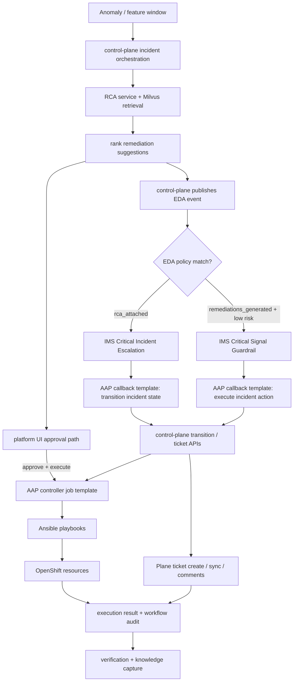

# IMS Anomaly Detection: RCA, Remediation, AAP / EDA Automation, Human-in-the-Loop, and Plane Integration

## 1. Executive Summary

This document defines the production-oriented design for the runtime response phase of the IMS anomaly detection demo: converting anomaly events into grounded root cause analysis (RCA), ranked remediation suggestions, AAP-backed execution, EDA-backed policy automation, Plane-backed workflow, and verified knowledge that improves future responses.

The target outcome is a closed-loop system:

**Anomaly Detection → Incident Created → RCA / Remediation → Human-Approved AAP Execution or EDA Policy Callback → Verification → Knowledge Capture**

Plane is the operator-facing work management surface where incidents become actionable tickets, humans collaborate, remediation decisions are tracked, and final outcomes are captured. Plane is not the semantic knowledge store. Milvus remains the retrieval layer, and PostgreSQL remains the operational source of truth.

This design intentionally keeps Plane behind a provider abstraction so Jira or another system can be added later without redesigning the core incident pipeline.

### 1.1 Phase Alignment

This document is the primary deep dive for the runtime response phases:

- Phase 6: Custom Services
- Phase 7: Real-Time Detection and RCA
- Phase 8: Remediation

It assumes the earlier phases already provide persisted traffic data, a trained anomaly model, model metadata, and a live serving endpoint.

### 1.2 Document Role

Keep this document as the detailed runtime response contract.

Use this file when you need:

- the RCA and remediation workflow in full
- state machine, data model, APIs, and ticketing behavior
- embedding strategy and retrieval rules
- automation execution, safety controls, and human approval rules

Use [`event-driven-ansible.md`](./event-driven-ansible.md) when you want the narrower walkthrough of the EDA webhook, activation, and callback path.

### 1.3 Current Implementation Snapshot

The current cluster implementation already includes the following runtime control points:

- AAP Controller project sync from the in-cluster Gitea repository
- dynamic OpenShift API credential creation for controller execution
- controller job templates for `scale_scscf`, `rate_limit_pcscf`, and `quarantine_imsi`
- controller callback templates for event-driven incident transition and event-driven action execution
- EDA project, decision environment, and running activations bootstrapped from the same repository
- Plane ticket creation plus comment synchronization for workflow transitions and action execution updates
- automatic bootstrap on control-plane startup so a fresh cluster can reconcile the automation surfaces without manual setup

Use the phase overview files for short stage summaries. They do not replace the operational and API-level detail captured here.

---

## 2. Goals

### 2.1 Primary Goals

- Produce grounded RCA for detected IMS/SIP anomalies.
- Produce one or more remediation suggestions for each incident.
- Support human-in-the-loop validation before medium- or high-impact action is taken, while allowing explicit low-risk policy-driven automation.
- Support execution of manual steps and automation, including Ansible playbooks.
- Record final outcomes, including whether remediation worked.
- Feed verified outcomes back into the knowledge system so future RCA/remediation becomes more accurate.
- Deploy Plane inside the same OpenShift cluster for V1.
- Create Plane issues automatically for selected incidents.
- Sync RCA and remediation suggestions into Plane.
- Allow humans to manage workflow in Plane while execution and verification remain controlled by the platform.
- Capture final resolution from Plane back into the incident system.

### 2.2 Secondary Goals

- Support Jira integration later without redesigning the core model.
- Keep Milvus as the semantic knowledge store.
- Keep the architecture modular so remediation engines and ticket systems can be swapped.
- Keep Plane optional per incident severity or workflow policy.

---

## 3. Non-Goals

- Replacing model serving runtime now.
- Deep Snowflake / Databricks / Feast integration in this phase.
- Full autonomous remediation without human approval.
- Enterprise-grade ITSM breadth in V1.
- Long-term case management, SLA, escalations, and multi-team workflows.
- Storing semantic knowledge primarily in Plane.
- Embedding every Plane comment or issue blindly.
- Making Plane the execution engine or the operational source of truth.

---

## 4. High-Level Product Behavior

When the anomaly detection system detects an issue, the platform should:

1. Create an incident evidence record.
2. Retrieve semantically similar historical incidents and verified resolutions.
3. Generate RCA using LLM + retrieved context + deterministic incident evidence.
4. Generate one or more remediation suggestions.
5. Open a human review workflow.
6. Based on policy, create or update a Plane issue for human workflow.
7. Optionally publish EDA events for selected escalation or low-risk guardrail cases.
8. Allow a human to approve, reject, modify, or execute a remediation, or let an explicit EDA policy call back into the same workflow.
9. Capture execution outcome.
10. Mark the outcome as verified or not verified.
11. Store validated knowledge for future retrieval.

---

## 5. Key Design Principles

### 5.1 Grounded RCA, Not Pure LLM Guessing

RCA must be grounded in:

- anomaly metadata
- feature windows
- SIP/IMS response patterns
- retrieved historical incidents
- retrieved verified resolutions

### 5.2 Verified Knowledge Has Highest Value

The system must distinguish between:

- generated hypotheses
- suggested remediations
- human-validated fixes

Only validated fixes should be treated as trusted future knowledge.

### 5.3 Append Knowledge, Do Not Overwrite It

Do not keep mutating one semantic record for the entire lifecycle. Instead, create linked records by stage. Workflow metadata may be updated in-place in the operational store, but semantic knowledge should be append-oriented.

### 5.4 Human Approval Before Action

Human approval remains the default gate for operationally impactful remediation in V1. The only exceptions should be explicit, low-risk, policy-backed EDA actions that still re-enter the control-plane workflow, audit, and verification path.

### 5.5 Ticketing Is a Workflow Surface, Not the Source of Truth

The system’s operational database remains the source of truth. Plane is the collaboration surface, Milvus is the semantic retrieval store, and PostgreSQL is the operational truth for incidents, approvals, execution state, sync state, and audit history.

---

## 6. Architecture Overview

### 6.1 Core Components

- **Traffic / anomaly pipeline**: SIPp/OpenIMS traffic and anomaly detection.
- **Incident API / orchestrator**: creates incidents, coordinates downstream processing, and owns workflow state transitions.
- **Milvus**: semantic knowledge store for evidence, RCA, remediations, and verified resolutions.
- **Operational DB**: PostgreSQL recommended for workflow state, approvals, ticket IDs, execution logs, and audit history.
- **RCA service**: retrieval + prompt construction + LLM invocation + structured RCA output.
- **Remediation service**: produces ranked suggestions.
- **Human review UI**: operator-facing interface for approve/reject/modify/verify.
- **AAP controller integration**: project sync, inventory, dynamic OpenShift credential, job template launch, and controller job monitoring.
- **EDA integration**: project sync, decision environment, activation lifecycle, callback templates, and webhook delivery services.
- **Plane**: in-cluster ticket and collaboration workflow surface for V1.
- **Ticketing adapter**: `PlaneTicketProvider` for V1, Jira-compatible abstraction for future.
- **Notification layer**: optional Slack notifications / approval links.

### 6.2 Recommended V1 Deployment on OpenShift

- OpenShift cluster hosts all components.
- Existing components reused where possible: OpenShift AI, Milvus, Kafka, KFP if needed.
- PostgreSQL deployed in-cluster or consumed if already available.
- AAP Controller and AAP EDA are deployed in-cluster in the `aap` namespace.
- The control-plane bootstraps controller job templates, callback templates, the EDA project, the decision environment, and activations on startup from repository content stored in Gitea.
- OpenShift RBAC and token minting allow the control-plane to provision controller credentials and expose EDA webhook services without storing a static cluster kubeconfig in git.
- Plane deployed in-cluster, ideally in `plane-system` or `ims-ticketing`.
- All remediation playbooks and rulebooks remain versioned in the same repository as the application.

### 6.3 Current Runtime Control Flow



---

## 7. End-to-End Workflow

### 7.1 Stage 1: Incident Creation

Input:

- anomaly_type
- anomaly_score
- feature window
- response codes
- scenario metadata
- source/target/context

Output:

- operational incident record created
- semantic evidence record created in Milvus

### 7.2 Stage 2: Retrieval

Retrieve from Milvus:

- similar incident evidence
- similar RCA records
- verified resolutions
- prior remediation suggestions

Ranking preference:

1. verified resolutions
2. validated remediations
3. RCA records
4. raw evidence

### 7.3 Stage 3: RCA Generation

RCA service generates structured RCA with:

- root cause summary
- category
- explanation
- confidence
- supporting evidence references
- rationale

RCA output is stored both:

- as a semantic RCA record in Milvus
- as structured workflow state in PostgreSQL

### 7.4 Stage 4: Remediation Suggestion Generation

Remediation service generates one or more suggestions:

- manual action suggestions
- Ansible playbook actions
- investigate / gather-more-data actions
- ticket-only / escalate actions

Each suggestion is ranked and recorded with a stable `action_ref`.

Current live automation-backed `action_ref` values are:

- `scale_scscf`
- `rate_limit_pcscf`
- `quarantine_imsi`

Current policy-backed, non-playbook workflow actions include:

- escalation into Plane-backed coordination
- selective event-driven execution of the low-risk P-CSCF guardrail path

### 7.5 Stage 5: Human Review

A human operator can:

- approve a suggestion
- reject a suggestion
- edit a suggestion
- mark RCA incorrect
- enter custom remediation
- create or sync a Plane issue
- trigger automation

In the current implementation:

- the platform UI is the control point for human approval and manual execution
- Plane mirrors the workflow and receives synced comments, but does not directly execute remediation
- EDA may act on a small allowlist of low-risk conditions, but it still calls back through the control-plane workflow APIs rather than bypassing them

### 7.6 Stage 6: Execution

Execution paths:

- manual operator action
- AAP Controller job template launch
- controller runner-job fallback when controller writes are blocked by the current license
- EDA callback template invoking the control-plane execution API
- no-op / notify only

Execution outcome is recorded together with:

- the launched controller job id or runner job name
- the effective `extra_vars` used for the allowlisted action
- workflow transition audit events
- ticket comment synchronization when a Plane issue is already attached

### 7.7 Stage 7: Verification

Operator marks remediation result:

- resolved
- partially resolved
- failed
- wrong RCA
- custom fix applied

If execution was triggered through AAP or EDA, verification still happens in the same platform workflow. Event-driven automation does not bypass the verification gate.

### 7.8 Stage 8: Knowledge Capture

Once verified, create a verified resolution record in Milvus, linked back to:

- the incident evidence
- RCA record
- selected remediation record
- ticket record if any

This verified resolution becomes the highest-value knowledge for future retrieval.

### 7.9 Incident State Machine

Recommended V1 operational states:

- `NEW`
- `RCA_GENERATED`
- `REMEDIATION_SUGGESTED`
- `AWAITING_APPROVAL`
- `APPROVED`
- `EXECUTING`
- `EXECUTED`
- `VERIFIED`
- `CLOSED`

Supporting exception states:

- `RCA_REJECTED`
- `EXECUTION_FAILED`
- `VERIFICATION_FAILED`
- `FALSE_POSITIVE`
- `ESCALATED`

Core transitions:

- `NEW` → `RCA_GENERATED`
- `RCA_GENERATED` → `REMEDIATION_SUGGESTED`
- `REMEDIATION_SUGGESTED` → `AWAITING_APPROVAL`
- `AWAITING_APPROVAL` → `APPROVED` or `RCA_REJECTED` or `ESCALATED`
- `APPROVED` → `EXECUTING`
- `EXECUTING` → `EXECUTED` or `EXECUTION_FAILED`
- `EXECUTED` → `VERIFIED` or `VERIFICATION_FAILED`
- `VERIFIED` → `CLOSED`
- `RCA_REJECTED` → `RCA_GENERATED`
- `EXECUTION_FAILED` → `REMEDIATION_SUGGESTED` or `ESCALATED`
- `VERIFICATION_FAILED` → `REMEDIATION_SUGGESTED` or `RCA_GENERATED`
- `FALSE_POSITIVE` → `CLOSED`

State ownership rules:

- the platform owns lifecycle state transitions
- Plane mirrors workflow and collaboration state
- Plane must not move incidents into execution or verification states by itself

---

## 8. Data Model

## 8.1 Milvus Collections

Use separate collections, not separate Milvus instances.

### A. `ims_runbooks`

Purpose: stable reusable operator knowledge and category-specific incident articles.

Suggested fields:

- `id`
- `reference`
- `title`
- `doc_type = knowledge_article | runbook`
- `stage = runbooks`
- `category`
- `status = seeded`
- `embedding_text`
- `content`
- `knowledge_weight`
- `vector`

Notes:

- This collection is the reusable background knowledge layer, not an incident lifecycle record.
- Category-specific bundles should exist for the primary anomaly categories used by the demo.
- The control plane may retrieve up to ten category-matched articles from this collection for incident detail UX.
- These articles should be bootstrap-seeded so a fresh cluster starts demo-ready.

### B. `incident_evidence`

Purpose: raw semantic incident memory.

Suggested fields:

- `id`
- `incident_id`
- `stage = evidence`
- `project`
- `anomaly_type`
- `created_at`
- `status`
- `embedding_text`
- `content_json`
- `severity`
- `scenario_name`
- `response_codes_summary`
- `knowledge_weight`
- `vector`

Notes:

- Contains original, stable evidence only.
- Avoid later semantic mutation.

### C. `incident_reasoning`

Purpose: RCA records and remediation suggestions.

Suggested fields:

- `id`
- `incident_id`
- `parent_id`
- `stage` (`rca` or `remediation`)
- `created_at`
- `version`
- `record_status`
- `embedding_text`
- `content_json`
- `confidence`
- `category`
- `suggestion_type`
- `knowledge_weight`
- `vector`

Notes:

- One RCA record per generation/version.
- One remediation record per suggestion.

### D. `incident_resolution`

Purpose: human-validated final outcomes.

Suggested fields:

- `id`
- `incident_id`
- `parent_id`
- `stage = resolution`
- `created_at`
- `verified`
- `verified_by`
- `resolution_type`
- `success_score`
- `embedding_text`
- `content_json`
- `knowledge_weight`
- `vector`

Notes:

- This collection is the most important for future retrieval.
- `knowledge_weight` should rank verified resolutions highest.

### Collection Interaction Rules

- `ims_runbooks` is the stable curated knowledge layer
- `incident_evidence`, `incident_reasoning`, and `incident_resolution` are append-oriented semantic incident history
- RCA generation may retrieve a small mixed set across collections
- operator-facing incident detail may retrieve a larger category-scoped article set from `ims_runbooks`
- verified resolutions should outrank reasoning records for future remediation ranking, but they do not replace curated KB articles

---

## 8.2 PostgreSQL Tables

### `incidents`

Tracks operational incident state.

Suggested columns:

- `incident_id` PK
- `project`
- `status`
- `severity`
- `anomaly_type`
- `anomaly_score`
- `created_at`
- `updated_at`
- `source_system`
- `current_rca_id`
- `current_ticket_id`
- `workflow_state`
- `workflow_revision`

`workflow_revision` should increment on any RCA or remediation change, but not on every ticket sync, webhook comment, or other mirror-only ticket update.

### `incident_rca`

- `rca_id` PK
- `incident_id` FK
- `version`
- `based_on_revision`
- `root_cause`
- `category`
- `confidence`
- `explanation`
- `model_name`
- `prompt_version`
- `retrieval_refs`
- `created_at`

### `incident_remediation`

- `remediation_id` PK
- `incident_id` FK
- `rca_id` FK
- `based_on_revision`
- `suggestion_rank`
- `title`
- `suggestion_type`
- `description`
- `risk_level`
- `confidence`
- `automation_level`
- `requires_approval`
- `playbook_ref`
- `preconditions_json`
- `status`
- `created_at`

### `incident_actions`

Tracks actual action execution.

- `action_id` PK
- `incident_id` FK
- `remediation_id` FK nullable
- `action_mode` (`manual`, `ansible`, `notify`, `custom`)
- `source_of_action`
- `approved_revision`
- `triggered_by`
- `execution_status`
- `started_at`
- `finished_at`
- `result_summary`
- `result_json`

### `incident_verification`

- `verification_id` PK
- `incident_id` FK
- `action_id` FK nullable
- `verified_by`
- `verification_status`
- `notes`
- `custom_resolution`
- `created_at`

### `incident_tickets`

- `ticket_id` PK
- `incident_id` FK
- `provider` (`plane`, `jira`)
- `external_key`
- `external_id`
- `workspace_id`
- `project_id`
- `status`
- `url`
- `title`
- `last_synced_at`
- `sync_state`
- `created_at`
- `updated_at`

### `ticket_sync_events`

- `sync_event_id` PK
- `ticket_id` FK
- `direction` (`outbound`, `inbound`)
- `event_type`
- `delivery_id` nullable
- `payload_hash`
- `status`
- `error_message`
- `created_at`

### `ticket_comments_index`

- `comment_index_id` PK
- `ticket_id` FK
- `external_comment_id`
- `author_ref`
- `content_hash`
- `synced_at`

### `ticket_resolution_extracts`

- `extract_id` PK
- `ticket_id` FK
- `incident_id` FK
- `resolution_summary`
- `operator_notes`
- `verified_candidate`
- `extracted_at`

### `audit_events`

- `event_id` PK
- `incident_id`
- `event_type`
- `actor_type`
- `actor_id`
- `details_json`
- `created_at`

---

## 9. Stage Records and Lineage

Every semantic record must support lineage.

Required lineage fields:

- `incident_id`
- `id`
- `parent_id`
- `stage`
- `version`

Example lineage:

- evidence record
- rca record references evidence
- remediation record references RCA
- resolution record references remediation or RCA

This preserves history and improves explainability.

---

## 10. RCA Design

## 10.1 Inputs

- incident evidence
- retrieved evidence records
- retrieved verified resolutions
- deterministic indicators such as response codes and contributing conditions

## 10.2 Output Schema

```json
{
  "root_cause": "Malformed SIP INVITE rejected by proxy due to missing or invalid mandatory headers.",
  "category": "protocol_error",
  "confidence": 0.92,
  "explanation": "Repeated 502 responses, payload anomaly, and malformed_invite scenario strongly indicate malformed SIP message construction rather than transport instability.",
  "supporting_evidence": ["evidence-123", "resolution-456"],
  "limitations": "No packet-level capture was included in this evaluation."
}
```

## 10.3 RCA Generation Strategy

Recommended V1 approach:

- deterministic extraction of incident features
- Milvus retrieval
- LLM reasoning on grounded context
- strict JSON output validation

## 10.4 RCA Safety Rules

- never claim certainty without confidence scoring
- always cite retrieved evidence internally
- include limitations if evidence is incomplete
- no auto-remediation from RCA alone

## 10.5 RCA Confidence Calibration

Confidence must not be a free-form LLM output. It should be computed from normalized signals and then exposed as a bounded score.

Suggested V1 inputs:

- `retrieval_similarity`
- `rule_match_strength`
- `anomaly_model_score`
- `historical_success_rate`

Suggested V1 formula:

- `rca_confidence = clamp(0.35 * retrieval_similarity + 0.30 * rule_match_strength + 0.20 * anomaly_model_score + 0.15 * historical_success_rate, 0.0, 0.98)`

Calibration guardrails:

- cap confidence at `0.60` if fewer than two evidence sources are present
- reduce confidence if retrieved evidence conflicts materially with deterministic rules
- set the historical component to `0` when no verified historical matches are available

---

## 11. Remediation Design

## 11.1 Remediation Categories

- `manual`
- `ansible_playbook`
- `investigation`
- `notify_only`
- `escalate_ticket`
- `custom_operator_action`

## 11.2 Suggestion Schema

```json
{
  "title": "Validate SIP INVITE mandatory headers",
  "suggestion_type": "manual",
  "confidence": 0.88,
  "risk_level": "low",
  "automation_level": "manual",
  "requires_approval": true,
  "description": "Compare malformed INVITE template against known-good baseline and correct missing headers.",
  "preconditions": ["Access to scenario file"],
  "expected_outcome": "502 responses stop and INVITE processing succeeds."
}
```

## 11.3 Multiple Suggestions

The system should always allow multiple suggestions.

Ranking factors:

- confidence
- historical success rate
- risk level
- ease of execution
- whether remediation was previously verified

## 11.4 Suggested Ranking Policy

Prefer:

1. verified low-risk solutions
2. manual investigative steps
3. human-approved automation
4. escalation/ticketing

## 11.5 Remediation Ranking Formula

Remediation ranking should be deterministic enough to explain, tune, and test.

Suggested V1 score:

- `rank_score = (0.40 * historical_success_rate) + (0.25 * retrieval_similarity) + (0.20 * rca_confidence) + (0.15 * policy_bonus) - (0.20 * risk_penalty) - (0.10 * execution_cost_penalty)`

Recommended factors:

- `historical_success_rate`: derived from verified prior resolutions
- `retrieval_similarity`: based on Milvus retrieval scores for similar incidents or fixes
- `rca_confidence`: calibrated RCA confidence from Section 10.5
- `policy_bonus`: promotes required manual steps or approved automation paths
- `risk_penalty`: downranks high-risk remediations
- `execution_cost_penalty`: downranks long, disruptive, or resource-heavy actions

Tie-breakers:

1. verified low-risk solutions
2. manual investigation before disruptive automation
3. human-approved automation before ticket-only escalation

## 11.6 Retry and Failure Loop

If remediation fails, the system must re-enter guided decision-making rather than dead-end.

- `EXECUTION_FAILED` → `REMEDIATION_SUGGESTED` when alternate suggestions exist
- `EXECUTION_FAILED` → `ESCALATED` when no safe next action exists
- `VERIFICATION_FAILED` → `RCA_GENERATED` when the operator marks the RCA incorrect
- `VERIFICATION_FAILED` → `REMEDIATION_SUGGESTED` when the RCA is still valid but the selected action failed
- human override must create a new remediation or resolution record linked to the failed action rather than overwriting it

---

## 12. Human-in-the-Loop Design

## 12.1 Human Roles

- operator
- approver
- investigator
- admin

### 12.2 Human Decisions

For each incident, the human can:

- confirm RCA
- reject RCA
- choose remediation suggestion
- edit remediation suggestion
- trigger playbook
- add manual notes
- add custom fix
- mark verified / failed / partial
- create or update Plane issue

## 12.3 Required UI Actions

- incident detail view
- RCA panel
- ranked remediation list
- approve/reject/edit buttons
- trigger action button
- verification form
- ticket section
- audit trail

## 12.4 Human Override Requirement

A human must be able to replace the AI suggestion with the actual fix applied. That actual fix must be stored as the final resolution record.

## 12.5 Approval Ownership and Concurrency

V1 approval mode should be single-approver.

Required action metadata:

- `approval_mode = single_approver`
- `source_of_action` (`platform_ui`, `plane`)
- `actor_id`
- `actor_role`
- `incident_revision` or `workflow_revision`

Approval rules:

- only an authorized approver role can move `AWAITING_APPROVAL` → `APPROVED`
- execution approval must happen in the platform UI; Plane may request or document approval but must not directly trigger execution
- the first valid approval on the current incident revision wins
- stale updates must be rejected and require the user to refresh before acting again
- approval must be tied to a specific `remediation_id` and `workflow_revision`
- approval is revocable only until execution starts
- approval expires automatically when a new RCA or remediation version increments `workflow_revision`
- any expired or revoked approval must not be reused for execution

---

## 13. Automation / Ansible Integration

## 13.1 Why Ansible

Ansible is suitable because it aligns with deterministic operations, repeatable tasks, and enterprise expectations.

## 13.2 Current Execution Model

The platform does not let the LLM directly execute playbooks. Instead:

- LLM and deterministic logic suggest remediation
- the control-plane owns workflow state and policy checks
- manual execution is launched from the platform UI after approval
- event-driven execution is limited to an explicit EDA allowlist and still routes back through the control-plane APIs
- execution results are recorded as incident actions, approvals, audit events, and ticket comments

The current manual execution path is:

1. Operator approves remediation in the platform UI.
2. Control-plane validates role, workflow revision, and action allowlist.
3. Control-plane builds action-specific `extra_vars`.
4. AAP Controller launches the matching job template.
5. Control-plane polls job status and stores the outcome.
6. Plane receives synced comments when a ticket is attached.

The current event-driven path is:

1. Control-plane publishes a structured EDA event such as `rca_attached` or `remediations_generated`.
2. EDA rulebook activation receives the webhook and evaluates policy conditions.
3. EDA launches a controller callback job template.
4. The callback template calls the control-plane transition or automation API.
5. Control-plane re-enters the same workflow and auditing path used by the UI.

## 13.3 Bootstrapped Controller Resources

On startup, the control-plane reconciles the controller-side resources required for remediation:

- organization: `Default`
- inventory: `IMS Incident Local Inventory`
- project: `IMS Incident Automation`
- dynamic OpenShift credential: `IMS OpenShift API Credential`

Current manual job templates:

- `IMS Scale S-CSCF Path`
- `IMS Rate Limit P-CSCF Ingress`
- `IMS Quarantine Subscriber or Source`

Current callback job templates used by EDA:

- `IMS EDA Transition Incident State`
- `IMS EDA Execute Incident Action`

The controller project syncs from the in-cluster Gitea URL so the same repository revision drives both the application and the automation content.

## 13.4 Current Manual Action Catalog

The current live manual automation catalog is:

- `scale_scscf`
  - template: `IMS Scale S-CSCF Path`
  - playbook: `automation/ansible/playbooks/scale-scscf.yaml`
  - target: `ims-scscf` deployment scale subresource
  - typical cases: `registration_storm`, `call_setup_timeout`, `server_internal_error`
- `rate_limit_pcscf`
  - template: `IMS Rate Limit P-CSCF Ingress`
  - playbook: `automation/ansible/playbooks/rate-limit-pcscf.yaml`
  - target: `ims-pcscf` deployment annotation `ims.demo/rate-limit-review`
  - typical cases: `registration_storm`, `retransmission_spike`, `network_degradation`
- `quarantine_imsi`
  - template: `IMS Quarantine Subscriber or Source`
  - playbook: `automation/ansible/playbooks/quarantine-imsi.yaml`
  - target: remediation state ConfigMap entry for the selected IMSI
  - typical cases: `authentication_failure`, `registration_failure`, `malformed_sip`

Each playbook consumes Kubernetes API details through `K8S_AUTH_*` environment variables injected by the controller credential rather than relying on a static kubeconfig in git.

## 13.5 Event-Driven Ansible Policies

The current live EDA configuration is also bootstrapped from the repository:

- project: `IMS Incident Event Policies`
- decision environment: `IMS Incident Decisions`
- webhook activations exposed through control-plane-managed Services in the `aap` namespace

Current policy catalog:

- `IMS Critical Incident Escalation`
  - rulebook: `rulebooks/critical-incident-escalation.yml`
  - event: `rca_attached`
  - cases: `authentication_failure`, `server_internal_error`, `network_degradation`
  - behavior: transitions the incident to `ESCALATED` and creates or syncs the Plane issue through the callback template
- `IMS Critical Signal Guardrail`
  - rulebook: `rulebooks/critical-signal-guardrail.yml`
  - event: `remediations_generated`
  - cases: `registration_storm`, `retransmission_spike`, `network_degradation`
  - behavior: triggers `rate_limit_pcscf` through the callback template when the ranked remediation set includes that low-risk guardrail

## 13.6 Execution Safety Controls

- approval required for manual controller-backed actions
- allowlist playbooks and callback templates only
- input schema validation and `workflow_revision` validation before execution
- timeout, failure handling, and background status polling for controller jobs
- full audit logging for approval, execution, ticket sync, and verification
- dynamic service-account token minting for the AAP controller credential instead of static cluster secrets
- namespace-scoped RBAC for:
  - `ims-scscf` deployment scale operations
  - `ims-pcscf` deployment patch/update
  - remediation ConfigMap writes
  - `serviceaccounts/token` creation
  - `jobs`, `pods/log`, and `services` access in the `aap` namespace for runner fallback and EDA webhook service reconciliation

---

## 14. Ticketing Strategy

## 14.1 Recommendation for V1

Deploy Plane inside the same OpenShift cluster rather than making Jira a hard dependency in V1.

Recommended pattern:

- implement a generic ticket provider abstraction
- first provider = Plane
- second provider = Jira later

## 14.2 Why Plane

Plane is a modern open-source project management platform with self-hosting guidance, REST APIs, webhooks, OAuth apps, and Kubernetes-oriented deployment documentation. Its developer docs advertise 180+ REST endpoints and webhook support for issue and comment lifecycle events, which makes it a strong workflow integration surface rather than just a UI-only tool.

[Plane developer docs](https://developers.plane.so/)

Plane fits this project because:

- it can be self-hosted
- it offers a usable operator workflow surface
- it has APIs for issue lifecycle management
- it supports webhooks for sync events
- it is easier to deploy in-cluster than relying on external SaaS dependencies for the demo

## 14.3 System Boundaries

Plane should be treated as:

- a ticket and work-item provider
- a collaboration surface for operators
- a source of human comments and final resolution notes

Plane should not be treated as:

- the vector database
- the primary workflow or audit database
- the automation execution engine
- the source of truth for semantic incident knowledge

Recommended system boundaries:

- **Milvus**: semantic memory for evidence, RCA, remediations, and verified resolutions
- **PostgreSQL**: operational truth for incidents, approvals, execution state, sync state, and audit events
- **Plane**: ticket surface and human collaboration workflow

## 14.4 High-Level Integration Flow

### Forward Path

1. An anomaly is detected.
2. The platform creates an operational incident.
3. RCA is generated.
4. Remediation suggestions are generated.
5. Control-plane emits structured EDA events such as `rca_attached` and `remediations_generated`.
6. Based on severity and policy, the platform creates or updates a Plane issue.
7. The issue is populated with:

   - incident summary
   - RCA summary
   - ranked remediation suggestions
   - links back to the platform UI
8. Operators work in Plane and/or the platform UI.
9. Human-approved remediation is executed through AAP Controller, or a selected low-risk EDA policy triggers the callback template path.
10. Control-plane records job state, action state, and comments back to the same Plane issue.
11. Verification result is captured.
12. Plane issue is updated and eventually closed.

### Reverse Path

1. Plane issue or issue comment changes.
2. Plane sends webhook events to the platform.
3. The platform validates the webhook signature.
4. The platform updates local ticket sync state.
5. Plane comments may enrich local context, but they do not directly execute remediations.
6. If human notes indicate a real fix, the platform creates a normalized verified resolution artifact.
7. The verified resolution artifact is stored in Milvus for future retrieval.

## 14.5 Integration Modes

### Recommended V1 Mode: Platform-Led Sync

The platform remains the decision-making orchestrator.

- platform creates issue in Plane
- platform updates Plane with RCA and remediation
- Plane sends webhooks back for operator changes
- platform interprets Plane activity and updates its own state

### Future Mode: Plane-Centric Team Workflow

For larger deployments, teams may choose to do more work directly inside Plane. Even then, the platform should still own:

- automation approval policy
- execution state
- verified knowledge creation

## 14.6 Plane Object Mapping

Primary mapping:

- **Incident** → **Plane Issue**

Supporting relationships:

- `incident_id` ↔ `plane_issue_id`
- incident severity ↔ Plane priority or label
- anomaly type ↔ Plane label, component, or custom field
- RCA summary ↔ issue description section
- remediation suggestions ↔ issue description and comments
- verification outcome ↔ closing comment or resolution field

Suggested issue title:

- `[IMS][{severity}] {anomaly_type} on {project}`

Suggested issue description sections:

- Incident Summary
- RCA Summary
- Supporting Evidence
- Suggested Remediations
- Platform Links
- Execution / Verification Notes

Suggested labels or tags:

- anomaly type
- severity
- environment
- `needs-review`
- `remediation-approved`
- `verified`

## 14.7 OpenShift Deployment Model

Recommended namespace:

- `plane-system` or `ims-ticketing`

Recommended route layout:

- `plane.apps.<base-domain>`
- `plane-api.apps.<base-domain>` if Plane requires separate API exposure

Expected supporting services:

- PostgreSQL
- Redis
- object or file storage if required by the Plane deployment profile
- OpenShift route exposure

Use the official Plane self-hosting guidance as the baseline, then adapt it to OpenShift manifests or Helm/Kustomize as needed.

[Plane self-hosting and deployment docs](https://developers.plane.so/)

## 14.8 Provider Abstraction

The application should not hard-code Plane logic directly into business workflows.

Define a ticket provider interface with operations such as:

- `create_ticket(incident)`
- `update_ticket(ticket_ref, incident_state)`
- `add_comment(ticket_ref, content)`
- `transition_ticket(ticket_ref, status)`
- `get_ticket(ticket_ref)`
- `handle_webhook(payload, headers)`

Implementations:

- `PlaneTicketProvider`
- `JiraTicketProvider` later
- `LocalTicketProvider` fallback if needed

This keeps Plane replaceable.

## 14.9 API and Webhook Integration

Platform-to-Plane operations should support:

- create issue when severity or policy requires human workflow
- update issue when RCA, remediation, execution, or verification state changes
- add comments for execution results and operator notes
- close or transition issue when verified resolved, false positive, or superseded

### Ticket Creation Policy Exclusions

Do not create a Plane issue when:

- incident severity is below the configured ticket threshold
- the incident is classified as a high-confidence false positive
- the incident is a duplicate of an already tracked parent incident
- a safe automatic or manual local resolution completed before human workflow was needed
- policy explicitly marks the incident as noise-only or monitor-only

Idempotency state should store:

- external issue key or id
- last synced revision hash
- last sync timestamp
- sync status

Webhook endpoint:

- `POST /integrations/plane/webhooks`

Webhook processing should:

1. accept HTTP POST
2. read the raw body
3. validate `X-Plane-Signature`
4. deduplicate using `X-Plane-Delivery`
5. parse event and action
6. map Plane issue or comment to the local incident
7. update sync state
8. trigger normalization if issue resolution content changed

Plane documents webhook support, HMAC signing, retry behavior, and headers including `X-Plane-Delivery`, `X-Plane-Event`, and `X-Plane-Signature`.

[Plane webhook docs](https://developers.plane.so/dev-tools/intro-webhooks)

## 14.10 Sync Strategy and Source of Truth

Recommended V1 approach is controlled two-way sync:

- platform pushes structured state into Plane
- Plane sends human changes back to the platform
- platform decides what becomes authoritative operational state

Source of truth rules:

- incident lifecycle truth: PostgreSQL
- semantic knowledge truth: Milvus
- ticket workflow mirror: Plane

If values conflict, require explicit reconciliation rather than silently overwriting.

Explicit conflict rules:

- platform execution state and verification state always win over Plane state
- Plane issue closure alone must not close an incident
- if Plane says resolved but platform verification says failed, the platform keeps the incident open and syncs corrective status and comments back to Plane
- comments from Plane may enrich context but must not overwrite structured incident fields until normalized and re-approved

### Ticket State Mapping

Recommended Plane state mapping:

- `NEW`, `RCA_GENERATED`, `REMEDIATION_SUGGESTED` → Plane `Todo`
- `AWAITING_APPROVAL`, `APPROVED`, `EXECUTING` → Plane `In Progress`
- `ESCALATED`, `EXECUTION_FAILED`, `VERIFICATION_FAILED` → Plane `Blocked`
- `VERIFIED`, `CLOSED`, `FALSE_POSITIVE` → Plane `Done`

This mapping is for operator visibility only. The platform still owns lifecycle truth.

Sync only important fields:

- issue title
- issue description summary blocks
- comments generated by the platform
- operator comments from Plane
- status transitions
- assignee if relevant

Do not sync every cosmetic field.

## 14.11 Semantic Knowledge Strategy for Plane

The Plane integration itself does not require embeddings. Plane can be used entirely through APIs and webhooks without vector processing.

Embeddings become useful only after Plane contains meaningful, validated outcomes such as:

- final operator fix notes
- verified remediation summaries
- concise resolution statements
- human-corrected RCA

Do not blindly embed:

- every raw comment
- assignment chatter
- status-only updates
- repetitive sync notes

Instead, create normalized artifacts such as:

- `verified_resolution_summary`
- `operator_resolution_pattern`
- `human_corrected_rca`

Example normalized artifact:

```json
{
  "incident_id": "inc-123",
  "ticket_provider": "plane",
  "ticket_key": "IMS-42",
  "root_cause": "Malformed SIP INVITE missing mandatory headers",
  "resolution_summary": "Corrected INVITE template and reran scenario successfully",
  "verified": true,
  "verified_by": "operator-a",
  "operator_notes": "502 responses stopped after header correction"
}
```

Embed the normalized artifact, not the full Plane issue thread.

### Verified Resolution Extraction Criteria

A Plane-derived resolution may become a verified knowledge candidate only if all of the following are true:

- the incident reached `VERIFIED` in platform state
- the operator provided a non-empty resolution summary or selected an executed action
- there is either metric-based verification or explicit operator verification status
- the candidate is linked to a specific incident, action, or remediation record

If any of these conditions are missing, the content may still be stored for audit, but it must not be promoted as verified reusable knowledge.

## 14.12 Human Workflow and Automation

Humans may work in:

- the platform UI
- Plane
- both

Recommended V1 split:

- platform UI remains best for AI-specific context and action controls
- Plane is used for collaboration, assignment, and notes
- EDA is used only for selected, low-risk workflow or guardrail automations that the platform explicitly publishes and allows

Supported human actions in Plane:

- adding comments
- assigning issues
- transitioning issue state
- entering actual fix notes
- confirming resolution

Supported human actions in the platform UI:

- approve or reject remediation
- trigger AAP-backed remediation
- mark RCA correct or incorrect
- submit verification result
- mark resolution as verified knowledge

Current automation split:

- human-approved controller execution for `scale_scscf`, `rate_limit_pcscf`, and `quarantine_imsi`
- event-driven escalation through `IMS Critical Incident Escalation`
- event-driven low-risk guardrail through `IMS Critical Signal Guardrail`

Plane should not directly execute remediations. Instead:

1. Plane issue contains remediation suggestion.
2. Human approves in the platform UI.
3. Platform runs the AAP controller job template or runner fallback.
4. Platform adds execution and workflow comments to the same Plane issue.
5. Human verifies outcome.
6. Platform updates both its own verification record and the Plane issue.

## 14.13 Security and Reliability

- use service credentials scoped only to the required Plane workspace and project operations
- validate webhook HMAC signatures exactly as documented
- store webhook delivery IDs and outbound sync hashes to support idempotent retries
- allow only approved platform service accounts to create or update Plane issues automatically
- allow only the control-plane service account to bootstrap or reconcile AAP / EDA resources in cluster
- use short-lived OpenShift tokens for the controller Kubernetes credential rather than a long-lived kubeconfig secret
- keep EDA webhook activations behind internal cluster Services created from activation metadata so event delivery can be reconciled deterministically

---

## 15. APIs

## 15.1 Incident APIs

### `POST /api/incidents`

Create incident from anomaly event.

### `GET /api/incidents/{incident_id}`

Return incident with RCA, remediations, verification state, and ticket info.

### `POST /api/incidents/{incident_id}/transition`

Transition workflow state through the platform-owned state machine. This is the endpoint used by the EDA escalation callback template to move incidents into `ESCALATED` and sync the linked Plane issue.

---

## 15.2 RCA APIs

### `POST /api/incidents/{incident_id}/rca/generate`

Generates or regenerates RCA.

### `GET /api/incidents/{incident_id}/rca`

Gets current RCA.

---

## 15.3 Remediation APIs

### `POST /api/incidents/{incident_id}/remediation/generate`

Generate remediation suggestions.

### `POST /api/incidents/{incident_id}/remediation/{remediation_id}/approve`

Approve suggestion.

### `POST /api/incidents/{incident_id}/remediation/{remediation_id}/reject`

Reject suggestion.

### `POST /api/incidents/{incident_id}/remediation/{remediation_id}/execute`

Trigger approved execution.

### `POST /api/incidents/{incident_id}/automation/actions/{action_ref}/execute`

Trigger execution by `action_ref` rather than remediation id. This is the endpoint used by EDA callback templates so event-driven policies re-enter the same workflow and auditing path as the UI.

---

## 15.4 Verification APIs

### `POST /api/incidents/{incident_id}/verify`

Submit verification result.

Payload should allow:

- status
- notes
- custom_resolution
- whether RCA was correct

---

## 15.5 Ticket and Integration APIs

### `POST /api/incidents/{incident_id}/tickets/plane`

Create a Plane issue for the incident.

### `POST /api/incidents/{incident_id}/tickets/{ticket_id}/sync`

Sync the latest incident context, RCA, remediation, and verification state into Plane.

### `GET /api/incidents/{incident_id}/tickets`

List Plane ticket links, sync status, and historical provider mappings for the incident.

### `POST /integrations/plane/webhooks`

Receive Plane webhook events, validate `X-Plane-Signature`, deduplicate `X-Plane-Delivery`, and update local sync state.

### `POST /api/incidents/{incident_id}/tickets/{ticket_id}/extract-resolution`

Normalize final resolution content from Plane issue fields and comments into a verified knowledge candidate.

### `GET /api/automation/actions`

Return the controller-backed manual action catalog and the current automation mode exposed by the platform.

### `GET /integrations/status`

Return live integration status for AAP Controller, EDA, Plane, and other platform surfaces so operators can confirm that automation resources have bootstrapped.

---

## 15.6 Retrieval APIs

### `POST /api/incidents/{incident_id}/related`

Return similar evidence, RCA, and verified resolution records.

---

## 16. Retrieval and Embedding Strategy

## 16.1 Embedding Principles

Do not embed full raw JSON blindly. Construct stage-specific embedding text.

Do not blindly embed:

- full Plane issues
- every Plane comment
- assignment chatter
- status-only updates
- repetitive sync notes

Plane integration itself does not require embeddings. Use Plane for workflow, collaboration, and ticket lifecycle state. Create embeddings only from normalized, verified artifacts such as:

- `verified_resolution_summary`
- `operator_resolution_pattern`
- `human_corrected_rca`

Example normalized Plane-derived artifact:

```json
{
  "incident_id": "inc-123",
  "ticket_provider": "plane",
  "ticket_key": "IMS-42",
  "root_cause": "Malformed SIP INVITE missing mandatory headers",
  "resolution_summary": "Corrected INVITE template and reran scenario successfully",
  "verified": true,
  "verified_by": "operator-a",
  "operator_notes": "502 responses stopped after header correction"
}
```

### Evidence embedding text should include:

- anomaly type
- key response codes
- contributing conditions
- scenario name
- summarized feature signals

### RCA embedding text should include:

- root cause summary
- RCA category
- causal reasoning

### Remediation embedding text should include:

- action title
- action type
- preconditions
- expected outcome

### Resolution embedding text should include:

- actual fix applied
- validation outcome
- why it worked

## 16.2 Re-embedding Policy

- new semantic content → new record + new embedding
- workflow status changes only → no re-embedding needed

## 16.3 Knowledge Validation and Scoring

Every normalized resolution artifact should store:

- `verified`
- `verification_quality` (`high`, `medium`, `low`)
- `knowledge_weight`
- `usage_count`
- `success_rate`
- `last_validated_at`

Suggested V1 scoring:

- `knowledge_weight = (0.40 * verification_quality_score) + (0.30 * success_rate) + (0.20 * freshness_score) + (0.10 * reuse_score)`

Quality levels:

- `high`: validated by objective service metrics or successful verification checks
- `medium`: operator confirmed with supporting evidence
- `low`: manual assumption or incomplete verification

Low-quality knowledge may be stored for audit, but it should be strongly down-ranked or excluded from automatic remediation ranking.

## 16.4 Learning Loop

The learning loop should be explicit:

1. verified resolution created
2. normalized artifact stored in PostgreSQL
3. semantic artifact written to Milvus
4. future RCA and remediation retrieval ranks verified artifacts above unverified reasoning
5. successful reuse increments `usage_count` and `success_rate`
6. later rejection or override reduces `knowledge_weight`

---

## 17. Prompting Strategy

## 17.1 RCA Prompt Requirements

The model must:

- reason only from incident evidence and retrieved records
- return structured JSON
- state uncertainty
- avoid unsupported claims

## 17.2 Remediation Prompt Requirements

The model must:

- provide multiple suggestions when appropriate
- include risk and confidence
- separate manual vs automated actions
- avoid direct execution

---

## 18. Auditability and Explainability

Every material decision must be traceable.

Required audit events:

- incident created
- RCA generated
- remediation generated
- human approved/rejected
- action executed
- Plane issue created/updated
- Plane webhook processed
- verification submitted
- verified resolution stored

Explainability requirements:

- RCA shows supporting evidence references
- remediation shows why it was suggested
- verified resolution links to actual outcome

## 18.1 Observability Metrics

Track at minimum:

- `rca_accuracy`
- `remediation_success_rate`
- `time_to_resolution`
- `human_override_rate`
- `false_positive_rate`
- `ticket_sync_failure_rate`
- `webhook_processing_latency`
- `knowledge_reuse_success_rate`

Segment these metrics where possible by:

- `anomaly_type`
- `environment`
- `model_version`
- `remediation_type`
- `ticket_provider`

---

## 19. Security and Safety

- no direct LLM-to-execution path
- human approval required for all impactful actions
- playbook allowlist only
- RBAC on incident actions
- audit logs for all execution paths
- secrets stored securely using cluster-native secret management
- ticket integrations use provider-specific service credentials
- Plane webhook requests must validate `X-Plane-Signature` and reject invalid payloads
- webhook delivery IDs and outbound sync hashes must be stored for idempotent retries

---

## 20. UI Requirements

### 20.1 Incident Detail Page

Must show:

- incident summary
- anomaly evidence
- RCA card
- related incidents / related verified resolutions
- remediation options
- ticket panel with Plane link, sync status, and manual resync
- execution history
- verification form
- audit timeline

### 20.2 Operator Workflow

One operator should be able to:

1. open incident
2. read RCA
3. compare suggestions
4. create or update the Plane issue, or trigger an action
5. record result
6. mark verified

---

## 21. Implementation Plan

## Phase 1: Deploy Plane and Basic Connectivity

- deploy Plane in OpenShift
- create workspace and project for IMS incidents
- create service credentials
- test API connectivity

## Phase 2: Outbound Ticket Creation

- implement `PlaneTicketProvider`
- create issue from incident
- sync RCA and remediation summary into description
- store ticket linkage in PostgreSQL

## Phase 3: Inbound Webhooks

- expose webhook endpoint
- validate signature
- process issue and comment updates
- deduplicate deliveries

## Phase 4: Resolution Extraction

- parse issue closure and operator comments
- normalize final resolution artifact
- persist verified knowledge candidate
- write semantic record into Milvus if validated

## Phase 5: UI and Workflow Refinement

- show Plane ticket link in incident view
- show sync status
- allow manual resync
- allow promote-to-verified-knowledge action

---

## 22. Acceptance Criteria

### Functional

- anomaly event creates incident
- RCA is generated and stored
- at least two remediation suggestions can be generated when applicable
- human can approve one suggestion
- approved automation can be triggered
- manual action can be recorded
- verification outcome can be saved
- verified resolution creates a new semantic knowledge record
- Plane can be deployed in-cluster and accessed through OpenShift routing
- Platform can create a Plane issue for an incident
- RCA and remediation summaries can be synced into Plane
- Plane webhook events for issues and comments are received and verified
- human comments in Plane can be associated back to the incident
- final verified resolution can be normalized and stored as reusable knowledge

### Quality

- retrieval prioritizes verified resolution records
- full lineage exists across evidence → RCA → remediation → resolution
- incident state transitions are explicit and enforceable
- audit trail available for major actions
- no semantic overwriting of prior knowledge records
- outbound sync is idempotent
- inbound webhook processing is deduplicated
- ticketing remains provider-abstracted
- Plane issue noise is not blindly embedded into Milvus

### Demo

- full end-to-end path works live in cluster
- live incident creates Plane issue
- operator can open Plane issue and add notes
- execution result sync appears in Plane
- verified fix becomes future knowledge
- failed remediation results in alternate suggestion or escalation without losing lineage

---

## 23. Recommended Final V1 Decision Set

### Keep

- Milvus
- OpenShift AI / LLM reasoning
- human-in-the-loop
- Ansible as approved execution path
- Plane as the in-cluster ticketing and collaboration layer

### Defer

- Jira as required dependency
- fully autonomous remediation
- broad external data-platform integrations
- runtime replacement work

---

## 24. Final Recommendation

For this phase, the best architecture is:

- **Separate Milvus collections by stage**: `incident_evidence`, `incident_reasoning`, `incident_resolution`
- **PostgreSQL for workflow state and audit**
- **LLM for grounded RCA and remediation suggestion generation**
- **Human approval gate before remediation execution**
- **Ansible adapter for approved automation**
- **Plane as the in-cluster ticketing and collaboration layer for V1**
- **Explicit incident state machine with retry and conflict rules**
- **Deterministic confidence, remediation ranking, and knowledge scoring formulas**
- **Provider abstraction so Jira can be added later without redesign**
