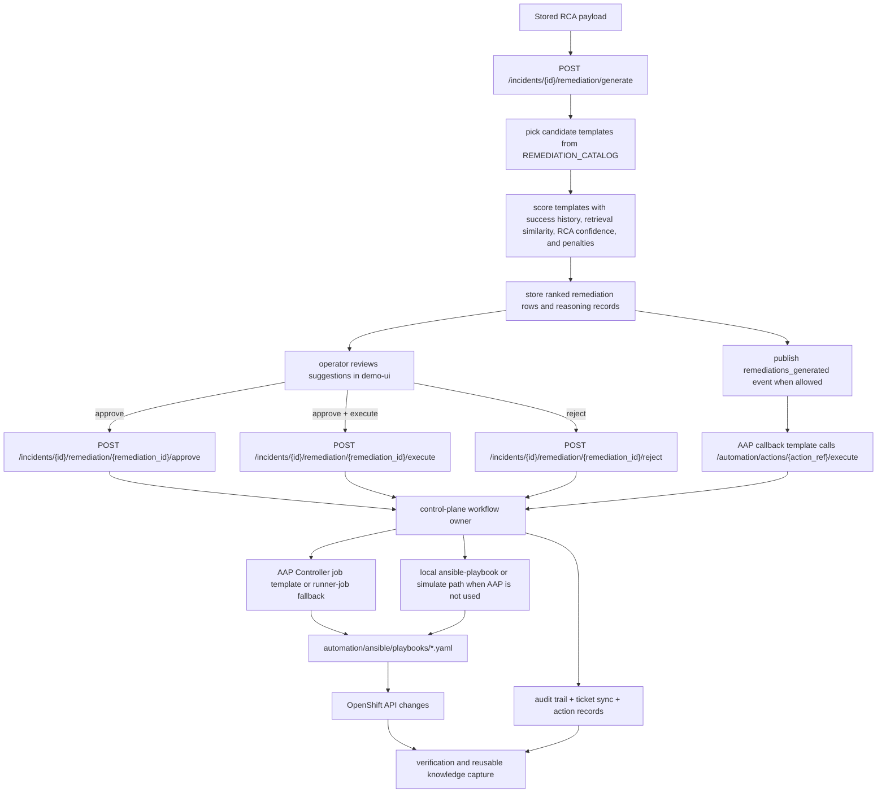

# Remediation Suggestions and Ansible Playbooks

## Purpose

This document explains the narrow Phase 8 question: how the platform turns RCA into ranked remediation actions, how those actions map to `action_ref` values and Ansible playbooks, and how execution flows back through the control-plane.

Use this file when you want:

- the current remediation suggestion algorithm
- the current anomaly-to-action mapping
- the current Ansible playbooks and what they change
- the execution path from UI or EDA callback into AAP and OpenShift

Use [`event-driven-ansible.md`](./event-driven-ansible.md) when you want the EDA webhook and rulebook path in detail. Use [`rca-remediation.md`](./rca-remediation.md) when you want the broader runtime response design across RCA, workflow state, ticketing, and verification.

## One-Screen Summary

The current implementation works like this:

1. RCA is already attached to the incident.
2. `POST /incidents/{incident_id}/remediation/generate` asks the control-plane to create ranked suggestions.
3. `services/shared/workflow.py` chooses candidate templates from `REMEDIATION_CATALOG` based on the normalized anomaly type.
4. Each template in `REMEDIATION_LIBRARY` contributes metadata such as `action_ref`, `suggestion_type`, `playbook_ref`, risk, preconditions, and a base success rate.
5. The control-plane scores each suggestion using historical verification success, retrieval similarity, RCA confidence, and policy bonuses, then subtracts risk and execution cost penalties.
6. Suggestions are stored, ranked, surfaced in the UI, published to the audit trail, and optionally emitted as `remediations_generated` EDA events.
7. When an operator approves or executes an action, the same `action_ref` flows into AAP Controller, an AAP runner-job fallback, or the local playbook/simulate path.
8. Execution, ticket sync, audit, verification, and retry all go back through the control-plane workflow instead of bypassing it.

## Current Flow



## How Suggestions Are Chosen

### 1. Candidate selection by anomaly type

The first step is deterministic. The platform normalizes `incident.anomaly_type` and uses that value to look up a short allowlist of candidate template IDs in `REMEDIATION_CATALOG`.

Current catalog:

| Normalized anomaly type | Current candidate actions |
| --- | --- |
| `registration_storm` | `scale_scscf`, `rate_limit_pcscf`, `open_plane_escalation` |
| `registration_failure` | `inspect_registration_policy`, `quarantine_imsi`, `open_plane_escalation` |
| `authentication_failure` | `inspect_authentication_path`, `quarantine_imsi`, `open_plane_escalation` |
| `malformed_sip` | `validate_invite_headers`, `quarantine_imsi`, `open_plane_escalation` |
| `routing_error` | `inspect_route_policy`, `open_plane_escalation` |
| `busy_destination` | `confirm_destination_capacity`, `open_plane_escalation` |
| `call_setup_timeout` | `trace_session_timeout`, `scale_scscf`, `open_plane_escalation` |
| `call_drop_mid_session` | `trace_mid_session_signaling`, `open_plane_escalation` |
| `server_internal_error` | `inspect_app_server_dependencies`, `scale_scscf`, `open_plane_escalation` |
| `network_degradation` | `investigate_network_transport`, `rate_limit_pcscf`, `open_plane_escalation` |
| `retransmission_spike` | `investigate_retransmissions`, `rate_limit_pcscf`, `open_plane_escalation` |

If the anomaly type is not in the catalog, the control-plane falls back to `open_plane_escalation`.

### 2. Template metadata from `REMEDIATION_LIBRARY`

Each template in `REMEDIATION_LIBRARY` defines the data the UI and executor use later:

- `title`
- `suggestion_type`
- `action_mode`
- `action_ref`
- `description`
- `risk_level`
- `automation_level`
- `requires_approval`
- `playbook_ref`
- `preconditions`
- `expected_outcome`
- `base_success_rate`
- `policy_bonus`
- `execution_cost_penalty`
- `keywords`

This means the platform does not let the LLM invent arbitrary executable actions. The LLM-derived RCA influences ranking, but the executable actions still come from a controlled library.

### 3. Ranking inputs

For each candidate template, the control-plane calculates:

- `historical_success`: past verified success rate for the same `action_ref`, or the template default if history is missing
- `retrieval_similarity`: the higher of
  - the best retrieved document score in the RCA payload
  - keyword overlap between the incident/RCA rationale text and the template keywords
- `rca_confidence`: the stored RCA confidence value
- `policy_bonus`: small boost derived from the template's automation level or explicit template bonus
- `risk_penalty`: higher penalty for higher-risk actions
- `execution_cost_penalty`: penalty for expensive or disruptive actions

Current formula:

```text
rank_score =
  (0.40 * historical_success)
  + (0.25 * retrieval_similarity)
  + (0.20 * rca_confidence)
  + (0.15 * policy_bonus)
  - (0.20 * risk_penalty)
  - (0.10 * execution_cost_penalty)
```

After scoring, suggestions are sorted by:

1. higher `rank_score`
2. lower `risk_penalty`
3. manual actions before automation when scores tie
4. title as a final stable tie-breaker

The control-plane then assigns `suggestion_rank` starting at `1`.

### 4. What gets stored

Each stored remediation row includes:

- a stable `suggestion_id`
- `based_on_revision`
- `suggestion_rank`
- `action_ref`
- `playbook_ref`
- `status`
- the ranking factors used to justify the decision

The control-plane also:

- stores reasoning records for retrieval and later inspection
- records the `remediations_generated` audit event
- publishes a `remediations_generated` EDA event with `available_actions`, `top_action_ref`, and boolean flags such as `rate_limit_pcscf_available`
- moves the incident into remediation review / approval workflow

## Current Action Types

The current system mixes three action families:

| Family | Examples | How it is used |
| --- | --- | --- |
| Manual analysis | `inspect_registration_policy`, `inspect_authentication_path`, `trace_session_timeout` | operator performs the investigation and records notes or outcome |
| Automation-backed Ansible | `scale_scscf`, `rate_limit_pcscf`, `quarantine_imsi` | control-plane launches AAP or playbook execution using a fixed `action_ref` |
| Ticket / coordination | `open_plane_escalation` | incident is moved into Plane-backed coordination without changing cluster resources directly |

## Current Ansible Playbooks

Only the following `action_ref` values are currently backed by repository playbooks:

| `action_ref` | Playbook | What it does now | Typical trigger path |
| --- | --- | --- | --- |
| `scale_scscf` | `automation/ansible/playbooks/scale-scscf.yaml` | patches the S-CSCF deployment scale and waits until the replica count settles | manual UI approval and execution |
| `rate_limit_pcscf` | `automation/ansible/playbooks/rate-limit-pcscf.yaml` | patches an annotation on the P-CSCF deployment to mark the temporary ingress guardrail path | manual UI approval or allowlisted EDA guardrail |
| `quarantine_imsi` | `automation/ansible/playbooks/quarantine-imsi.yaml` | writes a quarantine marker into the remediation-state ConfigMap for the affected IMSI | manual UI approval and execution |

### Playbook intent

These playbooks are intentionally narrow:

- they operate on explicit OpenShift objects
- they use data the control-plane passes in as `extra_vars`
- they emit a concise summary that can be captured in the incident action record
- they do not discover or invent new targets on their own

## How Execution Works

### 1. Operator or policy chooses an action

There are two supported ways to enter execution:

- manual UI flow:
  - `POST /incidents/{incident_id}/remediation/{remediation_id}/approve`
  - `POST /incidents/{incident_id}/remediation/{remediation_id}/execute`
  - `POST /incidents/{incident_id}/remediation/{remediation_id}/reject`
- event-driven flow:
  - `POST /incidents/{incident_id}/automation/actions/{action_ref}/execute`

Even the event-driven path does not execute the playbook directly. EDA re-enters the control-plane API first.

### 2. The control-plane stays the workflow owner

`services/control-plane/app.py` resolves the selected remediation, normalizes the current workflow state, and records approval and execution using the same incident workflow path for:

- UI-triggered actions
- retries
- already-approved action execution
- event-driven callback execution

This is important because the same code path also handles:

- audit events
- ticket comments and sync
- incident state transitions
- action records
- verification unlock rules

### 3. `action_ref` becomes `extra_vars`

Before launch, `_aap_extra_vars_for_action()` converts the chosen `action_ref` into a safe set of runtime variables:

| `action_ref` | Key `extra_vars` |
| --- | --- |
| `scale_scscf` | `target_namespace`, `target_deployment`, `target_replicas` |
| `rate_limit_pcscf` | `target_namespace`, `target_deployment`, `annotation_key`, `annotation_value` |
| `quarantine_imsi` | `target_namespace`, `target_configmap`, `quarantine_key`, `quarantine_reason`, `imsi` |

Common vars for every action include:

- `incident_id`
- `approved_by`
- `approval_notes`
- `workflow_revision`
- `remediation_id`
- `remediation_title`

### 4. Launch backends

The control-plane supports these execution backends:

| Backend | When it is used |
| --- | --- |
| AAP Controller job template | normal preferred path when the action is supported by AAP |
| AAP runner-job fallback | used when controller write operations are blocked by the current AAP license |
| local `ansible-playbook` execution | used when the runtime is in `execute` mode and the local path is active |
| local simulation | default demo-safe fallback when automation is not fully enabled |
| manual recorded execution | used for non-playbook/manual or notify-style actions |

The local mode is controlled by `AUTOMATION_MODE` or `ENABLE_AUTOMATION`.

## Audit, Verification, and Retry

After approval or execution, the platform records:

- approval rows
- incident action rows
- result summaries and raw execution metadata
- incident workflow transitions
- ticket sync events when Plane is attached

Verification still happens after execution, even when the action came from EDA. The current workflow also allows operators to return from `EXECUTED`, `EXECUTION_FAILED`, or `VERIFICATION_FAILED` back to remediation review so a different suggestion can be tried.

## Current Repo Touchpoints

- `services/shared/workflow.py`
- `services/control-plane/app.py`
- `services/shared/aap.py`
- `services/shared/eda.py`
- `automation/ansible/playbooks/scale-scscf.yaml`
- `automation/ansible/playbooks/rate-limit-pcscf.yaml`
- `automation/ansible/playbooks/quarantine-imsi.yaml`
- `automation/eda/playbooks/execute-incident-action.yml`
- `docs/architecture/phase-08-overview-remediation.md`
- `docs/architecture/rca-remediation.md`
- `docs/architecture/event-driven-ansible.md`

## Related Docs

- [Architecture by phase](./README.md)
- [Phase 08 Overview — Remediation](./phase-08-overview-remediation.md)
- [RCA and remediation](./rca-remediation.md)
- [Event-Driven Ansible](./event-driven-ansible.md)
