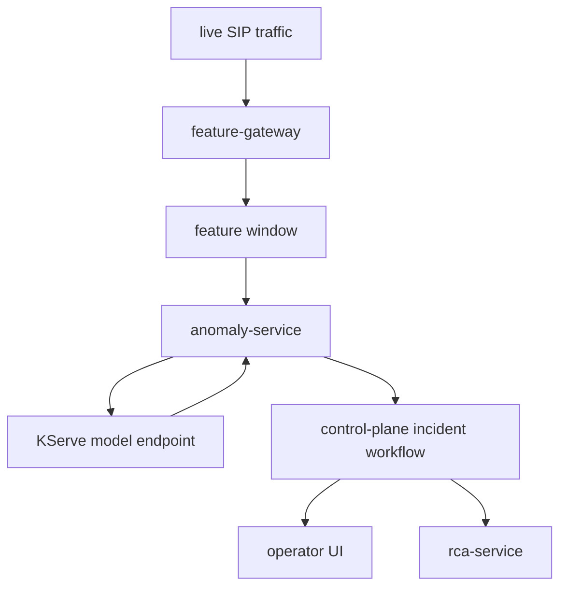
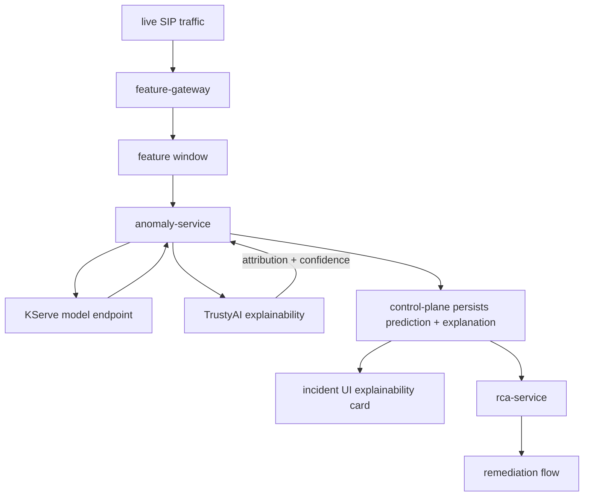

# TrustyAI Explainability For Incident Scoring

## Purpose

This document defines how ANI should introduce TrustyAI explainability into the Phase 7 incident scoring path so operators can see why the anomaly model predicted a given incident class before RCA and remediation decisions are made.

Use this file when you need:

- the explainability boundary between `anomaly-service`, the served classifier, and the incident UI
- the proposed TrustyAI feature-attribution contract for live incident predictions
- the UI behavior for a new explainability card on the incident workflow page
- the caching, failure, and rollout rules for prediction-time explanations

This design extends the current [Phase 07 overview](./phase-07-overview-real-time-detection-and-rca.md), [RCA and remediation](./rca-remediation.md), and [TrustyAI Guardrails for RCA](./trustyai-guardrails-for-rca.md) documents. It does not replace them.

## Status

This is a proposed next-step architecture document.

Current runtime reality:

- `anomaly-service` scores live feature windows through the deployed multiclass serving endpoint
- the control-plane stores `anomaly_type`, `predicted_confidence`, `class_probabilities`, `feature_window_id`, and `feature_snapshot`
- the incident UI already has a lightweight `explainability` shape in `services/demo-ui/lib/types.ts`
- the platform does not currently call TrustyAI to produce feature attribution for live incident predictions
- operators can see the prediction and RCA, but not a first-class explanation of why the model chose that class

The design goal here is to add an explicit model-explanation step between prediction and operator action.

## Product Notes

The Red Hat OpenShift AI documentation describes TrustyAI as the Responsible AI component for transparency, fairness, reliability, and model explanations. It also documents project-level setup tasks such as uploading training data and labeling fields for TrustyAI use.

Relevant references reviewed on April 19, 2026:

- [Monitoring your AI systems](https://docs.redhat.com/en/documentation/red_hat_openshift_ai_self-managed/3.4/html-single/monitoring_your_ai_systems/)
- [Monitoring data science models](https://docs.redhat.com/en/documentation/red_hat_openshift_ai_self-managed/2.25/html-single/monitoring_data_science_models/index)
- [OpenShift AI 3.0 release notes: TrustyAI capabilities](https://docs.redhat.com/en/documentation/red_hat_openshift_ai_self-managed/3.0/html/release_notes/new-features-and-enhancements_relnotes)

Rules for this repo:

- prefer the operator-managed TrustyAI component already aligned with OpenShift AI
- keep explainability deployment declarative and GitOps-managed
- treat TrustyAI explainability as a model-observability feature, not as a replacement for RCA or guardrails

## Problem Statement

The current incident workflow shows that the model predicted an anomaly class, but it does not show why.

Today an operator can see:

- the predicted incident class
- confidence and top alternatives
- RCA output generated later in the workflow
- remediation suggestions and optional AI playbook generation

What is missing is an explainability layer at the prediction boundary.

That gap matters because:

- operators need a transparent reason to trust the prediction before accepting downstream action
- RCA and remediation should build on a visible model signal path, not a black box
- demos are stronger when the platform can show both "what happened" and "why the classifier thought so"
- explainability improves tuning and debugging when the model overweights weak or unstable signals

ANI already explains incidents later with RCA. TrustyAI explainability should explain the classifier earlier, before RCA and remediation become the only narrative.

## Current Prediction Path

The current scoring path is narrow and already well defined.



Important current behavior:

- the feature gateway assembles the live feature vector
- the anomaly service invokes the served multiclass classifier
- the control-plane persists the predicted class, confidence, and feature metadata
- the UI can show confidence and top classes, but not TrustyAI-generated feature attribution

## Why TrustyAI Here

This design prefers TrustyAI explainability over ad hoc feature-weight rendering in application code for three reasons:

- it aligns with the OpenShift AI Responsible AI stack already used elsewhere in the platform story
- it keeps explanation generation tied to the deployed model interface instead of hardcoded display logic
- it gives the platform a reviewable transparency layer that is easier to defend in demos, customer reviews, and audits

## Target Scored And Explained Path

The target path adds an explainability step immediately after model inference and before the incident record is finalized.



The design intent is simple:

- prediction should remain the primary detection event
- explainability should be attached as a sibling to prediction, not bolted onto RCA later
- operators should see the explanation before they rely on RCA or remediation

## Design Principles

### Explain Before Action

The model should not only say what class it predicted. It should also show which signals most influenced that decision.

### Keep Prediction And Explanation Separate

Prediction and explanation are related but not identical.

- the classifier predicts the class
- TrustyAI explains the prediction
- RCA explains the likely root cause

Those should remain three distinct concepts in the data model and UI.

### Attribute The Model Decision, Not The RCA

This feature is about the classifier path only. It should not be mixed with LLM reasoning, retrieval evidence, or guardrail findings.

### Use Operator-Meaningful Feature Labels

Raw feature keys are acceptable in APIs, but the UI should prefer display labels such as `Retry rate` or `Authentication timeout` when they are available.

### Fail Soft For Explainability

If explainability is unavailable:

- incident creation must continue
- prediction must still be visible
- remediation should not be blocked solely because an explanation is missing
- the UI should say that explanation is temporarily unavailable

### Cache Explanations With Predictions

TrustyAI output should be persisted with the incident record so the UI does not recompute attribution on every page load.

### Start Deterministic For Pattern Insight

The first `pattern_insight` should be rule-based, not LLM-generated. That keeps the explanation layer stable and avoids creating a second trust boundary inside the transparency feature.

## What The Explainability Layer Must Answer

The operator-facing answer should be concise:

- which features contributed most to the chosen class
- whether each feature pushed for or against the prediction
- how strong the contribution was relative to the others
- a short pattern-level summary in domain language
- how confident the platform is that the explanation is representative

This is the minimal useful contract for trust-building in the UI.

## Proposed Incident Explainability Envelope

The current incident record already carries:

- `anomaly_type`
- `predicted_confidence`
- `top_classes`
- `class_probabilities`
- `feature_window_id`
- `feature_snapshot`

TrustyAI explainability should add a sibling envelope, not overload the existing RCA payload:

```json
{
  "anomaly_type": "registration_failure",
  "predicted_confidence": 0.90,
  "feature_window_id": "fw-123",
  "feature_snapshot": {
    "retry_rate": 15.0,
    "auth_timeout": 300.0,
    "packet_loss": 2.0,
    "cpu_usage": 40.0
  },
  "model_explanation": {
    "provider": "trustyai",
    "schema_version": "ani.explainability.v1",
    "prediction": "registration_failure",
    "explanation_confidence": "high",
    "top_features": [
      {
        "feature": "retry_rate",
        "display_label": "Retry rate",
        "impact": 0.45,
        "direction": "supports_prediction"
      },
      {
        "feature": "auth_timeout",
        "display_label": "Authentication timeout",
        "impact": 0.30,
        "direction": "supports_prediction"
      },
      {
        "feature": "packet_loss",
        "display_label": "Packet loss",
        "impact": 0.10,
        "direction": "supports_prediction"
      }
    ],
    "pattern_insight": "High retry rate combined with authentication timeout indicates registration failure behavior.",
    "generated_at": "2026-04-19T18:15:00Z"
  }
}
```

Rules for this contract:

- keep explainability separate from `rca_payload`
- persist only the authoritative normalized TrustyAI output, not raw internal attribution blobs
- prefer the top three to five features for UI use
- include both a machine key and a human display label when possible
- keep `pattern_insight` short and operator-readable

## Explainability Service Contract

The integration between ANI and TrustyAI must be explicit and versioned.

Recommended internal contract version:

- `schema_version`: `ani.explainability.v1`

### Request

Illustrative request shape:

```json
{
  "schema_version": "ani.explainability.v1",
  "incident_id": "INC-123",
  "project": "ani-demo",
  "feature_window_id": "fw-123",
  "model": {
    "name": "ani-anomaly-v1",
    "version": "ani-predictive-fs"
  },
  "prediction": {
    "class_name": "registration_failure",
    "confidence": 0.90,
    "class_probabilities": {
      "registration_failure": 0.90,
      "registration_storm": 0.06,
      "network_degradation": 0.04
    }
  },
  "inputs": {
    "retry_rate": 15.0,
    "auth_timeout": 300.0,
    "packet_loss": 2.0,
    "cpu_usage": 40.0
  }
}
```

### Response

```json
{
  "schema_version": "ani.explainability.v1",
  "provider": "trustyai",
  "prediction": "registration_failure",
  "prediction_confidence": 0.90,
  "top_features": [
    {
      "feature": "retry_rate",
      "impact": 0.45,
      "direction": "supports_prediction"
    },
    {
      "feature": "auth_timeout",
      "impact": 0.30,
      "direction": "supports_prediction"
    },
    {
      "feature": "packet_loss",
      "impact": 0.10,
      "direction": "supports_prediction"
    }
  ],
  "explanation_confidence": "high"
}
```

### Normalization Rules

ANI should normalize TrustyAI output before it reaches the UI.

Normalization rules:

- sort features by absolute impact
- truncate to the top three to five features for operator display
- keep raw feature keys for audit, but map to friendly labels for UI
- expose impact direction as `supports_prediction`, `opposes_prediction`, or `neutral`
- generate `pattern_insight` after normalization, not before

## Topology Choice

There are two valid integration topologies:

- call TrustyAI directly from `anomaly-service`
- add a separate ANI-owned `explainability-service`

Current recommendation:

- keep the first implementation inside `anomaly-service`
- persist normalized explanation output through the control-plane
- introduce a dedicated `explainability-service` only if multiple ANI services need the same attribution or caching layer

A separate service is acceptable later, but it adds another hop, another deployment, and another failure surface. The initial path does not need that complexity.

## Pattern Insight Generation

TrustyAI provides attribution, but ANI still needs a concise operator message.

Recommended first implementation:

- derive `pattern_insight` from deterministic domain rules over the top attributed features
- keep the rule set narrow and reviewable
- avoid LLM summarization in the first rollout

Illustrative examples:

- high `retry_rate` and high `auth_timeout` -> `registration failure behavior`
- high `error_5xx_ratio` and high `latency_p95` -> `server-side execution failure pattern`
- high `retransmission_count` and packet delay features -> `network degradation pattern`

This is the "secret sauce" layer, but it should start as deterministic domain logic.

## UI Rendering Contract

The incident page should add one explainability card in the same visual zone as confidence and risk.

Recommended card title:

- `Model Explanation`

Acceptable demo-oriented alternates:

- `Why this incident?`
- `AI Explainability (TrustyAI)`

Recommended rendering behavior:

1. show the top three to five contributing features
2. show a compact bar visualization or ranked list
3. show signed or directional impact
4. show a short `pattern_insight`
5. show `explanation_confidence`

Recommended placement:

- same row or grid grouping as `AI Confidence` and `Decision Risk`

Recommended UI rules:

- do not dump raw JSON
- do not show more than five features by default
- do not hide explanation unavailability behind an empty card
- optionally add a `Raw vs Interpreted` toggle later, but only after the base card is stable

## Persistence And Caching

Explainability should be computed once per accepted prediction and reused.

Rules:

- persist the normalized explanation on the incident record
- cache by `feature_window_id`, model identity, and prediction output
- invalidate cached explanation if the model version or feature window changes
- do not recompute explanation on every UI refresh

## Performance Considerations

Recommended operating modes:

| Mode | Strategy |
| --- | --- |
| real-time | compute attribution synchronously alongside prediction |
| optimized | cache explanation with prediction and serve it from the incident record |
| scaled | precompute or reuse explanations for repeated high-frequency patterns |

Initial recommendation:

- compute once at prediction time
- persist immediately with the incident
- render from the stored incident payload in the UI

## Failure Handling

If TrustyAI explainability fails:

- keep the incident and prediction
- store `model_explanation.status=unavailable`
- show `Explanation temporarily unavailable` in the UI
- log the model version, feature window id, and failure reason for replay

Illustrative fallback:

```json
{
  "provider": "trustyai",
  "status": "unavailable",
  "message": "Explanation temporarily unavailable."
}
```

This should be a soft failure, not an automation stop condition.

## Deployment Model On OpenShift AI

This repo should treat TrustyAI explainability as an operator-managed OpenShift AI capability.

Recommended deployment model:

- enable the TrustyAI component in the `DataScienceCluster`
- install TrustyAI for the relevant project namespace
- upload or register the training-data baseline required for attribution quality
- label fields so operator-facing names can be preserved
- keep configuration declarative and GitOps-managed where the platform supports it

## Repo Touchpoints

This design mainly affects these repo areas:

- `services/anomaly-service/`
- `services/control-plane/`
- `services/demo-ui/`
- `services/shared/`
- `docs/architecture/`
- `k8s/base/`
- `k8s/overlays/gitops/`

Expected code changes when implementation starts:

- add a TrustyAI explainability client near the scoring path
- extend the incident payload with `model_explanation`
- add the new explainability card to the incident UI
- persist and cache normalized attribution output
- add TrustyAI project setup and GitOps configuration for explainability inputs

## Rollout Plan

### Phase 1: Passive Storage

Call TrustyAI after prediction and store normalized attribution with the incident, but do not render it yet.

### Phase 2: UI Card

Add the `Model Explanation` card to the incident workflow view and show the top three features plus `pattern_insight`.

### Phase 3: Confidence And Insight Tuning

Tune field labels, feature ordering, and deterministic pattern rules with replayed incidents.

### Phase 4: Advanced Operator View

Optionally add:

- `Raw vs Interpreted`
- expanded feature list
- links back to the feature snapshot

## Demo Narrative

Recommended customer story:

1. the model detected a `registration_failure`
2. TrustyAI shows that `retry_rate` and `auth_timeout` were the dominant signals
3. the operator can trust the model path before reading RCA
4. RCA then explains likely cause
5. remediation stays human-reviewed and guardrailed

This creates a stronger end-to-end story:

- predictive model
- explainability
- RCA
- guardrails
- human approval
- automation

## Why This Matters

ANI already shows prediction, RCA, and remediation. TrustyAI explainability fills the missing transparency layer between prediction and action:

- the model stays useful, but less opaque
- operators gain a concrete reason to trust the classifier
- RCA no longer carries the full burden of explanation
- the demo becomes a stronger enterprise AI lifecycle story

## Related Docs

- [Architecture by phase](./README.md)
- [Engineering specification](./engineering-spec.md)
- [Phase 07 Overview — Real-Time Detection and RCA](./phase-07-overview-real-time-detection-and-rca.md)
- [RCA and remediation](./rca-remediation.md)
- [TrustyAI Guardrails for RCA](./trustyai-guardrails-for-rca.md)
- [AI playbook generation](./ai-playbook-generation.md)
